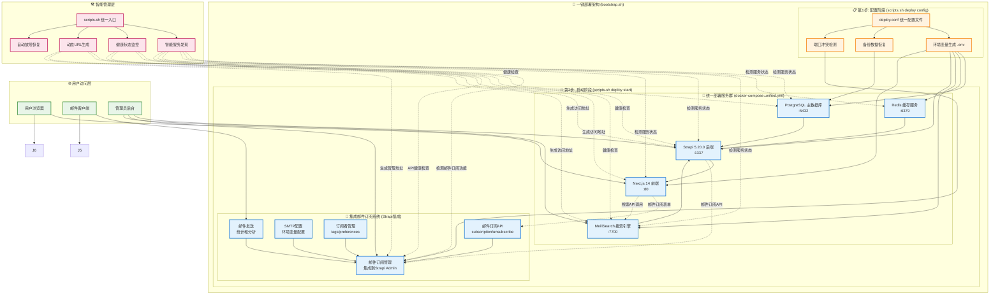
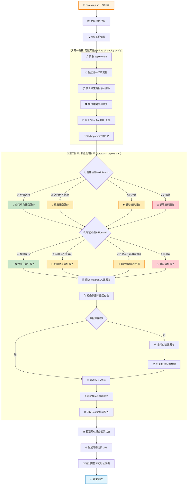

# 🚀 AI变现之路 - 全栈项目管理系统

<div align="center">


**现代化全栈Web应用，提供内容管理、搜索引擎、邮件营销等完整解决方案**

[快速开始](#-快速开始) • [在线演示](#) • [文档中心](#-文档导航) • [贡献指南](#-贡献指南)

</div>

---

## ✨ 项目特色

> 🎯 **一次配置，终身受用** - 统一配置管理，智能化部署流程

### 🚀 **核心优势**

| 特性 | 描述 | 优势 |
|------|------|------|
| 🎯 **极简配置** | 单文件配置 `deploy.conf` | 减少90%配置复杂度 |
| 🔄 **智能部署** | 一键自动化部署流程 | 从零到生产仅需5分钟 |
| 🚫 **零硬编码** | 完全动态配置架构 | 跨环境无缝迁移 |
| 🛡️ **安全可靠** | 内置安全最佳实践 | 企业级安全标准 |
| 📦 **开箱即用** | 完整功能生态系统 | 无需额外集成 |
| 🔧 **灵活扩展** | 模块化架构设计 | 轻松定制和扩展 |

## 🏗️ 技术架构

<div align="center">



</div>

### 🔧 **架构核心理念**

#### 📋 **一键部署 = 两步式智能配置**

> **核心思路**: 一键部署实际上是 `bootstrap.sh` 自动按序执行 `scripts.sh deploy config` 和 `scripts.sh deploy start`


#### 🎯 **两阶段部署详解**

| 阶段 | 操作命令 | 主要任务 | 关键脚本 |
|------|----------|----------|----------|
| **📋 配置阶段** | `scripts.sh deploy config` | 🔧 环境变量生成<br/>📦 备份数据恢复<br/>🛡️ 端口冲突检测 | `simple-deploy.sh` |
| **🚀 启动阶段** | `scripts.sh deploy start` | 🎯 统一服务群启动<br/>📧 独立邮件系统启动<br/>🔍 健康检查验证 | `start-dev.sh` |

### 💻 **技术栈详情**

#### 🎨 **前端技术栈**
- **Next.js 14** - React全栈框架，支持SSR/SSG，App Router架构
- **TypeScript** - 类型安全的JavaScript超集，提升开发效率
- **纯CSS变量系统** - 主题化设计，毛玻璃效果，深色模式支持
- **Zustand** - 轻量级状态管理，简单易用
- **响应式设计** - 1440px设计稿精确还原，完美适配移动端

#### ⚙️ **后端技术栈**
- **Strapi 5.20.0** - 现代化无头CMS，完整TypeScript支持
- **PostgreSQL 14+** - 企业级关系型数据库，ACID事务保证
- **RESTful API** - 标准化API接口，自动生成文档
- **OpenAPI 3.0** - 交互式API文档，支持在线测试

#### 🔧 **基础设施架构**
- **Docker Compose** - 智能混合容器编排，统一+独立双重策略
- **MeiliSearch** - 高性能全文搜索引擎，中文分词支持 (统一部署 :7700)
- **邮件订阅系统** - 完全集成到Strapi，通过内置API管理订阅和发送
- **Redis** - 内存缓存和会话存储，高性能数据缓存 (统一部署 :6379)
- **PostgreSQL** - 统一数据库架构，主业务数据和邮件订阅数据统一管理

#### 🏗️ **智能混合部署架构特色**

##### 🎯 **部署策略优势**
- **🔄 统一部署策略** - 所有服务统一编排部署，简化管理和维护
- **🚫 零硬编码设计** - 所有URL、端口、连接字符串均从 `deploy.conf` 动态生成
- **🔧 智能服务发现** - 自动识别现有服务状态，智能启动和管理服务
- **🛡️ 冲突智能预防** - 端口占用检测、服务重复检测、资源冲突预警

##### 🌐 **配置管理特色**
- **📋 单文件配置** - `deploy.conf` 统一管理所有服务参数和环境变量
- **🔄 环境自适应** - dev/production模式自动切换配置策略
- **🌐 动态URL构建** - 智能生成 `protocol://domain:port/path` 格式访问地址
- **⚡ 智能启动检测** - 健康检查、状态监控、自动重启机制

##### 📦 **统一服务架构**
- **🗄️ 数据统一管理** - 邮件订阅数据与主业务数据统一存储在PostgreSQL
- **🔧 配置集中管理** - 邮件系统配置集成在Strapi环境配置中
- **📊 监控统一** - 统一的日志系统、健康检查、性能监控
- **🚀 版本同步** - 邮件系统与主应用同步升级，保证功能一致性

## 🚀 快速开始

### 🎯 **30秒快速体验**

> **💡 配置说明**: 所有部署方式都会使用 `deployment/config/deploy.conf` 中的配置。一键部署使用默认配置，手动部署可先修改配置文件。

#### 方式一：一键部署（推荐）
```bash
# 一键安装并启动完整系统 (使用默认配置)
bash <(curl -s https://raw.githubusercontent.com/lyfe2025/aibianx/master/scripts/bootstrap.sh)
```

**🔧 一键部署执行流程:**
1. **环境检查** - 自动检查并安装必要依赖 (Git, Docker, Node.js)
2. **项目克隆** - 从GitHub获取最新代码
3. **配置生成** - 执行 `./scripts.sh deploy config` (对应菜单选项1)
4. **服务启动** - 执行 `./scripts.sh deploy start` (对应菜单选项2)
5. **智能部署** - 按序启动: 数据库检查创建 → 数据恢复 → 搜索引擎 → 邮件系统 → 后端 → 前端
6. **数据管理** - 自动检查数据库存在性，不存在则创建并从 `deploy.conf` 指定备份版本恢复数据
7. **健康检查** - 验证所有服务运行状态和连通性
8. **地址输出** - 显示所有访问地址和状态面板

**💡 一键部署 = bootstrap.sh → scripts.sh deploy config → scripts.sh deploy start**

#### 方式二：手动部署（可定制配置）
```bash
# 1. 克隆项目
git clone https://github.com/lyfe2025/aibianx.git && cd aibianx

# 2. [可选] 修改配置文件
vim deployment/config/deploy.conf    # 自定义域名、密码、端口等

# 3. 配置和启动系统
./scripts.sh deploy config    # 根据配置文件生成环境变量
./scripts.sh deploy start     # 启动所有服务

# 4. 查看访问地址
./scripts.sh tools services   # 获取所有服务地址
```

**🎯 手动部署 vs 一键部署详细对比:**

| 对比维度 | 一键部署 (bootstrap.sh) | 手动部署 (scripts.sh) |
|---------|------------------------|----------------------|
| **🔧 配置修改** | ❌ 使用默认配置，不可预先修改 | ✅ 可在部署前修改 `deploy.conf` 定制化配置 |
| **🛠️ 环境检查** | ✅ 自动检查并安装缺失依赖 (Git, Docker, Node.js) | ⚠️ 需手动确保依赖完整 |
| **📦 项目获取** | ✅ 自动从GitHub克隆最新代码 | ⚠️ 需手动 `git clone` 获取项目 |
| **🎯 执行流程** | 🚀 bootstrap.sh → scripts.sh config → scripts.sh start | 🔧 手动分步: config → start |
| **⚙️ 执行控制** | ❌ 一次性完整执行，中途难以干预 | ✅ 可分步执行、单独调试、失败重试 |
| **🛡️ 错误处理** | ⚠️ 失败需完全重新运行一键部署 | ✅ 可单独重试失败步骤，精准修复 |
| **📊 状态监控** | ✅ 自动显示最终状态和访问地址 | 🔧 需手动执行 `tools status` 查看状态 |
| **🎯 适用场景** | 🚀 快速体验、演示、全新环境部署 | 🔧 生产部署、定制需求、开发调试 |
| **👥 用户群体** | 🆕 新手用户、体验用户、快速演示 | 👨‍💻 开发者、运维人员、生产环境 |
| **🔄 重复部署** | ⚠️ 每次都重新克隆，覆盖本地修改 | ✅ 保留本地修改，仅更新配置和服务 |

**💡 选择建议:**
- **🆕 首次体验**: 选择一键部署，30秒快速上手
- **🔧 生产环境**: 选择手动部署，精确控制每个步骤
- **👨‍💻 开发调试**: 选择手动部署，便于问题排查和定制配置

**⚠️ 手动部署注意事项:**
1. **配置优先**: 部署前务必检查 `deployment/config/deploy.conf` 配置
2. **步骤顺序**: 必须先执行 `deploy config` 再执行 `deploy start`
3. **端口冲突**: 确保配置的端口未被占用 (默认: 80, 1337, 7700)
4. **权限要求**: 确保有Docker操作权限和端口绑定权限
5. **备份数据**: 如需恢复数据，确保 `backups/` 目录下有相应备份文件

### ⚙️ **详细部署流程**

<details>
<summary><b>🔧 点击展开详细配置说明</b></summary>

#### 📋 **Step 1: 项目克隆**
```bash
git clone https://github.com/lyfe2025/aibianx.git
cd aibianx
```

#### 📝 **Step 2: 配置文件设置 (可选)**
> **📋 重要**: 项目提供完整的默认配置，开发环境可直接使用，生产环境建议修改安全相关配置

编辑唯一配置文件：`deployment/config/deploy.conf`

**🔧 默认配置 (开发环境)**
```bash
# 🌐 基础配置
DEPLOY_MODE=dev                     # 部署模式: dev | production
DOMAIN=localhost                    # 主域名
MAIL_DOMAIN=localhost              # 邮件域名

# 📦 仓库配置 (一键部署使用)
REPO_ORG=lyfe2025                  # GitHub组织/用户名
PROJECT_NAME=aibianx               # 项目名称
REPO_URL=https://github.com/${REPO_ORG}/${PROJECT_NAME}.git

# 🔐 数据库配置 (系统自动创建数据库)
DB_NAME=aibianx_dev                # 数据库名称 (自动添加环境后缀 _dev/_prod)
DB_USER=aibianx_dev                # 数据库用户
DB_PASSWORD=                       # 数据库密码 (开发环境可为空)
DB_ADMIN_PASSWORD=postgres_admin_2024   # PostgreSQL管理员密码
# 邮件系统已集成到Strapi，通过Admin界面管理

# 📦 自动化配置
BACKUP_VERSION=latest              # 备份版本选择
AUTO_RESTORE_BACKUP=true           # 自动数据恢复
AUTO_DEPLOY_SEARCH=true            # 自动搜索引擎
AUTO_DEPLOY_EMAIL=true             # 自动邮件系统

# 🌐 端口配置 (可选，使用默认值)
FRONTEND_PORT=80                   # 前端端口
BACKEND_PORT=1337                  # 后端端口  
MEILISEARCH_PORT=7700              # 搜索引擎端口
# EMAIL_PORT=1337              # 邮件系统已集成到Strapi
```

**⚠️ 生产环境必须修改的配置:**
- `DEPLOY_MODE=production` - 启用生产模式
- `DOMAIN=yourdomain.com` - 设置真实域名
- `MAIL_DOMAIN=mail.yourdomain.com` - 设置邮件域名
- `DB_PASSWORD=your_secure_password` - 设置数据库密码
- `DB_ADMIN_PASSWORD=admin_secure_password` - 管理员密码
# - 邮件系统密码已不需要 (集成到Strapi)

#### 🔧 **Step 3: 系统配置**
```bash
# 自动配置所有服务
./scripts.sh deploy config
```

#### 🚀 **Step 4: 服务启动**
```bash
# 启动完整系统
./scripts.sh deploy start

# 检查系统状态和访问地址
./scripts.sh tools status
./scripts.sh tools services    # 查看所有服务访问地址
```

</details>

### 🛠️ **scripts.sh 手动部署详解**

<details>
<summary><b>📋 点击查看 scripts.sh 详细使用指南</b></summary>

#### 🎯 **交互式菜单模式**
```bash
# 启动交互式管理菜单
./scripts.sh

# 菜单选项说明：
# 1) 🔧 极简一键配置  - 生成环境变量，恢复备份数据
# 2) 🚀 启动完整环境  - 启动前端+后端+数据库+搜索+邮件
# 3) 🛑 停止所有服务  - 安全停止所有Docker容器
# 5) 🔍 系统状态      - 检查所有服务运行状态
# 9) 🌐 显示访问地址  - 查看完整的系统访问地址
```

#### 🚀 **命令行模式 (推荐生产环境)**
```bash
# 分步执行部署流程
./scripts.sh deploy config     # 第1步: 配置环境
./scripts.sh deploy start      # 第2步: 启动服务
./scripts.sh tools status      # 第3步: 检查状态
./scripts.sh tools services    # 第4步: 获取访问地址

# 单独管理特定服务
./scripts.sh search deploy     # 单独部署搜索引擎
./scripts.sh email check       # 检查邮件系统状态
./scripts.sh backup create     # 创建系统备份
```

#### ⚠️ **scripts.sh 特殊注意事项**

**🔧 配置文件依赖:**
- 所有命令都依赖 `deployment/config/deploy.conf` 配置
- 修改配置后需重新执行 `./scripts.sh deploy config`
- 配置变更会影响所有后续操作

**📋 执行顺序要求:**
```bash
# ❌ 错误顺序 - 会导致启动失败
./scripts.sh deploy start      # 没有先配置环境

# ✅ 正确顺序 - 必须先配置再启动
./scripts.sh deploy config     # 1. 先生成环境配置
./scripts.sh deploy start      # 2. 再启动所有服务
```

**🔒 权限和环境要求:**
- 需要 Docker 操作权限 (可能需要 sudo 或用户在 docker 组)
- 端口 80 需要管理员权限 (macOS/Linux)
- 确保防火墙允许配置的端口访问

**🚨 常见失败情况处理:**
```bash
# 端口被占用
./scripts.sh tools status      # 查看端口占用情况
sudo lsof -i :80,1337,7700  # 检查具体端口占用

# 服务启动失败
./scripts.sh deploy stop       # 停止所有服务
./scripts.sh deploy config     # 重新配置
./scripts.sh deploy start      # 重新启动

# 数据库连接失败
./scripts.sh database check    # 检查数据库状态
./scripts.sh backup restore    # 从备份恢复数据
```

**📊 状态监控和调试:**
```bash
# 实时监控系统状态
./scripts.sh tools status      # 一次性状态检查
./scripts.sh monitor start     # 持续监控 (如果可用)

# 查看详细日志
tail -f logs/backend.log        # 后端日志
tail -f logs/frontend.log       # 前端日志
./scripts.sh search logs        # 搜索引擎日志
```

**🔄 重启和重置:**
```bash
# 优雅重启
./scripts.sh deploy stop       # 停止服务
./scripts.sh deploy start      # 重新启动

# 完全重置 (谨慎使用)
./scripts.sh deploy stop       # 停止服务
./scripts.sh tools clean       # 清理缓存和临时文件
./scripts.sh deploy config     # 重新配置
./scripts.sh deploy start      # 重新启动
```

</details>

## 🌐 系统访问地址

<div align="center">

### 🎯 **服务访问面板**

> **💡 提示**: 部署完成后，运行 `./scripts.sh tools services` 获取最新的访问地址

| 服务 | 开发环境地址 | 说明 | 状态检查 |
|------|------|------|----------|
| 🌐 **前端网站** | [http://localhost](http://localhost) | 用户访问界面 | `curl localhost` |
| ⚙️ **后端管理** | [http://localhost:1337/admin](http://localhost:1337/admin) | Strapi管理后台 | `curl localhost:1337/admin` |
| 🔍 **搜索引擎** | [http://localhost:7700](http://localhost:7700) | MeiliSearch控制台 | `curl localhost:7700/health` |
| 📧 **邮件订阅管理** | [http://localhost:1337/admin](http://localhost:1337/admin) | Strapi集成邮件订阅管理 | `curl localhost:1337/api/email-subscription/stats` |

**📝 注意**: 生产环境地址将根据 `deployment/config/deploy.conf` 中的域名配置自动调整

</div>

#### 🔐 **默认访问凭据**

<details>
<summary><b>📋 点击查看各系统登录信息</b></summary>

- **Strapi后台** (首次需创建管理员)
  - 访问: http://localhost:1337/admin
  - 建议账号: `admin` / `admin@aibianx.com`

- **邮件订阅系统** (已集成到Strapi后台)
  - 访问: http://localhost:1337/admin  
  - 使用: 登录Strapi后台管理邮件订阅

- **MeiliSearch搜索**
  - 访问: http://localhost:7700
  - 开发模式: 无需认证

</details>

## 📁 项目结构

<details>
<summary><b>🗂️ 点击展开完整目录结构</b></summary>

```
aibianx/
├── 📁 deployment/               # 🚀 部署配置
│   ├── config/
│   │   └── deploy.conf         # 🎯 核心配置文件
│   ├── docker-compose.yml      # 容器编排配置
│   └── configs/                # 服务配置文件
│
├── 📦 backups/                  # 🛡️ 数据备份
│   ├── strapi_backup_*/        # 解压后备份目录
│   └── *.tar.gz               # 压缩包备份
│
├── 🌐 frontend/                 # 前端应用
│   ├── src/
│   │   ├── app/               # Next.js 14 App Router
│   │   ├── components/        # React组件
│   │   ├── lib/              # 工具函数
│   │   └── styles/           # CSS样式
│   └── public/               # 静态资源
│
├── ⚙️ backend/                  # 后端API
│   ├── src/
│   │   ├── api/              # API端点
│   │   ├── components/       # Strapi组件
│   │   └── services/         # 业务逻辑
│   └── config/               # 配置文件
│
├── 🔧 scripts/                  # 自动化脚本
│   ├── deployment/           # 部署脚本
│   ├── tools/               # 开发工具
│   ├── backup/              # 备份脚本
│   └── search/              # 搜索管理
│
├── 📚 docs/                     # 项目文档
│   ├── 架构文档/             # 系统设计
│   ├── 开发指南/             # 开发规范
│   └── API文档/              # 接口文档
│
├── 🗄️ logs/                     # 系统日志
└── 🚀 scripts.sh                # 统一管理入口
```

</details>

### 🎯 **核心目录说明**

| 目录 | 作用 | 重要文件 |
|------|------|----------|
| `deployment/` | 🚀 部署配置中心 | `deploy.conf` - 唯一配置文件 |
| `scripts/` | 🔧 自动化脚本 | `scripts.sh` - 统一管理入口 |
| `frontend/` | 🌐 Next.js前端 | App Router架构 |
| `backend/` | ⚙️ Strapi后端 | 无头CMS系统 |
| `docs/` | 📚 项目文档 | 分类文档管理 |

## 🔧 常用命令

### 🚀 **部署管理**
```bash
# 💡 完整部署流程（推荐）
./scripts.sh deploy config      # 1. 先配置所有服务
./scripts.sh deploy start       # 2. 再启动完整环境

# 🔧 服务管理
./scripts.sh deploy stop        # 停止所有服务  
./scripts.sh deploy restart     # 重启所有服务
./scripts.sh tools services     # 查看所有服务访问地址
```

### 📊 **系统监控**
```bash
# 🔍 状态检查
./scripts.sh tools status       # 系统整体状态
./scripts.sh tools check        # 代码质量检查
./scripts.sh tools health       # 健康状态检查

# 📊 性能监控
./scripts.sh monitor start      # 启动实时监控
./scripts.sh logs view          # 查看系统日志
```

### 💾 **备份管理**
```bash
# 📦 备份操作
./scripts.sh backup create      # 创建新备份
./scripts.sh backup list        # 查看可用备份
./scripts.sh backup restore     # 从备份恢复

# 🔄 数据同步
./scripts.sh sync database      # 同步数据库
./scripts.sh sync files         # 同步文件
```

### 🔍 **搜索管理**
```bash
# 🔍 搜索引擎
./scripts.sh search deploy      # 部署搜索引擎
./scripts.sh search manage      # 搜索管理界面
./scripts.sh search reindex     # 重建搜索索引
```

### 📧 **邮件系统**
```bash
# 📧 邮件服务
./scripts.sh email deploy       # 部署邮件系统
./scripts.sh email check        # 检查邮件状态
./scripts.sh email admin        # 打开邮件管理界面
./scripts.sh billionmail check  # 检查BillionMail状态
```

<details>
<summary><b>📋 更多高级命令</b></summary>

```bash
# 🛠️ 开发工具
./scripts.sh dev setup          # 开发环境配置
./scripts.sh dev clean          # 清理开发环境
./scripts.sh dev rebuild        # 重新构建

# 🔐 安全管理
./scripts.sh security scan      # 安全扫描
./scripts.sh security update    # 安全更新

# 📈 性能优化
./scripts.sh optimize images    # 图片优化
./scripts.sh optimize database  # 数据库优化
./scripts.sh optimize cache     # 缓存优化
```

</details>

## 📚 文档导航

<div align="center">

### 🗂️ **文档中心**

| 📋 分类 | 📖 文档 | 📝 说明 |
|---------|---------|---------|
| 🚀 **入门指南** | [极简部署指南](docs/部署运维/) | 30秒快速上手部署 |
| 🏗️ **架构设计** | [技术架构文档](docs/架构文档/) | 系统设计和技术选型 |
| 💻 **开发规范** | [开发指南](docs/开发指南/) | 编码规范和最佳实践 |
| 📡 **API接口** | [API文档](docs/API文档/) | 接口文档和调用示例 |
| 🛠️ **问题解决** | [故障排查](docs/问题解决/) | 常见问题和解决方案 |

</div>

### 🔧 **故障排除**

#### 常见问题解决

<details>
<summary><b>❓ 缺失系统依赖</b></summary>

**问题**: 提示缺少Git、Docker、Node.js等

**解决方案**:
```bash
# 项目内置依赖检查和安装工具
./scripts.sh tools check      # 检查依赖状态
./scripts/production/install-environment.sh  # 自动安装
```

</details>

<details>
<summary><b>❓ 服务启动失败</b></summary>

**问题**: 部分服务未启动或端口冲突

**解决方案**:
```bash
./scripts.sh tools status     # 检查服务状态
./scripts.sh deploy restart   # 重启服务
./scripts.sh tools services   # 查看访问地址
```

</details>

### 📖 **快速导航**

<details>
<summary><b>🔍 按需求查找文档</b></summary>

#### 🆕 **新手用户**
- [📋 30秒快速开始](#-快速开始)
- [🔧 系统要求](#-系统要求)
- [🌐 访问地址](#-系统访问地址)

#### 👨‍💻 **开发者**
- [🏗️ 技术架构](docs/架构文档/)
- [💻 开发指南](docs/开发指南/)
- [📡 API文档](docs/API文档/)

#### 🔧 **运维人员**
- [🚀 部署指南](docs/部署运维/)
- [🛠️ 故障排查](docs/问题解决/)
- [📊 性能监控](#-系统监控)

</details>

## 🏗️ 部署架构详解

<div align="center">

### 🚀 **智能混合部署策略**

</div>

我们采用**智能混合部署架构**，结合了服务隔离和统一管理的优势：

#### 📦 **独立邮件服务**
```bash
BillionMail/
├── docker-compose.yml          # 独立的邮件服务编排
├── postgresql-data/            # 邮件专用数据库
├── redis-data/                 # 邮件专用缓存
└── logs/                      # 邮件服务日志
```

**✅ 优势:**
- 🔒 **数据隔离** - 邮件数据与主业务数据完全分离
- 🛡️ **服务稳定** - 邮件服务故障不影响主业务
- 📦 **独立升级** - 可单独升级邮件系统版本
- 🔧 **专业配置** - 针对邮件服务的专门优化

#### 🎯 **统一核心服务**
```bash
deployment/
├── docker-compose.unified.yml  # 核心服务编排
├── config/deploy.conf          # 统一配置文件
└── configure-unified-env.sh    # 环境变量生成
```

**✅ 统一部署优势:**
- 🚫 **零硬编码** - 所有配置动态生成
- 🔄 **环境切换** - 一键切换开发/生产环境
- 🌐 **智能URL** - 自动生成正确的访问地址
- 🛡️ **冲突检测** - 自动避免服务冲突

#### 🎯 **智能混合架构核心优势**

| 对比维度 | 传统单体部署 | 完全微服务 | 智能混合架构 ✨ |
|---------|-------------|-----------|----------------|
| **部署复杂度** | ⚠️ 简单但耦合 | ❌ 极其复杂 | ✅ 智能简化 |
| **服务隔离** | ❌ 无隔离 | ✅ 完全隔离 | ✅ 关键服务隔离 |
| **配置管理** | ❌ 硬编码 | ⚠️ 配置分散 | ✅ 统一配置 |
| **服务发现** | ❌ 手动配置 | ⚠️ 复杂注册 | ✅ 智能检测 |
| **故障影响** | ❌ 全局影响 | ✅ 局部影响 | ✅ 关键隔离 |
| **维护成本** | ⚠️ 中等 | ❌ 极高 | ✅ 较低 |

**🚀 智能混合架构核心理念:**
- 📧 **邮件服务独立** - 24/7稳定运行，不受主业务影响
- 🎯 **核心服务统一** - 简化开发部署，配置管理集中
- 🔧 **智能决策** - 自动选择最优部署策略
- 🛡️ **故障隔离** - 关键服务故障不会级联影响

#### 🔧 **完整智能部署流程图**



**🎯 智能部署核心特色:**
- **🔧 两阶段式部署** - 配置阶段完成后再启动服务，确保环境一致性
- **🤖 智能服务检测** - 自动识别服务状态并选择最优处理策略
- **🛡️ 故障自动修复** - 检测到问题时自动尝试修复而非直接失败
- **🗄️ 智能数据库管理** - 自动检查数据库存在性，不存在则创建并恢复指定版本数据
- **📦 服务隔离管理** - 统一服务群 + 独立邮件服务的混合管理策略
- **🌐 动态地址生成** - 根据实际运行状态生成准确的访问地址

## 🌟 特色功能

<div align="center">

### ✨ **功能特色一览**

</div>

#### 🎨 **现代化UI设计**
- 🎭 **毛玻璃效果** - 现代化视觉体验
- 🌙 **深色主题** - 护眼夜间模式  
- 📱 **响应式设计** - 完美适配各种设备
- 🎯 **像素级还原** - 1440px设计稿精确实现

#### 🔍 **智能搜索引擎**
- ⚡ **全文搜索** - MeiliSearch高性能引擎
- 🇨🇳 **中文分词** - 智能中文内容解析
- 💡 **实时建议** - 搜索过程中的智能提示
- 🎯 **结果高亮** - 关键词精准标记

#### 📧 **专业邮件营销**
- 🚀 **BillionMail集成** - 企业级邮件解决方案
- 📝 **模板管理** - 可视化邮件模板编辑
- 👥 **订阅者管理** - 精细化用户分组
- 📊 **营销分析** - 详细的发送效果统计

#### 📊 **强大内容管理**
- ✍️ **文章发布** - 富文本编辑器支持
- 🏷️ **分类标签** - 灵活的内容组织
- 👨‍💼 **权限管理** - 多角色协作支持
- 🔍 **SEO优化** - 内置搜索引擎优化

#### 🛡️ **企业级安全**
- 🔐 **访问控制** - 基于角色的权限管理
- 🛡️ **数据加密** - 敏感信息安全保护
- 📝 **操作日志** - 完整的审计追踪
- 🔍 **安全扫描** - 自动化安全检测

#### ⚙️ **智能配置管理**
- 🚫 **零硬编码架构** - 完全消除硬编码，所有URL动态生成
- 📦 **单文件配置** - `deploy.conf` 统一管理所有服务参数
- 🔄 **环境自适应** - dev/production模式自动切换配置
- 🗄️ **智能数据库管理** - 自动检查、创建数据库并恢复指定版本数据
- 🌐 **动态URL构建** - 智能生成 `http://domain:port/path` 格式
- 🛡️ **服务冲突预防** - 自动检测并避免重复服务部署
- 🔧 **智能服务发现** - 优先使用已运行的独立服务

<details>
<summary><b>🔧 更多技术特性</b></summary>

#### 📦 **备份恢复系统**
```bash
backups/
├── strapi_backup_20250805_231325/     # 📁 解压后目录 (系统使用)
├── strapi_backup_20250805_231325.tar.gz  # 📦 压缩包 (存储)
└── latest -> strapi_backup_20250805_231325/  # 🔗 最新备份链接
```

**版本管理特性:**
- 🤖 **智能版本选择** - `latest` 自动选择最新备份
- 📅 **时间戳版本** - 如 `20250805_231325` 精确版本控制
- 🔄 **一键恢复** - 自动解压和数据恢复

**快速操作:**
```bash
# 🔄 解压备份 (如果需要)
tar -xzf backups/strapi_backup_*.tar.gz -C backups/

# 📦 创建备份
./scripts.sh backup create

# 🔄 恢复数据  
./scripts.sh backup restore latest
```

</details>

## 🛠️ 系统要求

<div align="center">

### 💻 **环境依赖**

| 组件 | 版本要求 | 说明 |
|------|----------|------|
| 🟢 **Node.js** | `20+` | JavaScript运行环境 |
| 🐳 **Docker** | `24+` | 容器运行环境 |
| 🐘 **PostgreSQL** | `14+` | 关系型数据库 |
| 📦 **Git** | `2.30+` | 版本控制工具 |
| 💾 **内存** | `4GB+` | 推荐运行内存 |
| 💿 **存储** | `20GB+` | 可用磁盘空间 |

</div>

### 🔧 **环境配置**

#### 🖥️ **开发环境**
```bash
# ⚡ 快速开发启动
DEPLOY_MODE=dev ./scripts.sh deploy start

# 🔍 开发环境检查
./scripts.sh tools status
./scripts.sh dev setup
```

#### 🚀 **生产环境**
```bash
# 📝 修改生产配置
vim deployment/config/deploy.conf

# 🌐 生产配置示例
DEPLOY_MODE=production
DOMAIN=yourdomain.com
MAIL_DOMAIN=mail.yourdomain.com

# 🚀 生产部署
./scripts.sh deploy config
./scripts.sh deploy start
```

### 🔐 **安全建议**

#### ⚠️ **必须修改项**
- 🔑 **数据库密码** - 修改默认数据库密码
- 🔐 **管理员密码** - 修改Strapi管理员密码  
- 📧 **邮件密码** - 修改BillionMail登录密码
- 🌐 **域名配置** - 配置正确的生产域名

#### 🛡️ **安全加固**
- 🔒 **HTTPS启用** - 配置SSL证书
- 🔥 **防火墙配置** - 限制不必要端口访问
- 📝 **定期备份** - 建立自动备份策略
- 🔍 **监控日志** - 建立日志监控机制

<details>
<summary><b>🔧 高级安全配置</b></summary>

```bash
# 🔐 安全检查
./scripts.sh security scan

# 🔒 SSL证书配置  
./scripts.sh ssl setup yourdomain.com

# 🔥 防火墙配置
./scripts.sh firewall config

# 📊 监控配置
./scripts.sh monitor setup
```

</details>

## 🤝 贡献指南

<div align="center">

**🌟 我们欢迎所有形式的贡献！**

</div>

### 📋 **贡献流程**


#### 🚀 **快速开始贡献**
```bash
# 1. 🍴 Fork 并克隆项目
git clone https://github.com/lyfe2025/aibianx.git
cd aibianx

# 2. 🌿 创建功能分支
git checkout -b feature/amazing-feature

# 3. ✍️ 进行开发
# 编写代码、测试、文档...

# 4. 📤 提交更改
git commit -m "feat: 添加了惊人的新功能"
git push origin feature/amazing-feature

# 5. 🔗 创建 Pull Request
# 在GitHub上创建PR，等待审查
```

### 🎯 **贡献类型**

| 类型 | 说明 | 标签 |
|------|------|------|
| 🐛 **Bug修复** | 修复已知问题 | `bug` |
| ✨ **新功能** | 添加新特性 | `feature` |
| 📚 **文档** | 改进文档 | `docs` |
| 🎨 **样式** | UI/UX改进 | `ui` |
| ⚡ **性能** | 性能优化 | `perf` |
| 🔧 **工具** | 开发工具改进 | `tools` |

### 📝 **代码规范**

<details>
<summary><b>💻 查看详细规范</b></summary>

#### 🎯 **提交规范**
```bash
# 格式: type(scope): description
feat(frontend): 添加用户登录功能
fix(backend): 修复API响应错误
docs(readme): 更新部署文档
style(ui): 优化按钮样式
```

#### 🔍 **代码质量**
- ✅ 遵循项目现有代码风格
- 📝 添加必要的注释和文档
- 🧪 确保测试通过
- 🔒 遵循安全最佳实践

</details>

---

<div align="center">

## 📄 开源协议

**本项目采用 [MIT](LICENSE) 协议** - 自由使用、修改和分发

## 🙏 致谢

<table>
  <tr>
    <td align="center">
      <b>🚀 核心技术</b><br>
      感谢 Next.js、Strapi、Docker 等优秀开源项目
    </td>
    <td align="center">
      <b>👥 社区贡献</b><br>
      感谢所有贡献者的代码、文档和反馈
    </td>
    <td align="center">
      <b>🌟 用户支持</b><br>
      感谢每一位使用者的信任和建议
    </td>
  </tr>
</table>

---

### 🎯 **开始你的AI变现之路**

<p>
<a href="#-快速开始">
  
</a>
<a href="docs/">
  
</a>
<a href="#-贡献指南">
  
</a>
</p>

**🚀 享受极简配置带来的高效开发体验！**

</div>