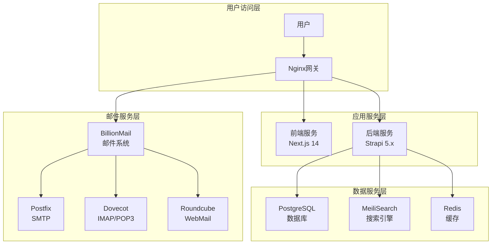

# 🚀 AI变现之路 - 专业的AI商业化平台

[](LICENSE)
[](https://www.docker.com/)
[](https://nextjs.org/)
[](https://strapi.io/)

**AI变现之路**是一个完整的AI商业化内容平台，专注于AI领域的实战经验分享、工具推荐和变现机会发现。

## ✨ 核心特性

- 🎯 **专业内容管理** - 基于Strapi 5.x的强大CMS系统
- 🔍 **智能搜索引擎** - MeiliSearch驱动的全文搜索
- 📧 **完整邮件营销** - 集成BillionMail邮件系统
- 🎨 **现代化设计** - Next.js 14 + TypeScript + 纯CSS
- 🐳 **容器化部署** - Docker一键部署，支持生产环境
- 📱 **响应式设计** - 完美适配移动端和桌面端
- 🔐 **企业级安全** - 完整的用户认证和权限管理
- 📊 **SEO优化** - 全面的搜索引擎优化支持

## 🎯 一键部署 (推荐)

**只需一条命令，3分钟完成全部部署：**

```bash
bash <(curl -s https://raw.githubusercontent.com/lyfe2025/aibianx/master/scripts/bootstrap.sh)
```

### 🔥 部署流程
1. ✅ **自动环境检测** - 检测系统并安装所需依赖
2. ✅ **智能代码拉取** - 自动下载最新项目代码  
3. ✅ **交互式配置** - 引导配置域名、数据库等参数
4. ✅ **一键服务启动** - 启动完整的生产环境
5. ✅ **健康状态检查** - 验证所有服务正常运行

### 🌐 部署后访问地址
- **网站首页**: `https://yourdomain.com`
- **管理后台**: `https://yourdomain.com/admin`
- **API文档**: `https://yourdomain.com/documentation`
- **邮件管理**: `https://yourdomain.com:8080/billion`

## 🛠️ 传统部署方式

如果需要更多控制，可以使用传统方式：

```bash
# 克隆项目
git clone https://github.com/lyfe2025/aibianx.git
cd aibianx

# 进入交互式管理界面
./scripts.sh
```

## 🏗️ 系统架构



## 📋 技术栈

### 前端技术
- **框架**: Next.js 14 (App Router)
- **语言**: TypeScript
- **样式**: 纯CSS + CSS变量系统
- **状态管理**: Zustand
- **字体**: Alibaba PuHuiTi 3.0

### 后端技术
- **CMS**: Strapi 5.20.0
- **数据库**: PostgreSQL 17
- **搜索**: MeiliSearch 1.5
- **缓存**: Redis 7.4
- **邮件**: BillionMail 完整邮件系统

### 部署技术
- **容器化**: Docker + Docker Compose
- **反向代理**: Nginx
- **SSL证书**: Let's Encrypt
- **监控**: 集成健康检查

## 🚀 快速管理命令

部署完成后可使用以下快捷命令：

```bash
# 全局管理命令
aibianx                    # 进入交互式管理界面
aibianx production status  # 检查生产环境状态
aibianx deploy start      # 启动开发环境
aibianx tools diagnose    # 系统诊断工具

# 本地管理命令
cd /opt/aibianx
./scripts.sh               # 交互式管理界面
./scripts.sh production logs    # 查看生产环境日志
./scripts.sh backup full       # 创建完整备份
```

## 📖 文档导航

- 📚 **[完整部署指南](docs/部署运维/生产部署完整指南.md)** - 详细的部署说明
- 🔧 **[开发环境搭建](docs/开发指南/)** - 本地开发环境配置
- 🏗️ **[系统架构设计](docs/架构文档/)** - 技术架构和设计方案
- 🔐 **[安全配置指南](docs/部署运维/)** - 生产环境安全配置
- 📊 **[API接口文档](docs/API文档/)** - 完整的API说明
- 🐛 **[问题排查指南](docs/问题解决/)** - 常见问题解决方案

## 🎯 功能特色

### 🎨 用户体验
- **毛玻璃设计** - 现代化的视觉效果
- **响应式布局** - 完美的移动端适配
- **平滑动画** - 流畅的交互体验
- **深色主题** - 专业的视觉风格

### 📝 内容管理
- **文章系统** - 完整的文章发布和管理
- **分类标签** - 灵活的内容分类
- **搜索功能** - 强大的全文搜索
- **SEO优化** - 完整的搜索引擎优化

### 📧 邮件营销
- **订阅管理** - 用户订阅和退订管理
- **邮件模板** - 可视化邮件模板编辑
- **营销活动** - 邮件营销活动管理
- **数据分析** - 详细的邮件营销数据

### 🔐 用户系统
- **多重认证** - 支持邮箱、GitHub、Google等登录
- **权限管理** - 细粒度的权限控制
- **会员系统** - 完整的会员功能
- **个人中心** - 用户个人信息管理

## 🤝 贡献指南

我们欢迎所有形式的贡献！

### 参与方式
1. 🐛 **报告问题** - 提交Issue报告bug
2. 💡 **功能建议** - 提出新功能想法
3. 🔧 **代码贡献** - 提交Pull Request
4. 📖 **文档改进** - 完善项目文档

### 开发流程
```bash
# 1. Fork项目到你的GitHub
# 2. 克隆你的Fork
git clone https://github.com/your-username/aibianx.git

# 3. 创建功能分支
git checkout -b feature/your-feature

# 4. 开发和测试
./scripts.sh deploy start  # 启动开发环境

# 5. 提交变更
git commit -m "Add: your feature description"

# 6. 推送并创建PR
git push origin feature/your-feature
```

## 📄 许可证

本项目基于 [MIT License](LICENSE) 开源许可证。

## 🙏 致谢

感谢所有为这个项目做出贡献的开发者和用户！

特别感谢以下开源项目：
- [Next.js](https://nextjs.org/) - 强大的React框架
- [Strapi](https://strapi.io/) - 灵活的CMS系统
- [MeiliSearch](https://meilisearch.com/) - 快速的搜索引擎
- [BillionMail](https://billionmail.io/) - 完整的邮件解决方案

## 📞 技术支持

如果遇到问题，可以通过以下方式获取帮助：

- 🐛 **GitHub Issues**: [提交问题](https://github.com/lyfe2025/aibianx/issues)
- 📚 **项目文档**: [查看文档](docs/)
- 💬 **讨论社区**: [参与讨论](https://github.com/lyfe2025/aibianx/discussions)

---

<div align="center">

**🚀 开始你的AI变现之路！**

[立即部署](https://github.com/lyfe2025/aibianx) | [查看文档](docs/) | [提交反馈](https://github.com/lyfe2025/aibianx/issues)

</div>