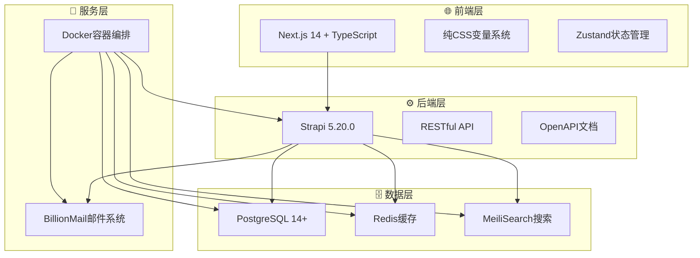

# 🚀 AI变现之路 - 全栈项目管理系统

<div align="center">


**现代化全栈Web应用，提供内容管理、搜索引擎、邮件营销等完整解决方案**

[快速开始](#-快速开始) • [在线演示](#) • [文档中心](#-文档导航) • [贡献指南](#-贡献指南)

</div>

---

## ✨ 项目特色

> 🎯 **一次配置，终身受用** - 统一配置管理，智能化部署流程

### 🚀 **核心优势**

| 特性 | 描述 | 优势 |
|------|------|------|
| 🎯 **极简配置** | 单文件配置 `deploy.conf` | 减少90%配置复杂度 |
| 🔄 **智能部署** | 一键自动化部署流程 | 从零到生产仅需5分钟 |
| 🛡️ **安全可靠** | 内置安全最佳实践 | 企业级安全标准 |
| 📦 **开箱即用** | 完整功能生态系统 | 无需额外集成 |
| 🔧 **灵活扩展** | 模块化架构设计 | 轻松定制和扩展 |

## 🏗️ 技术架构

<div align="center">



</div>

### 💻 **技术栈详情**

#### 🎨 **前端技术**
- **Next.js 14** - React全栈框架，支持SSR/SSG
- **TypeScript** - 类型安全的JavaScript超集
- **纯CSS变量系统** - 主题化设计，毛玻璃效果
- **Zustand** - 轻量级状态管理
- **响应式设计** - 1440px设计稿精确还原

#### ⚙️ **后端技术**
- **Strapi 5.20.0** - 无头CMS，TypeScript支持
- **PostgreSQL 14+** - 企业级关系型数据库
- **RESTful API** - 标准化API接口
- **OpenAPI 3.0** - 自动生成API文档

#### 🔧 **基础设施**
- **Docker Compose** - 容器编排和管理
- **MeiliSearch** - 高性能全文搜索引擎
- **BillionMail** - 专业邮件营销系统
- **Redis** - 内存缓存和会话存储

## 🚀 快速开始

### 🎯 **30秒快速体验**

#### 方式一：一键部署（推荐）
```bash
# 一键安装并启动完整系统
bash <(curl -s https://raw.githubusercontent.com/你的用户名/aibianx/master/scripts/bootstrap.sh)
```

#### 方式二：手动部署
```bash
# 1. 克隆项目
git clone https://github.com/你的用户名/aibianx.git && cd aibianx

# 2. 一键配置启动
./scripts.sh deploy start
```

### ⚙️ **详细部署流程**

<details>
<summary><b>🔧 点击展开详细配置说明</b></summary>

#### 📋 **Step 1: 项目克隆**
```bash
git clone https://github.com/你的用户名/aibianx.git
cd aibianx
```

#### 📝 **Step 2: 配置文件设置**
编辑唯一配置文件：`deployment/config/deploy.conf`

```bash
# 🌐 基础配置
DEPLOY_MODE=dev                     # 部署模式: dev | production
DOMAIN=localhost                    # 主域名
MAIL_DOMAIN=localhost              # 邮件域名

# 🔐 安全配置  
DB_ADMIN_PASSWORD=aibianx_2024     # 数据库管理员密码
BILLIONMAIL_USERNAME=admin         # 邮件系统用户名
BILLIONMAIL_PASSWORD=secure123     # 邮件系统密码

# 📦 自动化配置
BACKUP_VERSION=latest              # 备份版本选择
AUTO_RESTORE_BACKUP=true           # 自动数据恢复
AUTO_DEPLOY_SEARCH=true            # 自动搜索引擎
AUTO_DEPLOY_EMAIL=true             # 自动邮件系统
```

#### 🔧 **Step 3: 系统配置**
```bash
# 自动配置所有服务
./scripts.sh deploy config
```

#### 🚀 **Step 4: 服务启动**
```bash
# 启动完整系统
./scripts.sh deploy start

# 检查系统状态
./scripts.sh tools status
```

</details>

## 🌐 系统访问地址

<div align="center">

### 🎯 **服务访问面板**

| 服务 | 地址 | 说明 | 状态检查 |
|------|------|------|----------|
| 🌐 **前端网站** | [http://localhost](http://localhost) | 用户访问界面 | `curl localhost` |
| ⚙️ **后端管理** | [http://localhost:1337/admin](http://localhost:1337/admin) | Strapi管理后台 | `curl localhost:1337/admin` |
| 🔍 **搜索引擎** | [http://localhost:7700](http://localhost:7700) | MeiliSearch控制台 | `curl localhost:7700/health` |
| 📧 **邮件系统** | [http://localhost:8080](http://localhost:8080) | BillionMail管理界面 | `curl localhost:8080` |

</div>

#### 🔐 **默认访问凭据**

<details>
<summary><b>📋 点击查看各系统登录信息</b></summary>

- **Strapi后台** (首次需创建管理员)
  - 访问: http://localhost:1337/admin
  - 建议账号: `admin` / `admin@aibianx.com`

- **BillionMail邮件系统**
  - 访问: http://localhost:8080  
  - 默认账号: `admin` / `billionmail2024`

- **MeiliSearch搜索**
  - 访问: http://localhost:7700
  - 开发模式: 无需认证

</details>

## 📁 项目结构

<details>
<summary><b>🗂️ 点击展开完整目录结构</b></summary>

```
aibianx/
├── 📁 deployment/               # 🚀 部署配置
│   ├── config/
│   │   └── deploy.conf         # 🎯 核心配置文件
│   ├── docker-compose.yml      # 容器编排配置
│   └── configs/                # 服务配置文件
│
├── 📦 backups/                  # 🛡️ 数据备份
│   ├── strapi_backup_*/        # 解压后备份目录
│   └── *.tar.gz               # 压缩包备份
│
├── 🌐 frontend/                 # 前端应用
│   ├── src/
│   │   ├── app/               # Next.js 14 App Router
│   │   ├── components/        # React组件
│   │   ├── lib/              # 工具函数
│   │   └── styles/           # CSS样式
│   └── public/               # 静态资源
│
├── ⚙️ backend/                  # 后端API
│   ├── src/
│   │   ├── api/              # API端点
│   │   ├── components/       # Strapi组件
│   │   └── services/         # 业务逻辑
│   └── config/               # 配置文件
│
├── 🔧 scripts/                  # 自动化脚本
│   ├── deployment/           # 部署脚本
│   ├── tools/               # 开发工具
│   ├── backup/              # 备份脚本
│   └── search/              # 搜索管理
│
├── 📚 docs/                     # 项目文档
│   ├── 架构文档/             # 系统设计
│   ├── 开发指南/             # 开发规范
│   └── API文档/              # 接口文档
│
├── 🗄️ logs/                     # 系统日志
└── 🚀 scripts.sh                # 统一管理入口
```

</details>

### 🎯 **核心目录说明**

| 目录 | 作用 | 重要文件 |
|------|------|----------|
| `deployment/` | 🚀 部署配置中心 | `deploy.conf` - 唯一配置文件 |
| `scripts/` | 🔧 自动化脚本 | `scripts.sh` - 统一管理入口 |
| `frontend/` | 🌐 Next.js前端 | App Router架构 |
| `backend/` | ⚙️ Strapi后端 | 无头CMS系统 |
| `docs/` | 📚 项目文档 | 分类文档管理 |

## 🔧 常用命令

### 🚀 **部署管理**
```bash
# 💡 快速启动（新手推荐）
./scripts.sh deploy start       # 一键启动完整环境

# 🔧 高级管理
./scripts.sh deploy config      # 配置所有服务
./scripts.sh deploy stop        # 停止所有服务  
./scripts.sh deploy restart     # 重启所有服务
```

### 📊 **系统监控**
```bash
# 🔍 状态检查
./scripts.sh tools status       # 系统整体状态
./scripts.sh tools check        # 代码质量检查
./scripts.sh tools health       # 健康状态检查

# 📊 性能监控
./scripts.sh monitor start      # 启动实时监控
./scripts.sh logs view          # 查看系统日志
```

### 💾 **备份管理**
```bash
# 📦 备份操作
./scripts.sh backup create      # 创建新备份
./scripts.sh backup list        # 查看可用备份
./scripts.sh backup restore     # 从备份恢复

# 🔄 数据同步
./scripts.sh sync database      # 同步数据库
./scripts.sh sync files         # 同步文件
```

### 🔍 **搜索管理**
```bash
# 🔍 搜索引擎
./scripts.sh search deploy      # 部署搜索引擎
./scripts.sh search manage      # 搜索管理界面
./scripts.sh search reindex     # 重建搜索索引
```

### 📧 **邮件系统**
```bash
# 📧 邮件服务
./scripts.sh email deploy       # 部署邮件系统
./scripts.sh email check        # 检查邮件状态
./scripts.sh email admin        # 邮件管理界面
```

<details>
<summary><b>📋 更多高级命令</b></summary>

```bash
# 🛠️ 开发工具
./scripts.sh dev setup          # 开发环境配置
./scripts.sh dev clean          # 清理开发环境
./scripts.sh dev rebuild        # 重新构建

# 🔐 安全管理
./scripts.sh security scan      # 安全扫描
./scripts.sh security update    # 安全更新

# 📈 性能优化
./scripts.sh optimize images    # 图片优化
./scripts.sh optimize database  # 数据库优化
./scripts.sh optimize cache     # 缓存优化
```

</details>

## 📚 **文档导航**

- 📖 **[极简部署指南](docs/部署运维/极简部署指南.md)** - 详细的部署说明
- 🏗️ **[架构设计文档](docs/架构文档/)** - 技术架构和设计方案
- 🔧 **[开发指南](docs/开发指南/)** - 开发规范和最佳实践
- 📊 **[API文档](docs/API文档/)** - 接口文档和使用说明
- 🛠️ **[问题解决](docs/问题解决/)** - 常见问题和解决方案

## 🔐 **管理员账号**

### **Strapi后台管理**
- **访问地址**: http://localhost:1337/admin
- **首次访问**: 需要创建管理员账号
- **推荐设置**: 
  - 用户名: admin
  - 邮箱: admin@aibianx.com
  - 密码: 自己设置

### **BillionMail邮件系统**
- **访问地址**: http://localhost:8080
- **默认账号**: admin / billionmail2024
- **配置位置**: deployment/config/deploy.conf

### **MeiliSearch搜索引擎**
- **访问地址**: http://localhost:7700
- **开发模式**: 无需密钥访问

## 🗄️ **备份管理**

### **自动备份恢复**
系统支持从解压后的备份目录自动恢复：

```
backups/
├── strapi_backup_20250805_231325/     # 解压后目录 (系统使用)
├── strapi_backup_20250805_231325.tar.gz  # 压缩包 (存储)
└── ...
```

### **备份版本选择**
- **`latest`**: 自动选择最新备份 (默认推荐)
- **指定版本**: 如 `20250805_231325`

### **解压备份文件**
如果只有压缩包，需要先解压：
```bash
tar -xzf backups/strapi_backup_*.tar.gz -C backups/
```

## 🌟 **特色功能**

### **🎨 现代化UI设计**
- 毛玻璃效果界面
- 深色主题支持
- 响应式设计
- 1440px设计稿精确还原

### **🔍 强大的搜索功能**
- MeiliSearch全文搜索
- 中文分词支持
- 实时搜索建议
- 搜索结果高亮

### **📧 完整邮件营销**
- BillionMail集成
- 邮件模板管理
- 订阅者管理
- 营销活动追踪

### **📊 内容管理系统**
- 文章发布管理
- 分类标签系统
- 作者权限管理
- SEO优化支持

## 🔧 **开发环境**

### **系统要求**
- Node.js 20+
- Docker & Docker Compose
- PostgreSQL 14+
- Git

### **开发启动**
```bash
# 配置开发环境
DEPLOY_MODE=dev ./scripts.sh deploy config

# 启动开发服务
./scripts.sh deploy start

# 检查系统状态
./scripts.sh tools status
```

## 🚀 **生产部署**

### **生产环境配置**
```bash
# 修改配置文件
DEPLOY_MODE=production
DOMAIN=yourdomain.com
MAIL_DOMAIN=mail.yourdomain.com

# 部署到生产
./scripts.sh deploy config
./scripts.sh deploy start
```

### **安全建议**
- 修改所有默认密码
- 启用HTTPS访问
- 配置防火墙
- 定期备份数据

## 🤝 **贡献指南**

1. Fork 项目
2. 创建功能分支 (`git checkout -b feature/AmazingFeature`)
3. 提交更改 (`git commit -m 'Add some AmazingFeature'`)
4. 推送到分支 (`git push origin feature/AmazingFeature`)
5. 打开 Pull Request

## 📄 **开源协议**

本项目采用 MIT 协议 - 查看 [LICENSE](LICENSE) 文件了解详情

## 🙏 **致谢**

感谢所有为这个项目做出贡献的开发者和用户！

---

**开始使用AI变现之路，享受极简配置带来的高效体验！** 🚀