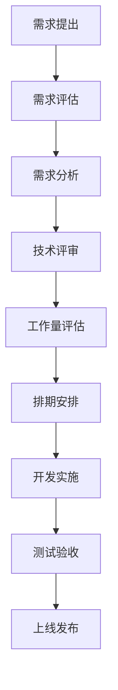

# 团队协作 🤝

> 📋 **团队规范、工作流程、沟通机制**

## 📚 目录说明

本目录包含AI变现之路项目的团队协作规范、工作流程和沟通机制相关文档。

---

## 👥 **团队结构**

### **核心团队组成**

#### **🎯 项目管理组**
- **项目经理**: 统筹项目进度和资源分配
- **产品经理**: 需求分析和产品规划
- **质量保证**: 测试和质量控制

#### **💻 技术开发组**
- **前端开发**: Next.js + TypeScript + UI/UX
- **后端开发**: Strapi + PostgreSQL + API
- **全栈开发**: 跨栈开发和系统集成
- **运维工程师**: 部署、监控和维护

#### **📝 内容运营组**
- **内容编辑**: 文章创作和编辑
- **SEO专员**: 搜索引擎优化
- **社区运营**: 用户互动和社区管理
- **数据分析师**: 数据分析和优化建议

#### **🎨 设计创意组**
- **UI设计师**: 界面设计和视觉规范
- **UX设计师**: 用户体验和交互设计
- **品牌设计师**: 品牌形象和营销物料

---

## 🔄 **工作流程**

### **开发工作流**

#### **需求管理流程**


#### **代码开发流程**
```bash
# 1. 创建功能分支
git checkout -b feature/new-feature

# 2. 开发功能
# - 编写代码
# - 添加测试
# - 更新文档

# 3. 代码检查
npm run lint
npm run test
npm run build

# 4. 提交代码
git add .
git commit -m "feat: add new feature"

# 5. 推送分支
git push origin feature/new-feature

# 6. 创建Pull Request
# - 填写PR描述
# - 请求代码评审
# - 等待评审通过

# 7. 合并主分支
git checkout main
git merge feature/new-feature
git push origin main

# 8. 部署发布
./scripts.sh deploy production
```

### **内容创作流程**

#### **文章发布流程**
```
1. 选题策划 → 2. 资料收集 → 3. 内容创作 → 4. 内容审核 → 5. SEO优化 → 6. 发布上线 → 7. 数据跟踪
```

#### **内容质量标准**
- **原创性**: 100%原创内容，严禁抄袭
- **专业性**: 内容准确，逻辑清晰，具有实用价值
- **可读性**: 结构清晰，语言通俗易懂
- **SEO友好**: 标题优化，关键词布局，内链建设
- **图文并茂**: 配图质量高，排版美观

---

## 📅 **工作安排**

### **工作时间安排**

#### **工作时间**
- **工作日**: 周一至周五 9:00-18:00
- **核心时间**: 10:00-16:00 (团队协作时间)
- **弹性工作**: 支持远程办公和弹性工作时间
- **加班政策**: 非必要不加班，加班需提前申请

#### **会议安排**
- **站会 (Daily Standup)**: 每日9:30，15分钟
- **周会 (Weekly Meeting)**: 每周一10:00，1小时
- **月会 (Monthly Review)**: 每月第一周，2小时
- **季度规划**: 每季度第一周，半天

### **任务分配原则**

#### **任务优先级**
- **P0 紧急重要**: 立即处理，24小时内完成
- **P1 重要不紧急**: 优先安排，3天内完成
- **P2 紧急不重要**: 及时处理，1周内完成
- **P3 不紧急不重要**: 有空处理，1个月内完成

#### **工作量评估**
- **小任务**: 1-4小时，当天完成
- **中任务**: 1-3天，本周完成
- **大任务**: 1-2周，分解后实施
- **项目级**: 1个月+，分阶段实施

---

## 💬 **沟通机制**

### **沟通渠道**

#### **即时沟通**
- **微信群**: 日常工作沟通和信息同步
- **腾讯会议**: 远程会议和技术讨论
- **线下讨论**: 复杂问题面对面沟通
- **邮件**: 正式通知和文档分享

#### **异步沟通**
- **GitHub Issues**: 技术问题和Bug反馈
- **GitHub Discussions**: 技术讨论和知识分享
- **Notion**: 文档协作和知识管理
- **飞书文档**: 项目计划和进度跟踪

### **沟通规范**

#### **消息回复时效**
- **紧急事项**: 30分钟内回复
- **工作事项**: 2小时内回复
- **一般讨论**: 当天内回复
- **非工作时间**: 次日上午回复

#### **会议规范**
```
会议前:
- 提前发送会议议程
- 准备相关资料和数据
- 确认参会人员和时间

会议中:
- 准时参加，控制时间
- 专注讨论，避免跑题
- 记录要点和决策

会议后:
- 发送会议纪要
- 跟进行动项目
- 确认责任人和时间
```

---

## 📋 **协作规范**

### **代码协作规范**

#### **代码风格**
```typescript
// 1. 命名规范
const userName = 'john';          // 变量: camelCase
const MAX_COUNT = 100;            // 常量: UPPER_SNAKE_CASE
function getUserInfo() {}         // 函数: camelCase
class UserService {}              // 类: PascalCase

// 2. 注释规范
/**
 * 获取用户信息
 * @param userId 用户ID
 * @returns 用户信息对象
 */
async function getUserInfo(userId: string): Promise<User> {
  // 实现逻辑
}

// 3. 文件组织
src/
├── components/     # 组件
├── pages/         # 页面
├── utils/         # 工具函数
├── types/         # 类型定义
└── styles/        # 样式文件
```

#### **Git协作规范**
```bash
# 提交信息格式
git commit -m "type(scope): description"

# 类型说明:
feat:     新功能
fix:      Bug修复  
docs:     文档更新
style:    代码格式
refactor: 重构
test:     测试相关
chore:    构建/工具

# 示例:
git commit -m "feat(auth): add user login functionality"
git commit -m "fix(api): resolve data validation issue"
git commit -m "docs(readme): update installation guide"
```

#### **代码评审规范**
```
评审要点:
1. 功能正确性: 代码逻辑是否正确
2. 代码质量: 是否遵循编码规范
3. 性能考虑: 是否存在性能问题
4. 安全性: 是否存在安全隐患
5. 测试覆盖: 是否有相应测试

评审流程:
1. 提交PR时添加详细描述
2. 指定合适的评审人员
3. 评审人在24小时内完成
4. 修改意见及时响应处理
5. 通过评审后方可合并
```

### **文档协作规范**

#### **文档编写规范**
```markdown
# 文档标题使用H1
## 章节标题使用H2
### 小节标题使用H3

- 使用项目符号列举要点
- **重要内容**使用粗体强调
- `代码片段`使用反引号标记
- 链接使用[描述](URL)格式

```代码块需要指定语言```
```

#### **文档维护规范**
- **实时更新**: 功能变更后及时更新相关文档
- **版本控制**: 重要文档使用Git版本控制
- **评审机制**: 重要文档需要团队评审
- **归档管理**: 过期文档及时归档或删除

---

## 🎯 **团队文化**

### **核心价值观**

#### **🚀 追求卓越**
- 不满足于平庸，持续追求更高标准
- 关注细节，精益求精
- 主动学习，保持技术敏感度
- 创新思维，勇于尝试新技术

#### **🤝 团队协作**
- 开放沟通，坦诚相待
- 互相帮助，共同成长
- 承担责任，言出必行
- 尊重差异，包容多元

#### **📈 结果导向**
- 目标明确，执行有力
- 关注成果，而非过程
- 数据驱动，理性决策
- 持续改进，快速迭代

#### **💡 用户中心**
- 深度理解用户需求
- 优先考虑用户体验
- 快速响应用户反馈
- 为用户创造真正价值

### **团队活动**

#### **技术分享**
- **频率**: 每月2次，每次1小时
- **形式**: 轮流分享，主题自选
- **内容**: 新技术、最佳实践、踩坑经验
- **目标**: 技术交流、知识共享、团队成长

#### **代码审查会**
- **频率**: 每周1次，重点代码评审
- **参与**: 全体技术人员
- **内容**: 代码质量、架构设计、性能优化
- **目标**: 提升代码质量、统一编码规范

#### **团队建设**
- **团队聚餐**: 每月1次，增进感情
- **户外活动**: 每季度1次，放松身心
- **技能培训**: 根据需要安排，提升能力
- **年度旅游**: 年底奖励，团队凝聚

---

## 📊 **绩效管理**

### **绩效考核指标**

#### **个人绩效考核**
| 考核维度 | 权重 | 考核内容 |
|---------|------|----------|
| **工作成果** | 40% | 任务完成质量和数量 |
| **技术能力** | 30% | 专业技能和学习成长 |
| **团队协作** | 20% | 沟通协作和团队贡献 |
| **创新思维** | 10% | 创新建议和改进方案 |

#### **团队绩效考核**
- **项目交付**: 按时按质完成项目目标
- **用户满意度**: 产品质量和用户反馈
- **技术指标**: 性能、稳定性、安全性
- **团队成长**: 技能提升和知识积累

### **激励机制**

#### **物质激励**
- **绩效奖金**: 根据考核结果发放
- **项目奖励**: 重要项目完成奖励
- **技术奖励**: 技术创新和分享奖励
- **年终奖**: 年度综合表现奖励

#### **精神激励**
- **技术认可**: 技术专家认证
- **成长机会**: 培训学习和技能提升
- **工作自主**: 工作方式和时间灵活
- **职业发展**: 明确的晋升通道

---

## 🔧 **工具和平台**

### **开发工具**

#### **代码管理**
- **GitHub**: 代码托管和版本控制
- **VS Code**: 统一开发环境
- **ESLint + Prettier**: 代码规范工具
- **Husky**: Git钩子和提交检查

#### **项目管理**
- **GitHub Projects**: 任务管理和看板
- **Notion**: 文档管理和知识库
- **飞书**: 团队协作和文档
- **石墨文档**: 文档协作和共享

#### **设计协作**
- **Figma**: UI设计和原型
- **蓝湖**: 设计稿标注和切图
- **PxCook**: 设计稿测量工具
- **IconFont**: 图标管理平台

### **运维监控**

#### **部署工具**
- **Docker**: 容器化部署
- **GitHub Actions**: 持续集成
- **Nginx**: 反向代理和负载均衡
- **PM2**: Node.js进程管理

#### **监控工具**
- **Google Analytics**: 网站数据分析
- **Search Console**: SEO数据监控
- **Sentry**: 错误监控和报警
- **Uptime Robot**: 服务可用性监控

---

## 📋 **入职指南**

### **新成员入职流程**

#### **第一天**
```
上午:
- 欢迎仪式和团队介绍
- 发放开发设备和账号
- 项目背景和目标介绍
- 开发环境搭建指导

下午:
- 代码库熟悉和讲解
- 开发规范和流程培训
- 第一个小任务安排
- 团队协作工具培训
```

#### **第一周**
- 熟悉项目架构和业务逻辑
- 完成开发环境搭建和测试
- 参与代码评审和技术讨论
- 完成第一个功能开发任务

#### **第一个月**
- 独立完成中等复杂度任务
- 参与需求讨论和技术方案设计
- 了解团队文化和工作方式
- 建立良好的协作关系

### **培训计划**

#### **技术培训**
- **项目技术栈**: Next.js, Strapi, PostgreSQL等
- **开发工具**: Git, VS Code, Docker等
- **编码规范**: ESLint, TypeScript, 测试等
- **部署运维**: CI/CD, 监控, 性能优化等

#### **业务培训**
- **产品理解**: AI变现领域和用户需求
- **业务流程**: 内容创作到变现的全流程
- **竞品分析**: 行业竞争格局和差异化
- **数据指标**: 关键业务指标和分析方法

---

## 🔗 **相关资源**

### **内部资源**
- [开发指南](../开发指南/README.md) - 技术规范和最佳实践
- [项目管理](../项目管理/README.md) - 项目计划和进度跟踪
- [API文档](../API文档/README.md) - 接口文档和调用指南

### **外部资源**
- [GitHub指南](https://guides.github.com/) - Git和GitHub使用指南
- [TypeScript手册](https://www.typescriptlang.org/docs/) - TypeScript官方文档
- [Next.js文档](https://nextjs.org/docs) - Next.js开发指南
- [Strapi文档](https://docs.strapi.io/) - Strapi使用手册

### **学习资源**
- **在线课程**: 慕课网、极客时间、掘金小册
- **技术博客**: 掘金、思否、CSDN、InfoQ
- **开发社区**: Stack Overflow、GitHub、Reddit
- **技术会议**: JSConf、VueConf、ReactConf等

---

**🤝 团队协作 - 让AI变现之路团队高效协作，共创佳绩！**

**📅 最后更新**: 2024年1月  
**📝 维护团队**: 人力资源组  
**🎯 下一步**: 根据团队发展不断优化协作机制