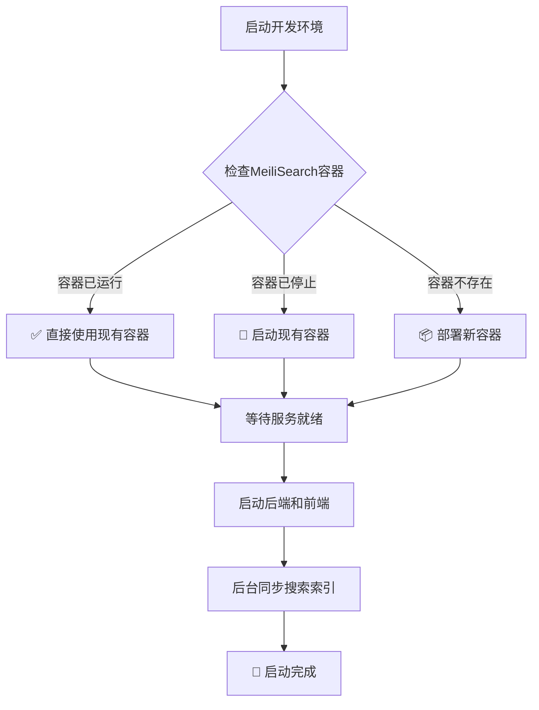
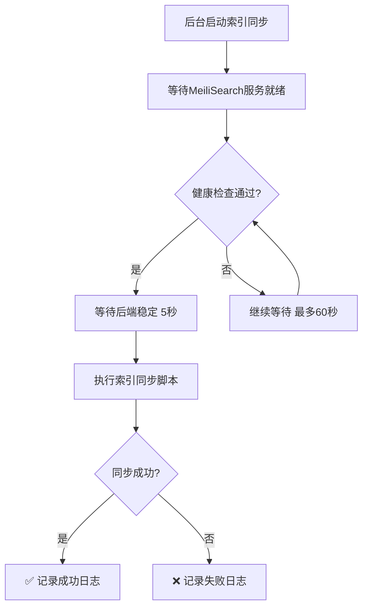

# 🔍 MeiliSearch 自动部署指南

## 📋 概述

AI变现之路的开发环境现在支持 **MeiliSearch 自动部署**，无需手动配置搜索引擎即可享受完整的搜索功能。

## 🚀 自动部署特性

### **启动时自动部署**
```bash
cd /opt/aibianx
./scripts.sh
# 选择：1) 启动完整环境
```

**自动执行流程：**
1. ✅ **智能检查** - 检测现有MeiliSearch容器状态
2. 🔄 **容器管理** - 启动现有容器或部署新容器  
3. 📦 **开发模式部署** - 自动使用开发环境配置
4. 🔧 **环境变量配置** - 自动清理API密钥，配置正确的连接参数
5. 🔍 **索引建立** - 后台自动同步搜索索引
6. 📝 **日志记录** - 完整的部署和同步日志

### **开发环境特性**
- 🌐 **Web管理界面** - 访问 http://localhost:7700
- 🔓 **无需API密钥** - 开发模式免认证
- 💾 **数据持久化** - Docker卷自动保存数据
- 🔄 **自动重启** - 容器异常时自动恢复

## 🔧 自动环境变量配置

### **智能配置机制**

MeiliSearch自动部署会**智能配置环境变量**，确保开发环境的最佳使用体验：

#### **自动清理API密钥**
```bash
# 自动执行的配置优化
✅ 清理后端 MEILISEARCH_API_KEY (开发模式无需密钥)
✅ 清理前端 NEXT_PUBLIC_SEARCH_API_KEY (开发模式无需密钥)
✅ 配置后端搜索URL (localhost:7700)
✅ 配置前端搜索URL (localhost:7700)
```

#### **配置文件自动更新**
- **后端** (`backend/.env`):
  ```bash
  MEILISEARCH_API_KEY=                    # 自动清空
  MEILISEARCH_DOMAIN=localhost            # 自动设置
  MEILISEARCH_PORT=7700                   # 自动设置  
  MEILISEARCH_PROTOCOL=http               # 自动设置
  ```

- **前端** (`frontend/.env.local`):
  ```bash
  NEXT_PUBLIC_SEARCH_API_KEY=             # 自动清空
  NEXT_PUBLIC_SEARCH_DOMAIN=localhost     # 自动设置
  NEXT_PUBLIC_SEARCH_PORT=7700            # 自动设置
  NEXT_PUBLIC_SEARCH_PROTOCOL=http        # 自动设置
  ```

#### **配置时机**
- ✅ **容器已运行** - 检查并更新环境配置
- ✅ **容器重启** - 验证并修正环境配置  
- ✅ **新部署** - 初始化正确的环境配置

#### **安全性保障**
- 🔒 **备份原配置** - 自动创建 `.bak` 备份文件
- 🛡️ **非破坏性修改** - 只更新必要的配置项
- 🔄 **可逆操作** - 可通过备份文件恢复原配置

## 🔧 配置选项

### **环境变量控制**
```bash
# 在 backend/.env 或 frontend/.env.local 中设置
AUTO_SYNC_SEARCH=true   # 启用自动索引同步 (默认)
AUTO_SYNC_SEARCH=false  # 禁用自动索引同步
```

### **Docker配置**
```bash
# MeiliSearch容器配置
容器名: meilisearch
端口映射: 7700:7700
环境模式: MEILI_ENV=development
数据卷: meilisearch_data:/meili_data
重启策略: unless-stopped
```

## 📊 监控和管理

### **实时状态检查**
```bash
# 检查MeiliSearch状态
./scripts.sh search check

# 访问Web管理界面
open http://localhost:7700
```

### **日志监控**
```bash
# 查看搜索索引同步日志
tail -f logs/search-sync.log

# 查看Docker容器日志
docker logs meilisearch
```

### **手动管理**
```bash
# 手动重建索引
./scripts.sh search manage

# 重启MeiliSearch容器  
./scripts.sh search restart

# 手动部署（如需自定义配置）
./scripts.sh search deploy
```

## 🎯 启动流程详解

### **智能检测流程**


### **索引同步流程**


## 📋 故障排查

### **常见问题**

#### **MeiliSearch部署失败**
```bash
# 检查Docker状态
docker ps -a | grep meilisearch

# 查看容器日志
docker logs meilisearch

# 手动清理重新部署
docker stop meilisearch && docker rm meilisearch
./scripts.sh search deploy
```

#### **索引同步失败**
```bash
# 查看同步日志
cat logs/search-sync.log

# 手动执行索引同步
./scripts/search/quick-reindex.sh

# 检查后端API连接
curl http://localhost:1337/api/articles
```

#### **Web管理界面无法访问**
```bash
# 确认容器运行状态
docker ps | grep meilisearch

# 确认端口映射
docker port meilisearch

# 直接测试健康状态
curl http://localhost:7700/health
```

#### **环境变量配置问题**
```bash
# 检查当前配置状态
grep -E "MEILISEARCH|SEARCH" backend/.env
grep -E "SEARCH|MEILISEARCH" frontend/.env.local

# 手动执行环境变量配置（如自动配置失败）
sed -i.bak "s/^MEILISEARCH_API_KEY=.*/MEILISEARCH_API_KEY=/" backend/.env
sed -i.bak "s/^NEXT_PUBLIC_SEARCH_API_KEY=.*/NEXT_PUBLIC_SEARCH_API_KEY=/" frontend/.env.local

# 查看配置备份文件
ls -la backend/.env.bak* frontend/.env.local.bak*

# 恢复配置 (如需要)
cp backend/.env.bak backend/.env
cp frontend/.env.local.bak frontend/.env.local
```

## 🔧 高级配置

### **自定义MeiliSearch配置**
如需自定义配置，可以：

1. **停用自动部署**：编辑 `start-dev.sh`，注释掉 `deploy_meilisearch` 调用
2. **手动部署**：使用 `./scripts.sh search deploy` 选择不同模式
3. **环境变量**：在 `backend/.env` 中添加自定义MeiliSearch配置

### **生产环境注意事项**
- 🚫 **自动部署仅限开发环境** - 生产环境需要手动配置安全密钥
- 🔐 **API密钥管理** - 生产环境必须配置Master Key
- 🛡️ **安全配置** - 生产模式会禁用Web管理界面

## 📈 性能优化

### **资源使用**
- **内存使用**: ~50-100MB (开发模式)
- **磁盘空间**: 根据索引数据量动态增长
- **CPU占用**: 索引建立时短暂较高

### **优化建议**
- 🔄 **定期清理**: 删除不需要的旧索引
- 📊 **监控资源**: 定期检查Docker容器资源使用
- ⚡ **批量更新**: 避免频繁的单条数据更新

## 🎯 总结

通过自动部署功能，开发者可以：
- ✅ **零配置启动** - 无需手动设置搜索引擎
- 🔧 **智能环境配置** - 自动清理API密钥，设置正确连接参数
- 🚀 **快速开发** - 专注业务逻辑而非基础设施
- 🔍 **完整功能** - 享受全功能搜索和管理界面
- 📝 **透明运行** - 完整的日志和监控支持
- 🔒 **安全保障** - 自动备份配置，支持一键恢复

**现在只需执行 `./scripts.sh` 选择启动完整环境，即可自动享受MeiliSearch的强大搜索功能！** 🎉