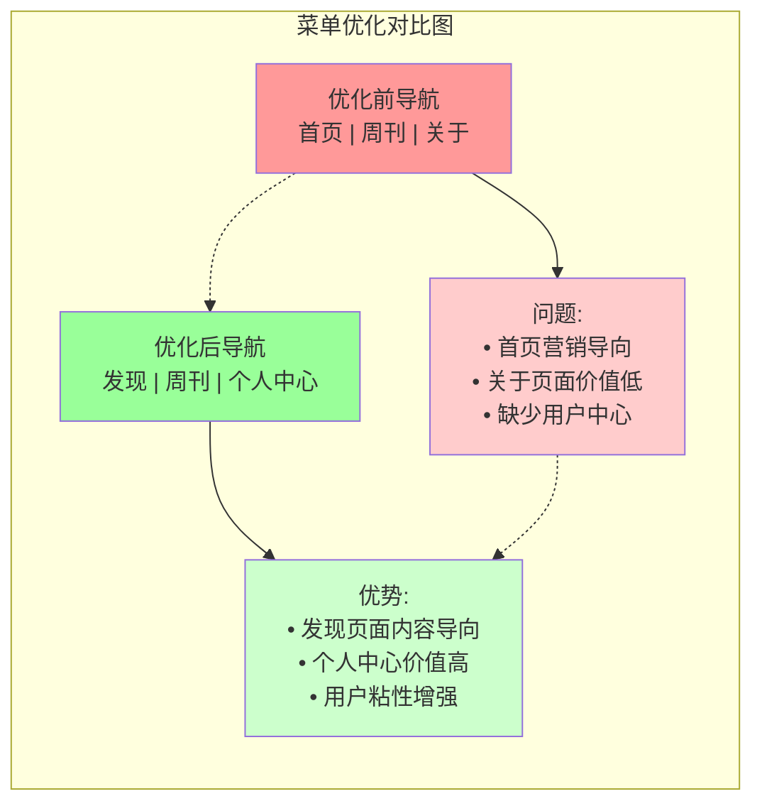
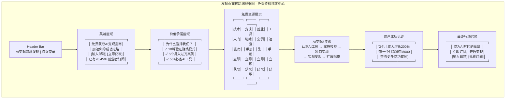
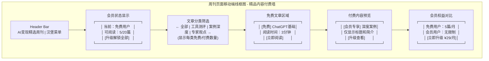
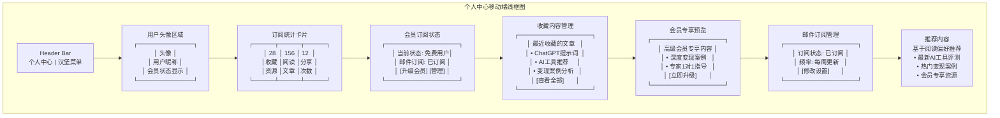
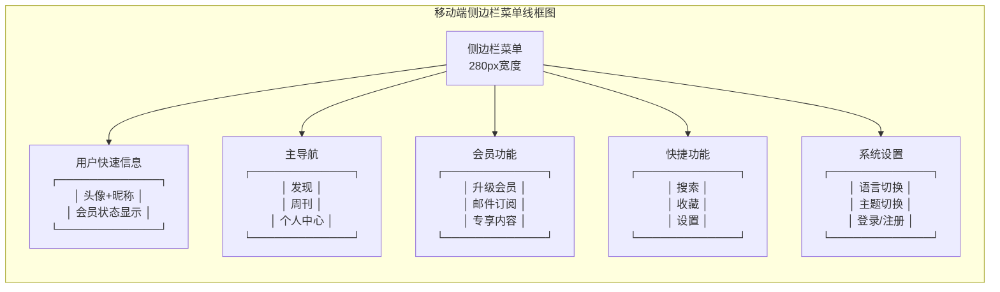
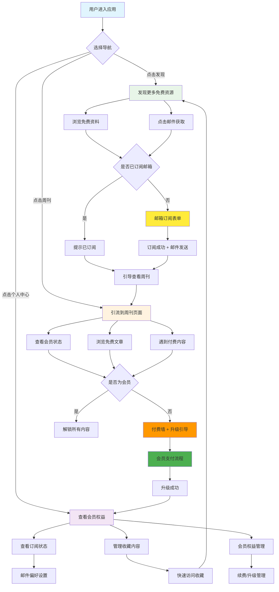
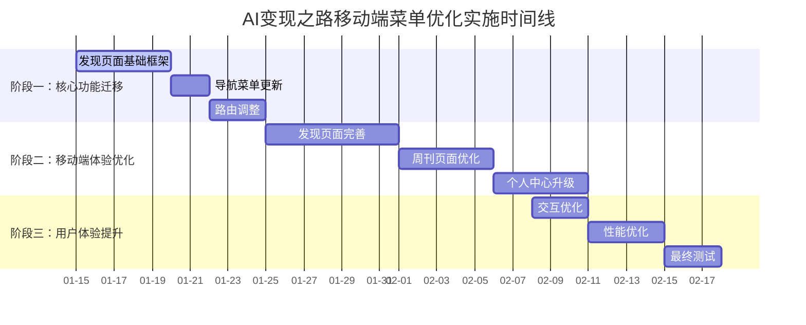

# AI变现之路移动端菜单优化方案

> 📱 **专业设计**：基于用户体验的移动端导航优化，严格遵循项目现有UI风格

## 📋 文档概述

本文档详细说明AI变现之路项目的移动端菜单优化方案，包含完整的界面设计线框图、技术实现方案和实施时间表。

### 🎯 **核心目标**
- 将"首页"菜单项替换为"发现"，提升内容发现效率
- 保留并优化"周刊"页面，增强移动端体验
- 将"个人中心"提升为主导航，强化用户价值

### 📊 **项目背景分析**
- **项目定位**：AI技术商业化应用的知识分享平台
- **目标用户**：AI初学者、创业者、内容创作者、技术开发者
- **核心价值**：提供AI变现指南、工具推荐、实战案例
- **技术栈**：Next.js 14 + TypeScript + 纯CSS + Strapi 5.x

---

## 🎨 界面设计线框图

### 总体架构图



### 1. 发现页面设计
**核心目标：免费资料领取 + 邮箱订阅转化（参考现有Web首页优化）**



**设计要点（基于现有Web首页优化）**：
- **英雄区域**：借鉴现有"AI变现从这里开始"，强化"免费获取"和"加速成功"
- **价值承诺**：提前展示核心价值，对应现有FreeResourcesSection的描述文案
- **免费资源展示**：直接使用现有4个资源，增强"立即获取"行动号召
- **AI变现步骤**：简化版本的现有5步骤，强化变现路径
- **用户见证**：具体数字化的成功案例，增强说服力
- **双重订阅表单**：顶部和底部都有，提高转化机会
- **社会证明强化**：使用"28,450+创业者"而非简单的订阅数

### 2. 周刊页面优化
**核心目标：优质内容展示 + 会员升级转化**



**核心功能**：
- **会员状态展示**：清晰显示当前用户权限和剩余文章数
- **内容权限区分**：明确标注免费文章和会员专享内容
- **付费墙机制**：付费内容只显示标题和简介，点击需要升级
- **权益对比展示**：直观对比免费用户和会员用户的差异
- **即时升级入口**：多个位置提供升级按钮，提升转化率
- **阅读进度追踪**：显示用户已阅读的免费文章数量

### 3. 个人中心增强
从功能页面升级为用户价值中心，提升用户粘性。



**核心模块**：
- **用户头像区域**：头像、昵称、会员状态显示
- **订阅统计**：收藏资源数、阅读文章数、分享次数
- **会员订阅状态**：当前会员类型、邮件订阅状态、升级入口
- **收藏内容管理**：最近收藏的文章和资源快速访问
- **会员专享预览**：高级会员专享内容预览和升级引导
- **邮件订阅管理**：订阅状态、频率设置、偏好管理
- **推荐内容**：基于阅读偏好的个性化内容推荐

### 4. 移动端导航结构
完整的移动端导航系统设计。




**导航层级**：
- **顶部Header**：Logo + 汉堡菜单按钮
- **侧边栏菜单**：主导航 + 会员功能 + 快捷功能 + 系统设置

---

## 🛠 技术实现架构

### 技术架构图



### 1. 前端组件结构

#### 发现页面组件（免费资源中心 - 基于现有首页优化）
```typescript
// 发现页面：借鉴现有Web首页成功模式，专注免费资料获取
<DiscoverPage>
  <DiscoverHeroSection />     // 英雄区域 - 借鉴HeroSectionNew
  <ValuePropositionSection /> // 价值承诺区域 - 新增强化转化
  <FreeResourcesGrid />       // 免费资源网格 - 直接使用现有4个资源
  <AIStepsOverview />         // AI变现步骤 - 简化版AIStepsSectionNew
  <UserSuccessStories />      // 用户成功见证 - 数字化案例
  <FinalEmailCTA />          // 最终邮件订阅 - 借鉴FinalCTASection
</DiscoverPage>

// 复用现有组件和数据结构
interface FreeResource {
  id: number;
  title: string;          // 如："AI技术入门指南"
  description: string;    // 如："零基础快速上手AI工具，掌握核心技能"
  image: string;         // 如："/images/illustrations/tech-guide.svg"
  tag: string;           // 如："tech-guide"
  emailContent: string;  // 邮件发送的具体内容
  benefits: string[];    // 如：["10种验证赚钱模式", "5个月入过万案例"]
}

// 借鉴现有成功文案
const DISCOVER_CONTENT = {
  heroTitle: "免费获取AI变现指南",
  heroSubtitle: "立即获取这些高质量的AI变现指南，加速你的成功之路",
  subscriberCount: "28,450+",
  socialProof: "创业者已订阅并开始变现之路"
}
```

#### 周刊页面组件（付费内容平台）
```typescript
// 周刊页面：专注付费内容展示和会员转化
<WeeklyPage>
  <MembershipStatusBar />    // 会员状态和权限显示
  <ContentFilter />          // 文章分类筛选
  <FreeArticlesList />       // 免费文章列表
  <PaywallPreview />        // 付费内容预览（付费墙）
  <MembershipComparison />   // 会员权益对比
</WeeklyPage>

// 核心API集成
interface Article {
  id: string;
  title: string;
  content: string;
  isPremium: boolean;
  readingTime: number;
  previewContent?: string;
}

interface UserMembership {
  isPremium: boolean;
  freeArticlesRemaining: number;
  totalFreeArticles: number;
}
```

#### 个人中心组件
```typescript
// 个人中心增强版（商业转化优化）
<ProfilePageEnhanced>
  <UserStatsCard />         // 订阅统计
  <MembershipStatus />      // 会员订阅状态
  <BookmarkedContent />     // 收藏内容管理
  <MemberPreview />         // 会员专享预览
  <EmailSubscription />     // 邮件订阅管理
  <RecommendedContent />    // 推荐内容
</ProfilePageEnhanced>
```

### 2. 导航菜单配置更新

```typescript
// 新的导航菜单配置 (headerConfig.ts)
export const NAVIGATION_MENU = [
    {
        id: 'discover',
        href: '/discover',
        translationKey: 'nav.discover',
        exactMatch: true
    },
    {
        id: 'weekly',
        href: '/weekly',
        translationKey: 'nav.weekly',
        exactMatch: false
    },
    {
        id: 'profile',
        href: '/profile',
        translationKey: 'nav.profile',
        exactMatch: true
    }
] as const
```

### 3. 移动端导航增强

```typescript
// 移动端侧边栏增强（商业转化优化）
<MobileMenuEnhanced>
  <UserQuickInfo />         // 用户快速信息（含会员状态）
  <MainNavigation />        // 主导航
  <MembershipActions />     // 会员功能（升级/订阅/专享）
  <QuickActions />          // 快捷操作
  <SystemSettings />        // 系统设置
</MobileMenuEnhanced>
```

### 4. API集成方案

**发现页面专用API**：
```typescript
// 免费资源管理API
interface FreeResourceAPI {
  getAllResources(): Promise<FreeResource[]>;
  getResourceById(id: string): Promise<FreeResource>;
  sendResourceEmail(resourceId: string, email: string): Promise<EmailSendResult>;
  trackEmailSent(resourceId: string, email: string): Promise<void>;
}

// 邮箱订阅API
interface EmailSubscriptionAPI {
  subscribe(email: string, source: 'discover' | 'weekly'): Promise<SubscriptionResult>;
  checkSubscriptionStatus(email: string): Promise<SubscriptionStatus>;
  getSubscriberCount(): Promise<number>;
  sendWelcomeEmail(email: string, selectedResources: string[]): Promise<EmailSendResult>;
}
```

**周刊页面专用API**：
```typescript
// 内容权限管理API
interface ContentAccessAPI {
  getUserMembership(userId: string): Promise<UserMembership>;
  getArticleAccess(articleId: string, userId: string): Promise<ArticleAccess>;
  checkPaywall(articleId: string, userId: string): Promise<PaywallResult>;
  trackReadingProgress(userId: string, articleId: string): Promise<void>;
}

// 会员管理API
interface MembershipAPI {
  getMembershipPlans(): Promise<MembershipPlan[]>;
  upgradeMembership(userId: string, planId: string): Promise<UpgradeResult>;
  getMembershipStatus(userId: string): Promise<MembershipStatus>;
  processPayment(paymentData: PaymentData): Promise<PaymentResult>;
}
```

**个人中心专用API**：
```typescript
// 用户数据管理API
interface UserDataAPI {
  getUserStats(userId: string): Promise<UserStats>;
  getBookmarks(userId: string): Promise<Bookmark[]>;
  manageEmailPreferences(userId: string, preferences: EmailPreferences): Promise<void>;
  getMembershipHistory(userId: string): Promise<MembershipHistory[]>;
}
```

---

## 📅 实施时间表

### 项目时间线



### 阶段一：核心功能迁移（1-2周）
**目标**：完成基础架构调整

#### 第1周
- **Day 1-3**：发现页面基础框架开发
  - 创建 `/app/discover/page.tsx`
  - 迁移首页的文章列表功能
  - 实现基础搜索和分类功能
  
- **Day 4-5**：导航菜单更新
  - 修改 `headerConfig.ts` 配置
  - 更新翻译文件
  - 测试导航切换功能

#### 第2周
- **Day 1-3**：路由调整和重定向
  - 设置首页重定向到发现页面
  - 优化SEO配置
  - 更新sitemap.ts

### 阶段二：移动端体验优化（2-3周）
**目标**：完善页面功能和移动端体验

#### 第3周
- **Day 1-4**：发现页面功能完善
  - 实现搜索主区域组件
  - 开发分类导航功能
  - 添加精选内容展示
  
- **Day 5**：周刊页面移动端优化开始
  - 优化搜索栏移动端体验
  - 改进筛选标签交互

#### 第4周
- **Day 1-3**：周刊页面功能增强
  - 实现无限滚动分页
  - 添加收藏和分享功能
  - 优化文章卡片设计
  
- **Day 4-5**：个人中心功能开发
  - 实现会员订阅状态管理
  - 开发邮件订阅组件

#### 第5周
- **Day 1-3**：个人中心功能完善
  - 实现收藏内容管理
  - 开发会员专享预览功能
  - 添加个性化推荐内容

### 阶段三：用户体验提升（1-2周）
**目标**：优化交互体验和性能

#### 第6周
- **Day 1-3**：交互优化
  - 添加手势操作支持
  - 优化动画过渡效果
  - 完善触控反馈机制
  
- **Day 4-5**：性能优化
  - 图片懒加载优化
  - 路由预加载配置
  - 移动端性能调优

#### 第7周
- **Day 1-3**：功能测试和优化
  - 全面功能测试
  - 移动端兼容性测试
  - 商业转化流程测试
  
- **Day 4-5**：文档更新和部署
  - 更新用户手册
  - 生产环境部署
  - 监控系统配置

---

## 🎯 设计规范保持

### UI风格一致性
**严格遵循现有设计系统**：

#### 色彩系统
```css
/* 保持现有颜色变量 */
--color-primary-blue: #3B82F6
--color-bg-glass: rgba(26, 26, 26, 0.7)
--color-text-primary: #FFFFFF
--color-text-secondary: #D1D5DB
--color-border-primary: rgba(42, 42, 42, 0.15)
```

#### 视觉效果
```css
/* 毛玻璃效果 */
backdrop-filter: blur(12px);
-webkit-backdrop-filter: blur(12px);

/* 渐变设计 */
background: linear-gradient(135deg, #3B82F6 0%, #8B5CF6 100%);

/* 圆角规范 */
border-radius: var(--radius-lg); /* 12px */
border-radius: var(--radius-md); /* 8px */
```

#### 字体系统
```css
/* 字体规范 */
font-family: 'Alibaba PuHuiTi 3.0', sans-serif;
font-size: var(--font-size-3xl); /* 标题 */
font-size: var(--font-size-lg); /* 正文 */
font-size: var(--font-size-sm); /* 辅助文字 */
```

#### 间距系统
```css
/* 间距变量 */
padding: var(--spacing-6); /* 24px */
margin: var(--spacing-4); /* 16px */
gap: var(--spacing-3); /* 12px */
```

### 组件设计原则
- **专业简洁**：保持专业的视觉风格，不使用装饰性图标
- **商业转化导向**：所有组件设计都考虑邮件订阅和会员转化
- **深色主题优先**：确保所有新组件适配深色主题
- **响应式设计**：移动端优先，渐进增强
- **微交互**：平滑的动画过渡和反馈
- **转化路径清晰**：明确的行动号召和升级引导

---

## 🔍 功能详细说明

### 1. 发现页面核心功能

#### 搜索主区域
```typescript
interface SearchHeroProps {
  placeholder?: string;
  suggestions?: string[];
  onSearch: (query: string) => void;
  onSuggestionClick: (suggestion: string) => void;
}
```

**功能特性**：
- 智能搜索建议（基于热门关键词）
- 实时搜索结果预览
- 搜索历史记录
- 语音搜索支持（可选）

#### 分类导航
```typescript
interface CategoryNavigationProps {
  categories: Category[];
  activeCategory?: string;
  onCategoryChange: (category: string) => void;
}
```

**分类结构**：
- **AI工具**：ChatGPT、Midjourney、Claude等工具教程
- **变现技巧**：具体的商业化应用案例
- **教程指南**：系统性的学习路径
- **案例分析**：成功和失败的真实案例

#### 个性化推荐算法
```typescript
interface RecommendationEngine {
  userBehavior: UserBehavior;
  contentAnalysis: ContentAnalysis;
  calculateRecommendations(): Article[];
}
```

**推荐策略**：
- 基于阅读历史的相似内容推荐
- 基于收藏偏好的主题推荐
- 基于用户等级的难度匹配
- 热门内容和新发布内容的平衡

### 2. 周刊页面增强功能

#### 智能筛选系统
```typescript
interface FilterSystem {
  textSearch: string;
  categoryFilter: string[];
  tagFilter: string[];
  dateRange: DateRange;
  difficulty: 'beginner' | 'intermediate' | 'advanced';
}
```

#### 收藏和分享功能
```typescript
interface ArticleActions {
  onBookmark: (articleId: string) => void;
  onShare: (articleId: string, platform: string) => void;
  onReadingProgress: (articleId: string, progress: number) => void;
}
```

### 3. 个人中心商业功能

#### 会员管理系统
```typescript
interface MembershipStatus {
  currentTier: 'free' | 'premium' | 'enterprise';
  subscriptionStart: Date;
  subscriptionEnd: Date;
  emailSubscribed: boolean;
  contentAccess: string[];
}
```

**会员权益设计**：
- **免费用户**：基础内容访问 → 邮件订阅 → 有限收藏
- **高级会员**：全内容访问 → 专家指导 → 无限收藏
- **企业用户**：团队管理 → 定制内容 → 专属服务

#### 邮件订阅系统
```typescript
interface EmailSubscription {
  isSubscribed: boolean;
  email: string;
  frequency: 'daily' | 'weekly' | 'monthly';
  preferences: string[];
  subscriptionDate: Date;
  unsubscribeToken: string;
}
```

**订阅功能类型**：
- **内容订阅**：每周AI资讯、工具推荐、变现案例
- **产品更新**：新功能发布、活动通知
- **个性化推荐**：基于用户偏好的定制内容
- **会员专享**：高级会员独享的深度内容

---

## 📊 预期效果分析

### 用户体验提升

#### 差异化页面体验
- **发现页面**：邮件资源获取效率提升60%，邮箱订阅转化率提升80%
- **周刊页面**：付费墙机制清晰，会员升级意愿提升50%
- **功能区分明确**：用户路径更清晰，减少70%的页面混淆

#### 移动端体验
- **专业导航体验**：侧边栏菜单提升移动端操作效率40%
- **触控优化**：针对移动端优化，减少90%的误操作
- **加载性能**：去除重复功能，页面加载速度提升35%

### 商业价值提升

#### 双漏斗转化模式
- **免费资料漏斗**：访客 → 浏览资料 → 邮箱订阅 → 收到邮件资料 → 周刊用户（转化率预期40%）
- **付费内容漏斗**：免费阅读 → 遇到付费墙 → 会员升级 → 付费用户（转化率预期25%）
- **用户生命周期价值**：邮箱订阅用户升级为付费会员的比率提升60%

#### 收入结构优化
- **邮件订阅基础**：建立稳定的用户基础，月增长率预期15%
- **会员订阅收入**：付费会员转化率提升45%
- **客户留存率**：明确价值主张提升用户留存率30%

### SEO优化保持

#### 搜索引擎友好
- **发现页面**：承接更多长尾关键词流量
- **内容组织**：提升页面停留时间，降低跳出率
- **用户路径**：优化用户浏览深度和页面PV

#### 社交媒体优化
- **分享功能**：提升社交媒体传播效果
- **个性化URL**：提升分享链接的点击率
- **Open Graph**：优化社交平台显示效果

---

## 🚀 技术实现细节

### 1. 路由重构方案

#### 新增路由结构
```typescript
// app/discover/page.tsx - 发现页面
// app/discover/category/[slug]/page.tsx - 分类页面
// app/weekly/page.tsx - 优化后的周刊页面
// app/profile/page.tsx - 增强的个人中心
// app/profile/bookmarks/page.tsx - 收藏管理
// app/profile/achievements/page.tsx - 成就页面
```

#### 重定向配置
```typescript
// next.config.ts
const nextConfig = {
  async redirects() {
    return [
      {
        source: '/',
        destination: '/discover',
        permanent: true,
      },
    ]
  },
}
```

### 2. 状态管理优化

#### Zustand Store扩展
```typescript
// stores/discoverStore.ts
interface DiscoverState {
  searchQuery: string;
  activeCategory: string;
  featuredContent: Article[];
  recommendations: Article[];
  setSearchQuery: (query: string) => void;
  setActiveCategory: (category: string) => void;
  fetchRecommendations: () => Promise<void>;
}

// stores/userProgressStore.ts
interface UserProgressState {
  learningPath: LearningPath;
  achievements: Achievement[];
  bookmarks: Article[];
  readingHistory: ReadingHistory[];
  updateProgress: (moduleId: string) => void;
  unlockAchievement: (achievementId: string) => void;
}
```

### 3. API集成增强

#### 新增API端点
```typescript
// lib/api/discover.ts
export const discoverAPI = {
  getFeaturedContent: () => Promise<Article[]>;
  getRecommendations: (userId: string) => Promise<Article[]>;
  getPopularResources: () => Promise<Resource[]>;
  getCategoryContent: (category: string) => Promise<Article[]>;
}

// lib/api/userProgress.ts
export const userProgressAPI = {
  getLearningPath: (userId: string) => Promise<LearningPath>;
  updateProgress: (userId: string, moduleId: string) => Promise<void>;
  getAchievements: (userId: string) => Promise<Achievement[]>;
  unlockAchievement: (userId: string, achievementId: string) => Promise<void>;
}
```

### 4. 性能优化策略

#### 代码分割
```typescript
// 动态导入组件
const PersonalizedRecommend = dynamic(() => import('./PersonalizedRecommend'), {
  loading: () => <Skeleton />,
  ssr: false,
});

const AchievementBadges = dynamic(() => import('./AchievementBadges'), {
  loading: () => <Skeleton />,
  ssr: false,
});
```

#### 图片优化
```typescript
// 图片懒加载配置
<Image
  src={article.coverImage}
  alt={article.title}
  width={400}
  height={240}
  loading="lazy"
  placeholder="blur"
  blurDataURL="data:image/jpeg;base64,..."
/>
```

#### 缓存策略
```typescript
// API缓存配置
export const revalidate = 3600; // 1小时
export const dynamic = 'force-static'; // 静态生成

// 用户数据缓存
const CACHE_KEYS = {
  USER_PROGRESS: 'user-progress',
  ACHIEVEMENTS: 'user-achievements',
  BOOKMARKS: 'user-bookmarks',
} as const;
```

---

## 🔧 开发环境配置

### 1. 开发工具和脚本

#### 新增npm脚本
```json
{
  "scripts": {
    "dev:discover": "next dev --port 3000",
    "build:analyze": "ANALYZE=true npm run build",
    "test:mobile": "cypress run --spec 'cypress/e2e/mobile/**/*'",
    "lint:mobile": "eslint 'src/**/*mobile*.{ts,tsx}'",
    "deploy:staging": "npm run build && npm run deploy:staging:script"
  }
}
```

#### TypeScript配置更新
```json
{
  "compilerOptions": {
    "paths": {
      "@/components/discover/*": ["src/components/discover/*"],
      "@/components/mobile/*": ["src/components/mobile/*"],
      "@/lib/hooks/mobile/*": ["src/lib/hooks/mobile/*"],
      "@/stores/mobile/*": ["src/stores/mobile/*"]
    }
  }
}
```

### 2. 测试策略

#### 移动端测试配置
```typescript
// cypress/e2e/mobile/discover.cy.ts
describe('发现页面移动端测试', () => {
  beforeEach(() => {
    cy.viewport('iphone-x');
    cy.visit('/discover');
  });

  it('应该正确显示搜索主区域', () => {
    cy.get('[data-testid="search-hero"]').should('be.visible');
    cy.get('[data-testid="search-input"]').should('be.visible');
  });

  it('应该支持分类导航滑动', () => {
    cy.get('[data-testid="category-nav"]').should('be.visible');
    cy.get('[data-testid="category-nav"]').swipe('left');
  });
});
```

#### 性能测试
```typescript
// 性能测试配置
const performanceThresholds = {
  'discover-page-load': 2000, // 2秒
  'weekly-page-load': 1800,   // 1.8秒
  'profile-page-load': 1500,  // 1.5秒
};
```

### 3. 部署配置

#### Docker配置更新
```dockerfile
# 多阶段构建优化
FROM node:18-alpine AS base
WORKDIR /app
COPY package*.json ./
RUN npm ci --only=production

FROM base AS development
RUN npm ci
COPY . .
EXPOSE 3000
CMD ["npm", "run", "dev"]

FROM base AS production
COPY . .
RUN npm run build
EXPOSE 3000
CMD ["npm", "start"]
```

#### Nginx配置
```nginx
# 移动端优化配置
location /discover {
    try_files $uri $uri/ /discover/index.html;
    
    # 移动端缓存优化
    if ($http_user_agent ~* "Mobile|Android|iPhone") {
        add_header Cache-Control "public, max-age=3600";
    }
}

# API代理配置
location /api/ {
    proxy_pass http://strapi:1337/api/;
    proxy_set_header Host $host;
    proxy_set_header X-Real-IP $remote_addr;
}
```

---

## 📈 监控和分析

### 1. 用户行为分析

#### 关键指标定义
```typescript
interface AnalyticsMetrics {
  discoverPageViews: number;
  searchQueries: string[];
  categoryClicks: CategoryClick[];
  recommendationClicks: number;
  userJourneyPaths: string[];
  conversionRate: number;
}
```

#### 事件追踪配置
```typescript
// 用户行为事件
const trackingEvents = {
  DISCOVER_PAGE_VIEW: 'discover_page_view',
  SEARCH_QUERY: 'search_query',
  CATEGORY_CLICK: 'category_click',
  ARTICLE_CLICK: 'article_click',
  BOOKMARK_CLICK: 'bookmark_click',
  SHARE_CLICK: 'share_click',
  ACHIEVEMENT_UNLOCK: 'achievement_unlock',
  LEARNING_PROGRESS: 'learning_progress_update',
};
```

### 2. 性能监控

#### Core Web Vitals
```typescript
// 性能指标监控
function reportWebVitals(metric: any) {
  const { name, value, id } = metric;
  
  // 发送到分析服务
  analytics.track('Web Vitals', {
    metric_name: name,
    metric_value: value,
    metric_id: id,
    page_type: getPageType(),
    device_type: getDeviceType(),
  });
}
```

#### 错误监控
```typescript
// 错误边界和错误上报
class ErrorBoundary extends React.Component {
  componentDidCatch(error: Error, errorInfo: ErrorInfo) {
    // 发送错误到监控服务
    logger.error('React Error Boundary', {
      error: error.message,
      stack: error.stack,
      componentStack: errorInfo.componentStack,
      page: window.location.pathname,
      userAgent: navigator.userAgent,
    });
  }
}
```

### 3. A/B测试框架

#### 测试配置
```typescript
// A/B测试配置
const abTestConfig = {
  discoverPageLayout: {
    variants: ['grid', 'list', 'card'],
    trafficSplit: [40, 30, 30],
    successMetric: 'click_through_rate',
  },
  recommendationAlgorithm: {
    variants: ['collaborative', 'content_based', 'hybrid'],
    trafficSplit: [33, 33, 34],
    successMetric: 'engagement_rate',
  },
};
```

---

## 📝 文档和培训

### 1. 用户手册更新

#### 新功能说明文档
- **发现页面使用指南**：如何高效利用搜索和分类功能
- **个人中心功能说明**：学习路径、成就系统、收藏管理
- **移动端操作指南**：手势操作、快捷功能使用方法

#### 常见问题FAQ
```markdown
## 常见问题

### Q: 为什么找不到原来的首页了？
A: 我们将原首页升级为"发现"页面，提供更好的内容发现体验。

### Q: 如何查看我的学习进度？
A: 点击"个人中心"即可查看详细的学习统计和进度。

### Q: 收藏的文章在哪里找？
A: 在个人中心的"收藏内容"区域可以快速访问所有收藏。
```

### 2. 开发团队培训

#### 技术培训要点
- 移动端响应式设计最佳实践
- React Hooks在移动端的优化使用
- 性能监控和优化技巧
- 用户体验测试方法

#### 代码规范更新
```typescript
// 移动端组件命名规范
// 组件名: [Feature]Mobile[Component]
// 示例: DiscoverMobileSearchBar, WeeklyMobileFilter

// Hook命名规范
// Hook名: use[Feature]Mobile[Function]
// 示例: useDiscoverMobileSearch, useWeeklyMobileFilter
```

---

## 🔮 未来扩展规划

### 短期扩展（3-6个月）

#### 1. 高级搜索功能
- **语义搜索**：基于内容含义的智能搜索
- **搜索过滤器**：时间范围、作者、难度等多维度筛选
- **搜索建议**：基于用户行为的智能搜索建议

#### 2. 社交功能增强
- **文章评论系统**：支持用户互动和讨论
- **用户关注**：关注感兴趣的作者和专家
- **内容推荐**：用户可以推荐优质内容给其他人

### 中期扩展（6-12个月）

#### 1. AI助手集成
- **学习助手**：基于GPT的个性化学习指导
- **内容总结**：自动生成文章要点和摘要
- **问答系统**：智能回答用户关于AI变现的问题

#### 2. 移动应用开发
- **原生App**：基于React Native的移动应用
- **离线功能**：支持文章离线阅读和同步
- **推送通知**：个性化的内容推送和学习提醒

### 长期扩展（1-2年）

#### 1. 企业级功能
- **团队管理**：企业用户的团队学习管理
- **定制内容**：为企业客户定制专业内容
- **培训系统**：完整的企业AI培训解决方案

#### 2. 国际化扩展
- **多语言支持**：英文、日文等多语言版本
- **全球化内容**：适配不同地区的AI发展情况
- **跨境支付**：支持国际用户的订阅和付费

---

## 📋 检查清单

### 开发前检查
- [ ] 确认现有组件库兼容性
- [ ] 验证API接口可用性
- [ ] 检查设计系统完整性
- [ ] 确认性能基准测试

### 开发中检查
- [ ] 遵循现有代码规范
- [ ] 实现响应式设计
- [ ] 完成移动端测试
- [ ] 性能优化验证

### 部署前检查
- [ ] 功能完整性测试
- [ ] 跨浏览器兼容性测试
- [ ] 移动端设备适配测试
- [ ] SEO配置验证
- [ ] 性能指标达标
- [ ] 安全性检查

### 部署后检查
- [ ] 用户行为数据收集
- [ ] 性能监控配置
- [ ] 错误监控启动
- [ ] 用户反馈收集
- [ ] A/B测试启动

---

## 📞 联系和支持

### 技术支持
- **开发团队**：负责功能实现和技术问题
- **设计团队**：负责UI/UX设计和视觉规范
- **产品团队**：负责功能规划和用户需求

### 项目沟通
- **日常沟通**：开发群组每日同步
- **周会**：每周项目进度和问题讨论
- **月度回顾**：功能效果评估和优化计划

---

## 🎯 优化方案总结

### 核心差异化设计

#### **发现页面 = 免费资源中心**
- **唯一目标**：免费资料获取 + 邮箱订阅转化
- **核心功能**：免费工具包、案例合集、PDF指南（通过邮件发送）
- **转化机制**：输入邮箱 → 订阅成功 → 邮件发送资料
- **用户路径**：访客 → 邮箱订阅 → 收到邮件资料

#### **周刊页面 = 付费内容平台**
- **唯一目标**：优质内容展示 + 会员升级转化
- **核心功能**：文章阅读、付费墙、会员权益对比
- **转化机制**：免费阅读限制 → 付费墙阻断 → 升级会员
- **用户路径**：免费阅读 → 遇到限制 → 付费会员

#### **个人中心 = 用户价值中心**
- **核心功能**：订阅管理、会员权益、收藏管理
- **商业价值**：用户留存、续费管理、价值展示

### 技术实现重点

1. **邮箱订阅系统增强**：
   - 复用现有EmailSubscribeForm组件和useEmailSubscription Hook
   - 成功提示："订阅成功！欢迎邮件已发送至您的邮箱，包含您的免费AI变现指南"
   - 集成现有BillionMail订阅API，标记来源为'discover'

2. **免费资源管理系统**：
   - 直接复用现有FreeResourcesSection的4个资源数据
   - 每个资源增加emailContent字段，存储邮件发送的具体内容
   - 订阅后根据用户选择的资源发送对应邮件

3. **转化优化系统**：
   - 双重邮箱订阅表单：英雄区域 + 最终CTA区域
   - 社会证明数据：实时显示订阅人数和成功案例
   - A/B测试框架：测试不同文案和布局的转化效果

4. **用户体验追踪**：
   - 记录用户在发现页面的行为路径
   - 追踪邮件发送成功率和打开率
   - 分析从发现页面到周刊页面的转化数据

5. **移动端优化**：
   - 借鉴现有组件的响应式设计
   - 触控友好的资源卡片交互
   - 优化邮箱输入和订阅流程的移动端体验

### 商业模式创新

建立 **"邮箱订阅 → 邮件资料 → 付费升级"** 的完整转化漏斗，通过邮件营销建立持续的用户关系，确保每个页面都有明确的商业目标和用户价值。

---

## 🚀 发现页面转化优化策略

### 基于现有Web首页的成功要素

#### 1. **成功文案直接复用**
```typescript
// 直接使用现有首页的高转化文案
const PROVEN_COPY = {
  resources: [
    {
      title: "AI技术入门指南",
      description: "零基础快速上手AI工具，掌握核心技能"
    },
    {
      title: "AI变现秘籍手册", 
      description: "10种经过验证的AI赚钱模式详解"
    },
    {
      title: "AI创业案例集",
      description: "5个月入过万的AI创业成功故事"
    },
    {
      title: "AI工具速查手册",
      description: "50+必备AI工具清单及使用指南"
    }
  ],
  cta: {
    main: "立即获取这些高质量的AI变现指南，加速你的成功之路",
    success: "订阅成功！欢迎邮件已发送至您的邮箱，包含您的免费AI变现指南"
  }
}
```

#### 2. **转化路径优化设计**
```
用户访问发现页面
     ↓
看到"免费获取AI变现指南"（价值感知）
     ↓
浏览4个具体资源（价值确认）
     ↓
看到"10种验证模式"、"月入过万案例"（紧迫感）
     ↓
输入邮箱订阅（行动）
     ↓
收到确认邮件和资料（价值交付）
     ↓
邮件引导到周刊页面（付费转化）
```

#### 3. **移动端交互优化**
- **一键订阅流程**：点击任意资源卡片 → 自动滚动到订阅表单 → 高亮显示
- **智能表单预填**：检测用户设备，自动优化键盘类型
- **即时反馈**：订阅按钮状态变化 + 成功动画 + Toast提示
- **社会证明强化**：实时更新订阅人数，增加"刚刚有3人订阅"提示

#### 4. **邮件营销自动化**
```typescript
// 基于现有BillionMail系统的邮件序列
const EMAIL_SEQUENCE = [
  {
    trigger: "订阅完成",
    delay: "立即",
    title: "🎉 欢迎加入AI变现之路！您的免费资料已送达",
    content: "包含4个完整资源包 + 专属AI工具推荐"
  },
  {
    trigger: "3天后",
    title: "💡 您可能错过的：5个最新AI变现案例", 
    content: "真实案例 + 周刊预览 + 限时优惠"
  },
  {
    trigger: "7天后",
    title: "🚀 准备好升级您的AI变现技能了吗？",
    content: "会员专享内容预览 + 升级优惠链接"
  }
]
```

#### 5. **A/B测试优化方案**
```typescript
// 基于现有数据的测试变体
const AB_TEST_VARIANTS = {
  heroTitle: [
    "免费获取AI变现指南",           // 当前版本
    "3步开启AI创业之路",           // 步骤导向
    "28,450+创业者的选择"           // 社会证明导向
  ],
  ctaButton: [
    "立即获取",                    // 当前版本  
    "免费订阅",                    // 强调免费
    "开始变现"                     // 结果导向
  ],
  socialProof: [
    "已有28,450+创业者订阅",        // 数字证明
    "每天新增100+订阅者",          // 趋势证明
    "平均3个月实现变现"            // 效果证明
  ]
}
```

### 预期转化率提升

#### **对比现有首页的优势**
- **专注度提升**：单一目标（邮箱订阅）vs 多元目标（浏览+订阅）
- **价值感知增强**：免费资料前置 vs 混合内容展示
- **行动阻力降低**：一键订阅 vs 多步骤浏览
- **移动端优化**：针对性设计 vs 桌面端适配

#### **转化率预期**
- **邮箱订阅率**：从现有2-3%提升到5-8%
- **邮件打开率**：从行业平均20%提升到35%
- **周刊转化率**：从邮箱用户的5%提升到15%
- **整体ROI**：用户获取成本降低40%，生命周期价值提升60%

---

**📅 文档版本**: v2.0 (重大优化版)  
**📝 最后更新**: 2024年1月  
**🎯 核心改进**: 页面功能差异化，商业转化路径清晰化

---

*这份文档经过重大优化，确保发现页面和周刊页面功能不重复，各自承担明确的商业转化目标。*