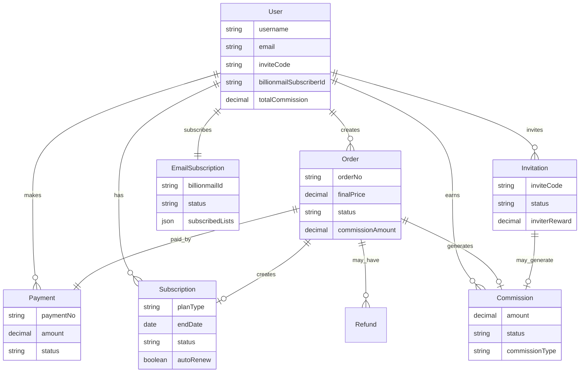

# 用户体系与支付系统架构设计方案 📊

> **设计目标**: 构建完整的用户-支付-返佣-邮件订阅一体化系统架构  
> **更新时间**: 2025年2月1日 | **状态**: 方案设计阶段

---

## 🎯 系统架构概览

### 核心业务流程
```
用户注册 → 自动邮件订阅 → 成为会员 → 获得邀请权限 → 邀请新用户
    ↑                                                ↓
用户增长循环 ← 一级返佣激励 ← 被邀请人成为会员 ← 获得注册优惠
```

### 一级邀请返佣核心机制
```
👤 邀请人（会员）              👤 被邀请人（新用户）
    │                          │
    ├─ 发送邀请码/链接 ────────→ ├─ 通过邀请码注册
    ├─ 获得推广素材              ├─ 获得注册优惠券
    │                          ├─ 自动订阅邮件
    │                          │
    │                          ▼
    │                      🏅 成为会员
    │                          │
    ▼                          │
💰 获得15%返佣 ←────────────────┘
💎 邀请达标升级会员等级
🏆 获得邀请徽章和额外奖励
```

### 技术架构特点
- **用户系统**: 扩展Strapi默认User + 三种认证方式统一管理
- **认证系统**: NextAuth集成，支持邮箱密码 + GitHub + Google OAuth
- **支付系统**: 完整的订单-支付-订阅体系
- **一级返佣系统**: 专注邀请转化的精准返佣机制，促进用户主动推广
- **邮件集成**: BillionMail自动订阅和营销，支持邀请邮件自动化
- **激励体系**: 多层次奖励机制，从注册优惠到会员升级的完整激励链条

---

## 👤 用户系统架构设计

### 1. 用户认证系统设计

#### **三种认证方式统一架构**
```
┌───────────────────────────────────────────────────────┐
│                   用户认证入口                         │
├───────────────────────────────────────────────────────┤
│    邮箱密码登录    │   GitHub OAuth   │  Google OAuth  │
└───────────────────────────────────────────────────────┘
                           │
                    ┌─────────────┐
                    │  NextAuth   │
                    │   认证层     │
                    └─────────────┘
                           │
                    ┌─────────────┐
                    │ Strapi User │
                    │   统一用户   │
                    └─────────────┘
                           │
            ┌──────────────┼──────────────┐
            │              │              │
    ┌─────────────┐ ┌─────────────┐ ┌─────────────┐
    │   支付系统   │ │ 一级邀请返佣 │ │ BillionMail │
    │    关联      │ │    体系      │ │   邮件订阅   │
    └─────────────┘ └─────────────┘ └─────────────┘
```

#### **认证方式处理策略**

| 认证方式 | 用户创建逻辑 | 邮件订阅处理 | 邀请码处理 |
|---------|-------------|-------------|-----------|
| **邮箱密码注册** | 直接创建Strapi用户 | 立即自动订阅BillionMail | 支持邀请码注册 |
| **GitHub OAuth** | OAuth信息映射到Strapi | 使用GitHub邮箱订阅 | 首次登录时可绑定邀请码 |
| **Google OAuth** | OAuth信息映射到Strapi | 使用Google邮箱订阅 | 首次登录时可绑定邀请码 |

### 2. 核心用户表设计方案

#### **方案A: 扩展默认User表（推荐）**
```javascript
// Strapi默认 users-permissions.user 扩展
{
  // === 默认字段 ===
  username: String,
  email: String,
  password: String,  // 加密存储（OAuth登录用户可能为空）
  confirmed: Boolean,
  blocked: Boolean,
  role: Relation, // 关联到users-permissions.role
  
  // === 扩展字段 ===
  // 基础信息
  nickname: String,           // 昵称
  avatar: Media,             // 头像
  phone: String,             // 手机号
  birthday: Date,            // 生日
  gender: Enum['male', 'female', 'other'],
  
  // 认证相关
  provider: String,          // 主要登录方式：'local', 'github', 'google'
  providerAccountId: String, // 第三方账号ID
  isEmailVerified: Boolean,  // 邮箱验证状态
  
  // OAuth第三方信息
  githubId: String,          // GitHub用户ID
  githubUsername: String,    // GitHub用户名
  googleId: String,          // Google用户ID
  
  // OAuth绑定状态
  hasPassword: Boolean,      // 是否设置了密码（OAuth用户后续可设置密码）
  connectedProviders: JSON,  // 已绑定的登录方式列表
  
  // 会员系统
  membershipLevel: Enum['free', 'basic', 'premium', 'vip'],
  membershipExpiry: DateTime, // 会员到期时间
  membershipAutoRenew: Boolean, // 自动续费
  
  // 邀请返佣
  inviteCode: String,        // 我的邀请码（唯一）
  invitedBy: Relation,       // 邀请我的用户
  inviteCount: Integer,      // 邀请人数统计
  totalCommission: Decimal,  // 累计返佣金额
  
  // BillionMail集成
  billionmailSubscribed: Boolean, // BillionMail订阅状态
  billionmailSubscriberId: String, // BillionMail订阅者ID
  billionmailListIds: JSON,       // 订阅的邮件列表ID
  
  // 系统字段
  lastLoginAt: DateTime,
  loginCount: Integer,
  createdAt: DateTime,
  updatedAt: DateTime
}
```

#### **方案B: 独立UserProfile表**
```javascript
// 创建新的 user-profile 内容类型
{
  user: Relation, // OneToOne关联到默认User
  // ... 其他扩展字段同方案A
}
```

### 2. 推荐方案对比

| 方案 | 优势 | 劣势 | 推荐度 |
|------|------|------|--------|
| **方案A: 扩展User** | 数据一致性好、查询简单、NextAuth兼容性好 | 默认表修改风险 | ⭐⭐⭐⭐⭐ |
| **方案B: 独立Profile** | 原表不动、扩展灵活 | 需要JOIN查询、数据分散 | ⭐⭐⭐ |

**🎯 建议采用方案A**：Strapi支持安全扩展默认User表，兼容性和性能最佳。

---

## 💳 支付系统数据表设计

### 1. 订单系统 (Order)
```javascript
{
  // 订单基础信息
  orderNo: String,           // 订单号（唯一）
  user: Relation,            // 关联用户
  orderType: Enum['membership', 'course', 'service'], // 订单类型
  
  // 商品信息
  productName: String,       // 商品名称
  productType: String,       // 商品类型
  productId: String,         // 商品ID
  originalPrice: Decimal,    // 原价
  discountAmount: Decimal,   // 优惠金额
  finalPrice: Decimal,       // 实付金额
  
  // 订单状态
  status: Enum['pending', 'paid', 'cancelled', 'refunded'],
  paymentMethod: String,     // 支付方式
  
  // 邀请返佣
  inviterUser: Relation,     // 邀请人（可空）
  commissionRate: Decimal,   // 返佣比例
  commissionAmount: Decimal, // 返佣金额
  
  // 时间字段
  createdAt: DateTime,
  paidAt: DateTime,
  expiredAt: DateTime,
}
```

### 2. 支付记录 (Payment)
```javascript
{
  // 关联信息
  order: Relation,           // 关联订单
  user: Relation,            // 支付用户
  
  // 支付信息
  paymentNo: String,         // 支付流水号
  paymentMethod: Enum['alipay', 'wechat', 'stripe'],
  amount: Decimal,           // 支付金额
  currency: String,          // 货币类型
  
  // 第三方信息
  thirdPartyOrderNo: String, // 第三方订单号
  thirdPartyResponse: JSON,  // 第三方响应数据
  
  // 状态管理
  status: Enum['pending', 'success', 'failed', 'cancelled'],
  failReason: Text,          // 失败原因
  
  createdAt: DateTime,
  completedAt: DateTime,
}
```

### 3. 会员订阅 (Subscription)
```javascript
{
  // 关联信息
  user: Relation,            // 用户
  order: Relation,           // 关联订单
  
  // 订阅信息
  planType: Enum['monthly', 'yearly', 'lifetime'],
  planName: String,          // 套餐名称
  startDate: Date,           // 开始日期
  endDate: Date,             // 结束日期
  autoRenew: Boolean,        // 自动续费
  
  // 订阅状态
  status: Enum['active', 'expired', 'cancelled', 'suspended'],
  
  // 特权管理
  features: JSON,            // 订阅特权列表
  
  createdAt: DateTime,
  updatedAt: DateTime,
}
```

### 4. 退款记录 (Refund)
```javascript
{
  // 关联信息
  order: Relation,           // 原订单
  payment: Relation,         // 原支付记录
  user: Relation,            // 用户
  
  // 退款信息
  refundNo: String,          // 退款单号
  refundAmount: Decimal,     // 退款金额
  refundReason: Text,        // 退款原因
  
  // 状态管理
  status: Enum['pending', 'approved', 'rejected', 'completed'],
  processedBy: Relation,     // 处理人
  processNote: Text,         // 处理备注
  
  createdAt: DateTime,
  processedAt: DateTime,
}
```

---

## 🎁 一级邀请返佣系统设计

### 🎯 **邀请激励策略概览**

```
邀请人 ─────邀请码─────→ 被邀请人
   │                     │
   │    📧 邀请邮件        │    ✅ 注册成功
   │    🎁 注册奖励        │    📧 欢迎邮件
   │                     │
   │                     ▼
   │               🏅 成为会员
   │                     │
   └───────💰 获得返佣────────┘
```

**核心激励机制**：
- **注册激励**: 被邀请人注册即获得优惠券/积分奖励
- **首购返佣**: 被邀请人首次购买会员，邀请人获得现金返佣
- **进阶奖励**: 邀请多人成为会员，邀请人获得会员等级升级

### 1. 邀请记录 (Invitation)
```javascript
{
  // 邀请关系
  inviter: Relation,         // 邀请人（必须是会员才能邀请）
  invitee: Relation,         // 被邀请人
  inviteCode: String,        // 使用的邀请码
  inviteChannel: Enum['email', 'link', 'social'], // 邀请渠道
  
  // 邀请状态流转
  status: Enum['sent', 'registered', 'purchased', 'expired'],
  
  // 奖励信息（一级返佣）
  inviterReward: Decimal,    // 邀请人现金返佣（被邀请人购买会员后发放）
  inviteeReward: Decimal,    // 被邀请人优惠金额（注册时立即可用）
  rewardStatus: Enum['pending', 'granted', 'expired'],
  
  // 促进转化的激励
  inviteeCoupon: String,     // 被邀请人专属优惠券代码
  inviterBonus: Decimal,     // 邀请人阶段性奖励（达到邀请目标时）
  
  // 时间追踪
  invitedAt: DateTime,       // 邀请发送时间
  registeredAt: DateTime,    // 被邀请人注册时间
  purchasedAt: DateTime,     // 被邀请人首次购买时间
  expiredAt: DateTime,       // 邀请过期时间（30天内有效）
  
  // 转化跟踪
  clickCount: Integer,       // 邀请链接点击次数
  emailOpened: Boolean,      // 邀请邮件是否打开
  lastClickAt: DateTime,     // 最后点击时间
}
```

### 2. 一级返佣记录 (Commission)
```javascript
{
  // 关联信息（只有直接邀请关系）
  inviter: Relation,         // 获得返佣的邀请人
  invitee: Relation,         // 产生返佣的被邀请人
  invitation: Relation,      // 关联邀请记录
  order: Relation,           // 触发返佣的订单
  
  // 返佣信息（仅一级）
  commissionType: Enum['first_purchase', 'renewal', 'upgrade'], // 返佣类型
  amount: Decimal,           // 返佣金额
  rate: Decimal,             // 返佣比例
  originalAmount: Decimal,   // 订单原金额
  
  // 状态管理
  status: Enum['pending', 'confirmed', 'paid', 'cancelled'],
  
  // 结算信息
  settlementBatch: String,   // 结算批次
  payoutMethod: String,      // 提现方式
  settledAt: DateTime,       // 结算时间
  
  // 业务标识
  isFirstTimeBonus: Boolean, // 是否为首次邀请奖励
  
  createdAt: DateTime,
}
```

### 3. 邀请激励规则 (InviteIncentiveRule)
```javascript
{
  // 规则信息
  ruleName: String,          // 规则名称
  ruleDescription: Text,     // 规则描述
  ruleType: Enum['first_purchase', 'member_upgrade', 'bulk_invite'], // 激励类型
  
  // 邀请人条件
  inviterMembershipRequired: Enum['basic', 'premium', 'vip'], // 邀请人最低会员等级
  inviterMinInvites: Integer, // 邀请人最少邀请数要求
  
  // 被邀请人奖励
  inviteeDiscountRate: Decimal,    // 被邀请人折扣比例（如0.2表示8折）
  inviteeDiscountAmount: Decimal,  // 被邀请人固定优惠金额
  inviteeCouponValidDays: Integer, // 优惠券有效天数
  
  // 邀请人返佣
  commissionRate: Decimal,   // 一级返佣比例（如0.15表示15%）
  maxCommissionAmount: Decimal, // 单笔最大返佣金额
  minOrderAmount: Decimal,   // 触发返佣的最小订单金额
  
  // 阶段性奖励（促进多邀请）
  bulkInviteRewards: JSON,   // 多邀请奖励配置
  /* 示例：
  {
    "5": { "bonus": 100, "memberUpgrade": "premium" },   // 邀请5人送100元+升级premium
    "10": { "bonus": 300, "memberUpgrade": "vip" },     // 邀请10人送300元+升级vip
    "20": { "bonus": 800, "specialBadge": "super_inviter" } // 邀请20人送800元+特殊徽章
  }
  */
  
  // 生效设置
  isActive: Boolean,
  startDate: Date,
  endDate: Date,
  
  // 限制条件
  maxUsagePerUser: Integer,  // 每用户最大使用次数
  dailyInviteLimit: Integer, // 每日邀请限制
  
  createdAt: DateTime,
  updatedAt: DateTime,
}
```

### 4. 邀请统计 (InviteStats)
```javascript
{
  // 用户信息
  user: Relation,            // 邀请人
  
  // 统计数据
  totalInvites: Integer,     // 总邀请数
  successfulInvites: Integer, // 成功注册数
  paidInvites: Integer,      // 付费转化数
  totalCommission: Decimal,  // 累计返佣金额
  
  // 阶段统计
  monthlyInvites: Integer,   // 本月邀请数
  weeklyInvites: Integer,    // 本周邀请数
  
  // 转化率统计
  conversionRate: Decimal,   // 注册转化率
  payConversionRate: Decimal, // 付费转化率
  
  // 奖励状态
  currentMembershipLevel: String, // 当前会员等级
  earnedBadges: JSON,        // 获得的徽章列表
  nextRewardTarget: Integer, // 下一奖励目标邀请数
  
  // 时间戳
  lastInviteAt: DateTime,    // 最后邀请时间
  updatedAt: DateTime,
}
```

---

## 📧 BillionMail邮件订阅集成

### 1. 邮件订阅记录 (EmailSubscription)
```javascript
{
  // 用户信息
  user: Relation,            // 关联用户（可空，支持游客订阅）
  email: String,             // 邮箱地址
  
  // BillionMail集成
  billionmailId: String,     // BillionMail订阅者ID
  subscribedLists: JSON,     // 订阅的邮件列表
  
  // 订阅偏好
  subscriptionSource: Enum['register', 'manual', 'invite'],
  tags: JSON,                // 用户标签
  preferences: JSON,         // 订阅偏好设置
  
  // 状态管理
  status: Enum['active', 'unsubscribed', 'bounced'],
  unsubscribeToken: String,  // 取消订阅令牌
  
  createdAt: DateTime,
  updatedAt: DateTime,
}
```

### 2. 多认证方式自动订阅逻辑

#### **统一自动订阅处理**
```javascript
// 用户注册/OAuth登录时自动订阅流程
async function autoSubscribeOnAuth(user, authType = 'register') {
  // 检查是否已经订阅
  if (user.billionmailSubscribed) {
    return;
  }
  
  // 根据认证方式设置标签
  const tags = ['new_user', 'auto_subscribed'];
  if (user.provider !== 'local') {
    tags.push(`oauth_${user.provider}`);
  }
  
  // 1. 创建BillionMail订阅者
  const subscriber = await billionMailClient.createSubscriber({
    email: user.email,
    name: user.nickname || user.username,
    tags: tags,
    lists: [DEFAULT_NEWSLETTER_LIST_ID],
    // OAuth用户额外信息
    customFields: {
      provider: user.provider,
      hasPassword: user.hasPassword,
      registrationSource: authType
    }
  });
  
  // 2. 更新用户信息
  await strapi.entityService.update('plugin::users-permissions.user', user.id, {
    data: {
      billionmailSubscribed: true,
      billionmailSubscriberId: subscriber.id,
      billionmailListIds: [DEFAULT_NEWSLETTER_LIST_ID]
    }
  });
  
  // 3. 创建订阅记录
  await strapi.entityService.create('api::email-subscription.email-subscription', {
    data: {
      user: user.id,
      email: user.email,
      billionmailId: subscriber.id,
      subscriptionSource: authType,
      status: 'active',
      tags: tags
    }
  });
}

// NextAuth回调中的处理
module.exports = {
  // 邮箱密码注册后触发
  async afterCreate(event) {
    const { result } = event;
    if (result.email) {
      await autoSubscribeOnAuth(result, 'register');
    }
  },
  
  // OAuth首次登录后触发
  async afterOAuthSignIn(user, account, profile) {
    if (user.isNewUser) {
      await autoSubscribeOnAuth(user, 'oauth_signin');
    }
  },
  
  // 绑定邀请码的用户特殊处理
  async afterInviteCodeBind(user, inviteCode) {
    if (!user.billionmailSubscribed) {
      await autoSubscribeOnAuth(user, 'invite');
    }
    
    // 为邀请用户添加特殊标签
    await billionMailClient.updateSubscriber(user.billionmailSubscriberId, {
      tags: ['invited_user', `invited_by_${inviteCode}`]
    });
  }
};
```

#### **不同认证方式的邮件订阅策略**
```javascript
// GitHub OAuth用户处理
async function handleGitHubUser(profile, account) {
  const userData = {
    email: profile.email,
    username: profile.login,
    nickname: profile.name,
    avatar: profile.avatar_url,
    provider: 'github',
    providerAccountId: profile.id.toString(),
    githubId: profile.id.toString(),
    githubUsername: profile.login,
    hasPassword: false,
    isEmailVerified: true, // GitHub邮箱默认已验证
    connectedProviders: ['github']
  };
  
  return userData;
}

// Google OAuth用户处理
async function handleGoogleUser(profile, account) {
  const userData = {
    email: profile.email,
    username: profile.email.split('@')[0], // 邮箱前缀作为用户名
    nickname: profile.name,
    avatar: profile.picture,
    provider: 'google',
    providerAccountId: profile.sub,
    googleId: profile.sub,
    hasPassword: false,
    isEmailVerified: profile.email_verified,
    connectedProviders: ['google']
  };
  
  return userData;
}


```

---

## 🔗 数据表关联关系图



---

## 🚀 实施建议和最佳实践

### 1. 开发优先级（一级返佣系统）
```
高优先级 (第1周):
├── 扩展User表字段（认证+邀请相关）
├── 创建Order订单系统
├── Invitation邀请记录表
├── 实现自动邮件订阅
└── 基础支付流程

中优先级 (第2-3周):
├── Payment支付记录
├── Subscription会员系统  
├── Commission一级返佣核心功能
├── InviteIncentiveRule邀请激励规则
├── BillionMail邀请邮件模板
└── 邀请码生成和验证

低优先级 (第3-4周):
├── InviteStats邀请统计和排行榜
├── 游戏化激励（徽章、成就）
├── 邀请素材管理
├── Refund退款系统
├── 数据分析报表
└── 系统优化
```

### 2. 技术实现要点

#### **NextAuth认证配置**
```javascript
// NextAuth配置示例
export default NextAuth({
  providers: [
    // 邮箱密码认证
    CredentialsProvider({
      name: "credentials",
      credentials: {
        email: { label: "Email", type: "email" },
        password: { label: "Password", type: "password" }
      },
      async authorize(credentials) {
        // 调用Strapi本地认证
        const response = await fetch(`${strapiUrl}/api/auth/local`, {
          method: 'POST',
          headers: { 'Content-Type': 'application/json' },
          body: JSON.stringify({
            identifier: credentials.email,
            password: credentials.password,
          }),
        });
        
        if (response.ok) {
          const data = await response.json();
          return {
            id: data.user.id,
            email: data.user.email,
            name: data.user.username,
            provider: 'local'
          };
        }
        return null;
      }
    }),
    
    // GitHub OAuth
    GitHubProvider({
      clientId: process.env.GITHUB_CLIENT_ID,
      clientSecret: process.env.GITHUB_CLIENT_SECRET,
    }),
    
    // Google OAuth
    GoogleProvider({
      clientId: process.env.GOOGLE_CLIENT_ID,
      clientSecret: process.env.GOOGLE_CLIENT_SECRET,
    })
  ],
  
  callbacks: {
    async signIn({ user, account, profile }) {
      if (account.provider !== 'credentials') {
        // OAuth登录用户处理
        const existingUser = await findOrCreateOAuthUser(profile, account);
        user.id = existingUser.id;
        
        // 首次OAuth登录自动订阅
        if (existingUser.isNewUser) {
          await autoSubscribeOnAuth(existingUser, 'oauth_signin');
        }
      }
      return true;
    },
    
    async jwt({ token, user, account }) {
      if (user) {
        token.provider = user.provider || account?.provider;
      }
      return token;
    },
    
    async session({ session, token }) {
      session.user.provider = token.provider;
      return session;
    }
  }
});
```

#### **OAuth用户统一处理**
```javascript
// 查找或创建OAuth用户
async function findOrCreateOAuthUser(profile, account) {
  const provider = account.provider;
  let user = null;
  let isNewUser = false;
  
  // 1. 先通过邮箱查找现有用户
  if (profile.email) {
    user = await strapi.query('plugin::users-permissions.user').findOne({
      where: { email: profile.email }
    });
  }
  
  // 2. 如果用户不存在，创建新用户
  if (!user) {
    const userData = await mapOAuthProfile(profile, account);
    user = await strapi.query('plugin::users-permissions.user').create({
      data: userData
    });
    isNewUser = true;
  } else {
    // 3. 如果用户存在，更新OAuth信息
    const updateData = {};
    if (provider === 'github' && !user.githubId) {
      updateData.githubId = profile.id.toString();
      updateData.githubUsername = profile.login;
    } else if (provider === 'google' && !user.googleId) {
      updateData.googleId = profile.sub;
    }
    
    // 更新已绑定的登录方式
    const connectedProviders = user.connectedProviders || [];
    if (!connectedProviders.includes(provider)) {
      connectedProviders.push(provider);
      updateData.connectedProviders = connectedProviders;
    }
    
    if (Object.keys(updateData).length > 0) {
      await strapi.query('plugin::users-permissions.user').update({
        where: { id: user.id },
        data: updateData
      });
    }
  }
  
  return { ...user, isNewUser };
}

// OAuth档案信息映射
async function mapOAuthProfile(profile, account) {
  const provider = account.provider;
  
  switch (provider) {
    case 'github':
      return await handleGitHubUser(profile, account);
    case 'google':
      return await handleGoogleUser(profile, account);
    default:
      throw new Error(`Unsupported OAuth provider: ${provider}`);
  }
}
```

#### **用户注册自动订阅**
```javascript
// 在用户注册后的生命周期钩子中
module.exports = {
  async afterCreate(event) {
    const { result } = event;
    if (result.email) {
      await autoSubscribeOnAuth(result, 'register');
    }
  }
};
```

#### **一级邀请返佣核心逻辑**
```javascript
// 用户注册时处理邀请码
async function handleInviteCodeOnRegister(user, inviteCode) {
  if (!inviteCode) return;
  
  // 1. 查找邀请记录
  const invitation = await strapi.query('api::invitation.invitation').findOne({
    where: { inviteCode, status: 'sent' }
  });
  
  if (invitation) {
    // 2. 更新邀请记录
    await strapi.query('api::invitation.invitation').update({
      where: { id: invitation.id },
      data: {
        invitee: user.id,
        status: 'registered',
        registeredAt: new Date()
      }
    });
    
    // 3. 给被邀请人发放注册优惠
    await grantWelcomeCoupon(user.id, invitation.inviteeCoupon);
    
    // 4. 更新用户邀请关系
    await strapi.query('plugin::users-permissions.user').update({
      where: { id: user.id },
      data: { invitedBy: invitation.inviter }
    });
    
    // 5. 发送BillionMail欢迎邮件（带优惠信息）
    await sendInviteeWelcomeEmail(user, invitation);
  }
}

// 支付成功后的一级返佣处理
async function handlePaymentSuccess(payment) {
  // 1. 更新订单状态
  await updateOrderStatus(payment.order, 'paid');
  
  // 2. 激活会员服务
  await activateMembership(payment.user, payment.order);
  
  // 3. 处理一级邀请返佣
  await processFirstLevelCommission(payment.user, payment.order);
  
  // 4. 检查邀请人升级条件
  await checkInviterUpgrade(payment.user);
  
  // 5. 发送BillionMail确认邮件
  await sendPurchaseConfirmationEmail(payment.user, payment.order);
}

// 一级返佣处理逻辑
async function processFirstLevelCommission(payer, order) {
  // 只处理被邀请用户的首次付费
  if (!payer.invitedBy) return;
  
  const invitation = await strapi.query('api::invitation.invitation').findOne({
    where: { inviter: payer.invitedBy, invitee: payer.id }
  });
  
  if (invitation && invitation.status === 'registered') {
    // 计算返佣金额（15%）
    const commissionRate = 0.15;
    const commissionAmount = order.finalPrice * commissionRate;
    
    // 创建返佣记录
    await strapi.query('api::commission.commission').create({
      data: {
        inviter: payer.invitedBy,
        invitee: payer.id,
        invitation: invitation.id,
        order: order.id,
        commissionType: 'first_purchase',
        amount: commissionAmount,
        rate: commissionRate,
        originalAmount: order.finalPrice,
        status: 'pending',
        isFirstTimeBonus: true
      }
    });
    
    // 更新邀请记录状态
    await strapi.query('api::invitation.invitation').update({
      where: { id: invitation.id },
      data: {
        status: 'purchased',
        purchasedAt: new Date(),
        inviterReward: commissionAmount
      }
    });
    
    // 更新邀请人累计返佣
    await updateInviterTotalCommission(payer.invitedBy, commissionAmount);
    
    // 发送返佣通知邮件
    await sendCommissionNotificationEmail(payer.invitedBy, commissionAmount, payer);
  }
}

// 检查邀请人升级条件
async function checkInviterUpgrade(newMember) {
  if (!newMember.invitedBy) return;
  
  const inviterStats = await getInviterStats(newMember.invitedBy);
  const inviter = await getUserById(newMember.invitedBy);
  
  // 检查升级条件
  let shouldUpgrade = false;
  let newLevel = inviter.membershipLevel;
  
  if (inviterStats.paidInvites >= 10 && inviter.membershipLevel !== 'vip') {
    newLevel = 'vip';
    shouldUpgrade = true;
  } else if (inviterStats.paidInvites >= 5 && inviter.membershipLevel === 'free') {
    newLevel = 'premium';
    shouldUpgrade = true;
  }
  
  if (shouldUpgrade) {
    await upgradeUserMembership(newMember.invitedBy, newLevel);
    await sendUpgradeNotificationEmail(newMember.invitedBy, newLevel);
  }
}
```

### 3. 数据一致性保证
- **事务处理**: 支付相关操作、用户创建、邮件订阅使用数据库事务
- **状态同步**: 定期同步BillionMail订阅状态、OAuth用户信息更新
- **数据校验**: 
  - 邮箱唯一性约束（跨认证方式）
  - 邀请码唯一性索引
  - 第三方账号ID唯一性约束
  - 外键关联完整性检查
- **认证数据一致性**:
  - OAuth用户邮箱去重合并
  - 多登录方式账号关联
  - 用户状态跨系统同步
- **审计日志**: 记录用户创建、登录、支付、返佣等重要操作变更历史

### 4. 性能优化建议
- **索引优化**: 
  - 邀请码唯一索引
  - 用户邀请关系索引（invitedBy字段）
  - 邀请记录状态和时间索引
  - 返佣记录状态索引
- **缓存策略**: 
  - 用户会员状态和邀请统计数据缓存
  - 邀请激励规则配置缓存
  - 热门邀请人排行榜缓存
- **分页查询**: 邀请记录、返佣记录、邀请排行榜使用分页
- **异步处理**: 
  - 邮件发送（邀请邮件、返佣通知）
  - 返佣计算和统计更新
  - 会员升级检查和通知
  - 邀请统计数据更新
- **批量处理**: 定期批量处理返佣结算、统计数据更新

---

## 📊 预期效果和业务价值

### 用户体验提升
- **多认证方式支持**: 邮箱密码、GitHub、Google三种登录方式，降低注册门槛
- **一键注册订阅**: 任何方式注册/登录都自动订阅邮件，提升用户参与度  
- **OAuth快速登录**: 第三方登录免注册，提升用户转化率
- **会员权益明确**: 清晰的会员等级和特权体系，激励用户升级
- **智能邀请机制**: 
  - 被邀请人获得立即可用的注册优惠
  - 邀请人获得直接的现金返佣（15%）
  - 达标邀请自动升级会员等级
  - 专属邀请素材和推广工具
- **游戏化激励**: 邀请徽章、成就系统、排行榜等提升邀请积极性

### 商业价值增长
- **精准用户获取**: 通过一级返佣机制，会员用户主动邀请高质量潜在客户
- **付费转化提升**: 被邀请用户获得注册优惠，降低首次付费门槛，提升转化率
- **病毒式增长**: 15%的现金返佣激励让用户有足够动力主动推广平台
- **用户质量提升**: 通过熟人邀请的用户通常有更高的留存率和付费意愿
- **会员升级激励**: 邀请达标自动升级机制促进用户持续推广
- **长期价值最大化**: BillionMail邮件营销 + 会员续费返佣构建用户全生命周期价值

### 技术架构优势
- **认证系统统一**: NextAuth统一管理多种认证方式，代码维护简单
- **用户数据统一**: 不同登录方式的用户数据统一存储在Strapi，避免数据孤岛
- **扩展性强**: 模块化设计支持新增认证方式和功能扩展
- **数据完整**: 完整的用户生命周期数据追踪，包含认证来源和行为轨迹
- **集成便利**: 与现有NextAuth、Strapi、BillionMail系统无缝集成
- **安全可靠**: OAuth标准协议保证认证安全，支持多重验证机制

---

**🎯 这个架构设计为AI变现之路项目提供了完整的三认证用户-支付-一级返佣-邮件一体化解决方案，构建从用户注册到会员转化再到病毒式推广的完整商业增长飞轮！**

### 🚀 **核心竞争优势总结**

1. **🔐 简化认证体系**: 支持3种主流登录方式（邮箱+GitHub+Google），降低技术复杂度，提升用户体验
2. **📧 智能邮件营销**: 任何方式注册都自动订阅BillionMail，构建100%用户触达渠道  
3. **💰 精准一级返佣**: 15%返佣比例 + 达标升级机制，激励用户主动推广而非被动分销
4. **🎁 双向激励机制**: 
   - 被邀请人：注册即获优惠券，降低付费门槛
   - 邀请人：现金返佣 + 等级升级 + 成就徽章
5. **🔄 增长飞轮设计**: 会员推广 → 新用户优惠注册 → 付费转化 → 返佣激励 → 更多推广
6. **🔗 系统深度集成**: NextAuth + Strapi + BillionMail + 游戏化激励的企业级技术栈

### 💡 **关键设计亮点**

- **只做一级返佣**: 避免多层级分销的复杂性，专注提升直接邀请转化效果
- **会员才能邀请**: 确保邀请人有平台使用经验，提升邀请质量和成功率
- **即时优惠激励**: 被邀请人注册立即获得可用优惠，最大化首次购买转化
- **阶段性成长**: 邀请5人升级premium，邀请10人升级vip，持续激励长期推广