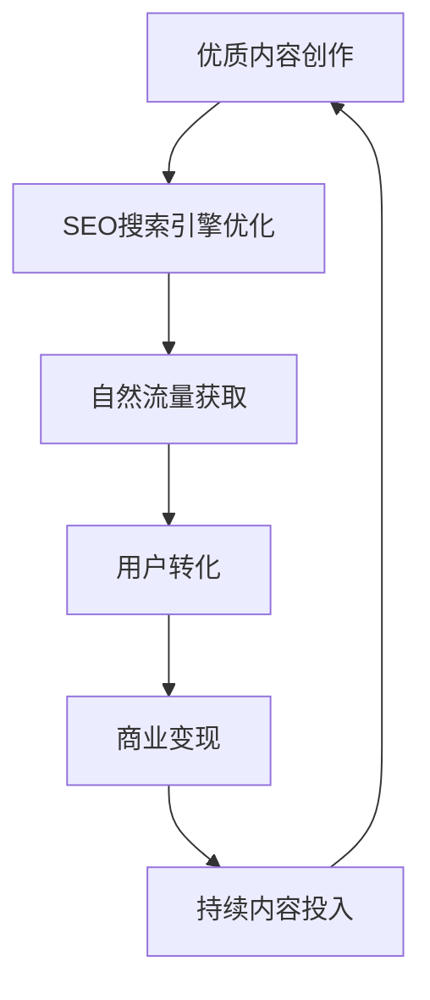

# 技术架构设计方案 🏗️

> 📖 **技术设计**：技术选型思路、架构设计和实施方案详解

## 📚 文档说明

本文档详细介绍AI变现之路项目的技术架构设计思路、技术选型原因和实施方案。

### 🔗 **相关文档**
- **[项目总览](./AI变现之路_项目总览.md)** - 项目背景和商业模式
- **[SEO优化策略指南](./SEO优化策略指南.md)** - SEO策略详解
- **[开发执行步骤总览](./开发执行步骤总览.md)** - 开发实施计划

---

## 🎯 **技术方案设计思路**

### **核心设计原则**

我们的技术方案基于一个核心理念：**内容驱动的SEO优化架构**



### **🎯 设计目标**

1. **SEO友好**：确保所有页面都能被搜索引擎有效抓取和索引
2. **内容管理**：支持高效的内容创作、编辑和发布流程
3. **用户体验**：快速加载、响应式设计、无障碍访问
4. **可扩展性**：支持未来功能扩展和用户增长
5. **成本效控**：在确保功能的前提下控制开发和运维成本

### **🏗️ 整体架构设计**

```
┌─────────────────────────────────────────────────────────────┐
│                        用户访问层                             │
├─────────────────────────────────────────────────────────────┤
│  搜索引擎    │    直接访问    │   社交媒体   │   移动应用     │
│ (SEO流量)    │   (品牌流量)   │  (社交流量)  │  (应用流量)    │
└─────────────────────────────────────────────────────────────┘
                               │
┌─────────────────────────────────────────────────────────────┐
│                       前端展示层                             │
├─────────────────────────────────────────────────────────────┤
│           Next.js 14 (App Router + SSR/SSG)                │
│    ┌──────────────┬──────────────┬──────────────────────┐    │
│    │   首页展示   │   文章详情   │     用户中心         │    │
│    │              │              │                      │    │
│    │  ·SEO优化    │  ·动态路由   │  ·个人资料管理      │    │
│    │  ·性能优化   │  ·分享功能   │  ·订阅管理          │    │
│    │  ·响应式     │  ·评论系统   │  ·支付历史          │    │
│    └──────────────┴──────────────┴──────────────────────┘    │
└─────────────────────────────────────────────────────────────┘
                               │
                          API调用
                               │
┌─────────────────────────────────────────────────────────────┐
│                       后端服务层                             │
├─────────────────────────────────────────────────────────────┤
│                    Strapi 5.x CMS                          │
│    ┌──────────────┬──────────────┬──────────────────────┐    │
│    │  内容管理API │  用户管理API │    支付处理API       │    │
│    │              │              │                      │    │
│    │  ·文章CRUD   │  ·认证授权   │  ·订阅管理          │    │
│    │  ·分类标签   │  ·权限控制   │  ·支付集成          │    │
│    │  ·媒体管理   │  ·用户资料   │  ·财务报告          │    │
│    └──────────────┴──────────────┴──────────────────────┘    │
└─────────────────────────────────────────────────────────────┘
                               │
┌─────────────────────────────────────────────────────────────┐
│                       数据存储层                             │
├─────────────────────────────────────────────────────────────┤
│               PostgreSQL 数据库                             │
│    ┌──────────────┬──────────────┬──────────────────────┐    │
│    │   内容数据   │   用户数据   │    业务数据          │    │
│    │              │              │                      │    │
│    │  ·文章内容   │  ·用户信息   │  ·订单记录          │    │
│    │  ·分类标签   │  ·权限角色   │  ·支付记录          │    │
│    │  ·媒体文件   │  ·用户行为   │  ·统计数据          │    │
│    └──────────────┴──────────────┴──────────────────────┘    │
└─────────────────────────────────────────────────────────────┘
```

---

## 🔧 **核心技术选型**

### **前端技术栈**

#### **Next.js 14 - 前端框架**
**选择原因**：
- **SEO优势**：服务端渲染(SSR)和静态生成(SSG)确保搜索引擎友好
- **性能优秀**：内置图片优化、代码分割、路由预取等性能优化
- **开发效率**：App Router、内置API路由、TypeScript支持
- **生态完善**：丰富的插件生态和社区支持

```typescript
// 核心配置示例
const nextConfig = {
  // SEO优化配置
  experimental: {
    appDir: true,
  },
  images: {
    domains: ['strapi.domain.com'],
    formats: ['image/webp', 'image/avif'],
  },
  // 静态生成配置
  output: 'standalone',
  trailingSlash: true,
};
```

#### **TypeScript - 类型安全**
**选择原因**：
- **代码质量**：静态类型检查，减少运行时错误
- **开发体验**：智能提示、重构支持、团队协作友好
- **可维护性**：大型项目的可维护性和可读性
- **生态支持**：与React、Next.js完美集成

#### **纯CSS + CSS变量 - 样式方案**
**选择原因**：
- **性能优秀**：无运行时开销，CSS文件可缓存
- **设计一致性**：CSS变量确保设计系统的一致性
- **维护友好**：主题切换、响应式设计更加灵活
- **包体积小**：不引入额外的CSS-in-JS库

```css
/* 设计系统变量 */
:root {
  --color-primary-blue: #3B82F6;
  --color-bg-glass: rgba(26, 26, 26, 0.7);
  --font-size-base: 16px;
  --spacing-md: 16px;
}
```

### **后端技术栈**

#### **Strapi 5.x - 内容管理系统**
**选择原因**：
- **快速开发**：可视化内容类型设计，自动生成API
- **内容管理**：强大的内容编辑和管理功能
- **权限系统**：内置用户角色和权限管理
- **插件生态**：丰富的插件支持各种功能扩展

```javascript
// Strapi配置示例
module.exports = {
  settings: {
    cors: {
      enabled: true,
      origin: ['http://localhost:3000', 'https://aibianx.com'],
    },
    responses: {
      privateAttributes: ['created_by', 'updated_by'],
    },
  },
};
```

#### **PostgreSQL - 数据库**
**选择原因**：
- **功能强大**：支持JSONB、全文搜索、复杂查询
- **数据一致性**：ACID特性保证数据可靠性
- **扩展性**：支持水平和垂直扩展
- **开源稳定**：成熟的开源数据库，社区支持良好

```sql
-- 示例表结构
CREATE TABLE articles (
  id SERIAL PRIMARY KEY,
  title VARCHAR(255) NOT NULL,
  slug VARCHAR(255) UNIQUE NOT NULL,
  content TEXT NOT NULL,
  seo_data JSONB DEFAULT '{}',
  published_at TIMESTAMP WITH TIME ZONE,
  created_at TIMESTAMP WITH TIME ZONE DEFAULT NOW()
);
```

### **开发工具链**

#### **开发环境**
- **Node.js 18+**：LTS版本，稳定性和性能平衡
- **pnpm**：快速、节省磁盘空间的包管理器
- **ESLint + Prettier**：代码规范和格式化
- **TypeScript**：静态类型检查

#### **部署和运维**
- **Docker**：容器化部署，环境一致性
- **Nginx**：反向代理和静态文件服务
- **PM2**：Node.js进程管理
- **Git + GitHub**：版本控制和代码托管

---

## 🚀 **系统架构优势**

### **SEO优化架构**

#### **服务端渲染(SSR)**
```typescript
// 文章页面SSR示例
export async function generateMetadata({ params }: ArticlePageProps) {
  const article = await getArticleBySlug(params.slug);
  
  return {
    title: article.seoTitle || article.title,
    description: article.seoDescription || article.excerpt,
    openGraph: {
      title: article.title,
      description: article.excerpt,
      images: [article.coverImage],
    },
  };
}
```

#### **静态生成(SSG)**
```typescript
// 静态路径生成
export async function generateStaticParams() {
  const articles = await getAllArticles();
  return articles.map((article) => ({
    slug: article.slug,
  }));
}
```

#### **自动Sitemap生成**
```typescript
// 动态Sitemap
export default async function sitemap(): Promise<MetadataRoute.Sitemap> {
  const articles = await getAllArticles();
  
  return [
    ...staticPages,
    ...articles.map((article) => ({
      url: `https://aibianx.com/weekly/${article.slug}`,
      lastModified: new Date(article.updatedAt),
      priority: 0.8,
    })),
  ];
}
```

### **性能优化架构**

#### **图片优化**
```typescript
// Next.js图片优化
<Image
  src={article.coverImage}
  alt={article.title}
  width={800}
  height={400}
  priority={isAboveFold}
  placeholder="blur"
  blurDataURL="data:image/jpeg;base64,..."
/>
```

#### **代码分割**
```typescript
// 动态导入
const DynamicComponent = dynamic(() => import('./HeavyComponent'), {
  loading: () => <Skeleton />,
  ssr: false,
});
```

#### **缓存策略**
```typescript
// API缓存配置
export const revalidate = 3600; // 1小时重新验证
export const dynamic = 'force-static'; // 强制静态生成
```

### **可扩展性设计**

#### **模块化架构**
```
src/
├── components/          # 可复用组件
│   ├── ui/             # 基础UI组件
│   ├── molecules/      # 复合组件
│   └── organisms/      # 复杂组件
├── lib/                # 工具函数和API
│   ├── api/           # API客户端
│   ├── utils/         # 通用工具
│   └── hooks/         # 自定义Hooks
├── stores/             # 状态管理
├── types/              # TypeScript类型
└── styles/             # 样式文件
```

#### **API设计原则**
```typescript
// 标准API响应格式
interface ApiResponse<T> {
  data: T;
  meta?: {
    pagination?: PaginationInfo;
    total?: number;
  };
  error?: string;
}
```

---

## 🔒 **安全性设计**

### **数据安全**
- **输入验证**：所有用户输入都经过严格验证和过滤
- **SQL注入防护**：使用参数化查询和ORM防护
- **XSS防护**：输出转义和内容安全策略(CSP)
- **CSRF防护**：CSRF token和同源策略

### **访问控制**
```typescript
// 权限检查中间件
export async function authMiddleware(req: NextRequest) {
  const token = req.headers.get('authorization');
  const user = await verifyToken(token);
  
  if (!user) {
    return NextResponse.json({ error: 'Unauthorized' }, { status: 401 });
  }
  
  return NextResponse.next();
}
```

### **数据备份**
- **自动备份**：每日自动备份数据库和文件
- **多地备份**：本地和云端双重备份
- **备份验证**：定期验证备份文件完整性
- **快速恢复**：支持快速数据恢复机制

---

## 📊 **监控和分析**

### **性能监控**
```typescript
// Core Web Vitals监控
function reportWebVitals(metric: any) {
  if (metric.label === 'web-vital') {
    analytics.track('Web Vitals', {
      name: metric.name,
      value: metric.value,
    });
  }
}
```

### **错误监控**
```typescript
// 错误边界
class ErrorBoundary extends React.Component {
  componentDidCatch(error: Error, errorInfo: ErrorInfo) {
    // 发送错误到监控服务
    logger.error('React Error Boundary', { error, errorInfo });
  }
}
```

### **用户行为分析**
```typescript
// 用户行为追踪
export const trackEvent = (action: string, properties?: any) => {
  analytics.track(action, {
    timestamp: new Date().toISOString(),
    url: window.location.href,
    ...properties,
  });
};
```

---

## 🔧 **开发和部署流程**

### **开发流程**
```bash
# 本地开发
git clone <repository>
cd aibianx
npm install
npm run dev

# 代码质量检查
npm run lint
npm run type-check
npm test

# 构建和部署
npm run build
npm run start
```

### **CI/CD流程**
```yaml
# GitHub Actions示例
name: Deploy
on:
  push:
    branches: [main]
jobs:
  deploy:
    runs-on: ubuntu-latest
    steps:
      - uses: actions/checkout@v3
      - name: Setup Node.js
        uses: actions/setup-node@v3
        with:
          node-version: '18'
      - name: Install dependencies
        run: npm install
      - name: Build
        run: npm run build
      - name: Deploy
        run: npm run deploy
```

### **环境管理**
```bash
# 开发环境
NODE_ENV=development
NEXT_PUBLIC_API_URL=http://localhost:1337

# 生产环境
NODE_ENV=production
NEXT_PUBLIC_API_URL=https://api.aibianx.com
```

---

## 💰 **技术成本分析**

### **开发成本**
- **初期开发**：2-3个月，20万元
- **技术栈学习**：成熟技术栈，学习成本低
- **第三方服务**：Strapi开源免费，减少许可成本

### **运维成本**
- **服务器**：云服务器2核4G，月费300元
- **数据库**：PostgreSQL托管服务，月费200元
- **CDN**：静态资源加速，月费100元
- **总成本**：月费600元，年费7200元

### **扩展成本**
- **水平扩展**：支持负载均衡和多实例部署
- **垂直扩展**：支持服务器配置升级
- **存储扩展**：支持对象存储和CDN集成

---

## 🎯 **技术发展规划**

### **第一阶段（当前）**
- 完成基础架构搭建
- 实现核心功能
- 优化SEO和性能

### **第二阶段（3-6个月）**
- 用户系统完善
- 支付系统集成
- 移动端优化

### **第三阶段（6-12个月）**
- 微服务架构升级
- 大数据分析系统
- 人工智能推荐系统

### **文档引用**
- **项目背景**: [AI变现之路项目总览](./AI变现之路_项目总览.md)
- **SEO策略**: [SEO优化策略指南](./SEO优化策略指南.md)
- **实施计划**: [开发执行步骤总览](./开发执行步骤总览.md)

---

**🏗️ 技术架构设计 - 为AI变现之路提供坚实的技术基础！**

**📅 最后更新**: 2024年1月  
**📝 更新内容**: 技术架构设计和实施方案  
**🎯 下一目标**: 开始技术实施和开发