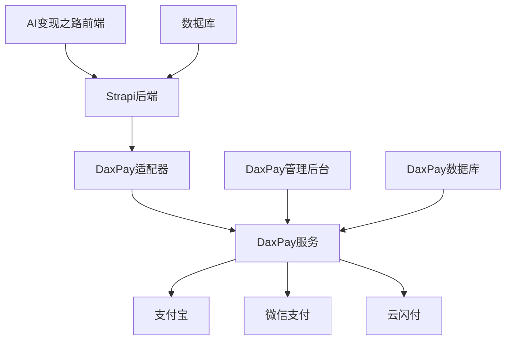

# AI变现之路 - 支付系统方案对比分析报告

> **文档版本**: v1.0  
> **创建时间**: 2025年1月
> **技术栈**: Node.js + TypeScript + Strapi 5.x  
> **适用场景**: 企业级支付系统集成方案选型

---

## 📋 目录

- [1. 方案概览](#1-方案概览)
- [2. 自主开发方案](#2-自主开发方案)
- [3. 开源项目方案](#3-开源项目方案)
- [4. 详细对比表](#4-详细对比表)
- [5. 技术实施细节](#5-技术实施细节)
- [6. 风险评估](#6-风险评估)
- [7. 最终推荐](#7-最终推荐)

---

## 1. 方案概览

### 1.1 背景需求

AI变现之路项目需要集成支付功能，支持：
- ✅ 支付宝支付（网页、手机、扫码）
- ✅ 微信支付（公众号、小程序、扫码）
- ✅ Stripe支付（国际信用卡）
- ✅ 订单管理、退款处理、对账功能
- ✅ 会员订阅、佣金分成等业务场景

### 1.2 技术约束

- **后端**: Strapi 5.x + PostgreSQL + TypeScript
- **前端**: Next.js 14 + React 19 + TypeScript
- **部署**: Docker + 云服务器
- **安全**: 企业级安全要求，支持生产环境

---

## 2. 自主开发方案

### 2.1 官方SDK直接集成

#### 技术方案

```typescript
// 支付宝官方SDK集成
import AlipaySdk from 'alipay-sdk';

export class AlipayService {
  private alipaySdk: AlipaySdk;

  constructor() {
    this.alipaySdk = new AlipaySdk({
      appId: process.env.ALIPAY_APP_ID,
      privateKey: process.env.ALIPAY_PRIVATE_KEY,
      alipayPublicKey: process.env.ALIPAY_PUBLIC_KEY,
      gateway: 'https://openapi.alipay.com/gateway.do'
    });
  }

  async createWebPayment(orderData: OrderData) {
    const formData = new AlipayFormData();
    formData.addField('bizContent', {
      outTradeNo: orderData.orderNo,
      productCode: 'FAST_INSTANT_TRADE_PAY',
      totalAmount: orderData.amount,
      subject: orderData.subject,
      body: orderData.description
    });

    return await this.alipaySdk.exec('alipay.trade.page.pay', {}, { formData });
  }
}

// 微信支付官方SDK集成
import { Payment } from 'wechatpay-axios-plugin';

export class WechatPayService {
  private payment: Payment;

  constructor() {
    this.payment = new Payment({
      appid: process.env.WECHAT_APP_ID,
      mchid: process.env.WECHAT_MCH_ID,
      private_key: process.env.WECHAT_PRIVATE_KEY,
      certificate: process.env.WECHAT_CERTIFICATE
    });
  }

  async createJSAPIPayment(orderData: OrderData) {
    return await this.payment.transactions.jsapi({
      appid: process.env.WECHAT_APP_ID,
      mchid: process.env.WECHAT_MCH_ID,
      description: orderData.subject,
      out_trade_no: orderData.orderNo,
      amount: {
        total: orderData.amount * 100,
        currency: 'CNY'
      },
      payer: {
        openid: orderData.openid
      }
    });
  }
}
```

#### 优势分析

| 优势项 | 说明 |
|--------|------|
| ✅ **完全可控** | 代码完全自主，无第三方依赖风险 |
| ✅ **性能最优** | 直接调用官方API，无中间层开销 |
| ✅ **功能最全** | 支持所有官方API功能 |
| ✅ **安全性高** | 直接与官方服务通信，安全可控 |
| ✅ **定制性强** | 可根据业务需求深度定制 |
| ✅ **学习价值** | 团队深度理解支付流程 |

#### 劣势分析

| 劣势项 | 说明 |
|--------|------|
| ❌ **开发工作量大** | 需要对接多个支付平台的API |
| ❌ **维护成本高** | 需要跟进各平台API变更 |
| ❌ **技术门槛高** | 需要深入理解各支付平台规范 |
| ❌ **测试复杂** | 需要搭建多套测试环境 |
| ❌ **风险控制** | 需要自行处理各种异常情况 |

#### 开发时间评估

- **支付宝集成**: 5-7天
- **微信支付集成**: 5-7天  
- **Stripe集成**: 3-5天
- **订单管理系统**: 7-10天
- **退款对账功能**: 5-7天
- **测试和优化**: 10-15天
- **总计**: 35-50天

---

## 3. 开源项目方案

### 3.1 DaxPay - 企业级支付网关

#### 项目信息

- **GitHub**: [https://github.com/xxm1995/dax-pay](https://github.com/xxm1995/dax-pay)
- **Stars**: 227 ⭐
- **Forks**: 42 🍴
- **Language**: Java + Vue3
- **License**: Apache-2.0
- **最后更新**: 2024年6月 (活跃维护)

#### 技术特点

```java
// DaxPay API调用示例
{
  "bizOrderNo": "ORDER20250101001",
  "title": "AI变现之路会员订阅",
  "amount": 9900,
  "channel": "ali_pay",
  "notifyUrl": "https://api.aibianx.com/daxpay/callback",
  "returnUrl": "https://aibianx.com/payment/success"
}
```

#### 功能矩阵

| 功能模块 | 支持情况 | 说明 |
|----------|----------|------|
| 💳 **支付方式** | ✅ 完整 | 支付宝、微信、云闪付、现金卡 |
| 🔄 **退款功能** | ✅ 完整 | 全额退款、部分退款、批量退款 |
| 📊 **对账功能** | ✅ 完整 | 自动对账、手工对账、差错处理 |
| 💰 **分账功能** | ✅ 完整 | 多商户分账、佣金分成 |
| 🎯 **收银台** | ✅ 完整 | H5收银台、PC收银台 |
| 📱 **管理后台** | ✅ 完整 | Vue3前端，功能完整 |
| 🔒 **安全认证** | ✅ 企业级 | 签名验证、IP白名单 |
| 📈 **监控告警** | ✅ 支持 | 支付监控、异常告警 |

#### 架构优势

- ✅ **微服务架构**: 模块化设计，易于扩展
- ✅ **HTTP解耦**: 与业务系统完全解耦
- ✅ **高可用**: 支持集群部署
- ✅ **中文文档**: 完整的中文文档和示例

### 3.2 Payshift - 统一支付API

#### 项目信息

- **GitHub**: [https://github.com/Skyquakers/payshift](https://github.com/Skyquakers/payshift)
- **Stars**: 11 ⭐
- **Forks**: 2 🍴
- **Language**: TypeScript
- **License**: 未明确
- **最后更新**: 2024年 (更新频率低)

#### 技术实现

```typescript
// Payshift集成示例
import { Payshift, AlipayProvider, WechatPayProvider, StripeProvider } from "payshift";

const alipay = new AlipayProvider({
  appId: process.env.ALIPAY_APP_ID,
  privateKey: fs.readFileSync(privateKeyPath),
  alipayPublicKey: fs.readFileSync(alipayPublicKeyPath)
});

const payshift = new Payshift([alipay, wechat, stripe]);

// 统一支付接口
const res = await payshift.createCharge({
  outTradeNo: 'ORDER20250101001',
  title: 'AI变现之路会员',
  amount: 9900,
  channel: 'alipay_mobile_web',
  currency: 'CNY'
});
```

#### 风险评估

| 风险项 | 级别 | 说明 |
|--------|------|------|
| 🔴 **社区风险** | 高 | 仅11个star，社区极小 |
| 🔴 **维护风险** | 高 | 维护者可能停止维护 |
| 🟡 **文档风险** | 中 | 文档较简单，缺乏深度 |
| 🟡 **功能风险** | 中 | 企业级功能支持不明 |

### 3.3 yzhanPay - 聚合支付系统

#### 项目信息

- **GitHub**: [https://github.com/mantoufan/yzhanPay](https://github.com/mantoufan/yzhanPay)
- **Stars**: 234 ⭐
- **Forks**: 4 🍴
- **Language**: PHP + JavaScript
- **License**: 商业限制
- **特点**: 多语言、插件扩展、订阅支付

#### 技术架构

```php
// yzhanPay插件架构
abstract class MyPaymentPlugin {
  abstract public function checkout($channel_id, $params);
  abstract public function sync($channel_id);
  abstract public function async($channel_id);
  abstract public function subscribe($channel_id, $params);
  abstract public function charge($channel_id, $params);
}
```

#### 适用性分析

| 评估项 | 结果 | 说明 |
|--------|------|------|
| 🔴 **技术栈不匹配** | 不适用 | PHP技术栈，与我们Node.js不匹配 |
| 🟡 **许可证限制** | 有风险 | 商业使用有限制 |
| ✅ **功能完整** | 优秀 | 支持订阅支付、多语言 |

### 3.4 Medusa.js支付插件生态

#### 代表性插件

1. **medusa-payment-razorpay**
   - **GitHub**: [https://github.com/SGFGOV/medusa-payment-razorpay](https://github.com/SGFGOV/medusa-payment-razorpay)
   - **Stars**: 24 ⭐, **Forks**: 22 🍴
   - **特点**: 印度Razorpay支付，架构清晰

2. **medusa-payment-mercadopago**
   - **GitHub**: [https://github.com/minskylab/medusa-payment-mercadopago](https://github.com/minskylab/medusa-payment-mercadopago)
   - **Stars**: 43 ⭐, **Forks**: 10 🍴
   - **特点**: 拉美MercadoPago支付

3. **medusa-payment-paytm**
   - **GitHub**: [https://github.com/saurabh73/medusa-payment-paytm](https://github.com/saurabh73/medusa-payment-paytm)
   - **Stars**: 4 ⭐, **Forks**: 3 🍴
   - **特点**: 印度Paytm支付

#### 架构借鉴价值

```typescript
// Medusa支付插件标准架构
export interface PaymentProvider {
  identifier: string;
  
  // 创建支付会话
  createPayment(data: CreatePaymentData): Promise<PaymentSessionData>;
  
  // 更新支付数据
  updatePayment(data: UpdatePaymentData): Promise<PaymentSessionData>;
  
  // 删除支付会话
  deletePayment(paymentSession: PaymentSession): Promise<void>;
  
  // 获取支付状态
  getStatus(data: PaymentSessionData): Promise<PaymentSessionStatus>;
  
  // 授权支付
  authorizePayment(paymentSession: PaymentSession): Promise<PaymentSessionData>;
  
  // 取消支付
  cancelPayment(payment: Payment): Promise<Payment>;
  
  // 获取支付数据
  retrievePayment(data: PaymentSessionData): Promise<PaymentSessionData>;
  
  // 处理webhook
  handleWebhook(data: any): Promise<void>;
}
```

### 3.5 其他开源方案

#### OpenPay - 微信独立收银台

- **GitHub**: [https://github.com/tans/OpenPay](https://github.com/tans/OpenPay)
- **Stars**: 14 ⭐, **Forks**: 1 🍴
- **特点**: 仅支持微信支付，功能有限

#### PassToPay - 全球支付

- **GitHub**: [https://github.com/Pass2Pay/PassToPay](https://github.com/Pass2Pay/PassToPay)
- **Stars**: 5 ⭐, **Forks**: 2 🍴
- **特点**: 跨境支付，但社区很小

---

## 4. 详细对比表

### 4.1 综合评分对比

| 方案 | 技术匹配 | 社区活跃 | 功能完整 | 文档质量 | 维护成本 | 安全性 | **总分** |
|------|----------|----------|----------|----------|----------|--------|----------|
| **自主开发** | 10/10 | N/A | 10/10 | 8/10 | 6/10 | 10/10 | **44/50** |
| **DaxPay** | 7/10 | 9/10 | 10/10 | 9/10 | 8/10 | 9/10 | **52/60** |
| **Payshift** | 10/10 | 3/10 | 7/10 | 5/10 | 4/10 | 6/10 | **35/60** |
| **yzhanPay** | 4/10 | 8/10 | 9/10 | 8/10 | 6/10 | 8/10 | **43/60** |
| **Medusa架构** | 10/10 | 7/10 | 6/10 | 7/10 | 7/10 | 7/10 | **44/60** |

### 4.2 开发成本对比

| 方案 | 初期开发 | 集成难度 | 测试工作 | 维护成本 | 人力需求 |
|------|----------|----------|----------|----------|----------|
| **自主开发** | 35-50天 | 高 | 大 | 高 | 2-3人 |
| **DaxPay** | 7-10天 | 中 | 中 | 中 | 1-2人 |
| **Payshift** | 3-5天 | 低 | 小 | 高⚠️ | 1人 |
| **yzhanPay** | 不适用 | - | - | - | - |
| **Medusa架构** | 15-20天 | 中 | 中 | 中 | 1-2人 |

### 4.3 技术风险评估

| 风险类型 | 自主开发 | DaxPay | Payshift | yzhanPay | Medusa架构 |
|----------|----------|---------|-----------|----------|------------|
| **开发风险** | 🔴 高 | 🟡 中 | 🟢 低 | 🔴 高 | 🟡 中 |
| **维护风险** | 🟡 中 | 🟢 低 | 🔴 高 | 🟡 中 | 🟡 中 |
| **安全风险** | 🟢 低 | 🟢 低 | 🟡 中 | 🟢 低 | 🟢 低 |
| **扩展风险** | 🟢 低 | 🟡 中 | 🔴 高 | 🔴 高 | 🟡 中 |
| **社区风险** | N/A | 🟢 低 | 🔴 高 | 🟡 中 | 🟡 中 |

---

## 5. 技术实施细节

### 5.1 DaxPay集成方案（推荐）

#### 部署架构



#### 实施步骤

1. **DaxPay环境搭建**
   ```bash
   # 1. 克隆项目
   git clone https://github.com/xxm1995/dax-pay.git
   cd dax-pay
   
   # 2. 配置数据库
   cp application-example.yml application.yml
   # 编辑数据库配置
   
   # 3. Docker部署
   docker-compose up -d
   
   # 4. 访问管理后台
   # http://localhost:9000
   ```

2. **Strapi适配器开发**
   ```typescript
   // backend/src/services/daxpay-adapter.ts
   export class DaxPayAdapter {
     private readonly apiUrl = process.env.DAXPAY_API_URL;
     private readonly signSecret = process.env.DAXPAY_SIGN_SECRET;
     
     async createUnifiedOrder(orderData: CreateOrderDto) {
       const payload = {
         bizOrderNo: orderData.orderNo,
         title: orderData.productName,
         amount: orderData.amount * 100, // 转换为分
         channel: this.mapChannel(orderData.paymentMethod),
         notifyUrl: `${process.env.BACKEND_URL}/api/daxpay/callback`,
         returnUrl: `${process.env.FRONTEND_URL}/payment/success`,
         reqTime: Date.now(),
         clientIp: orderData.clientIp
       };
       
       // 添加签名
       payload.sign = this.generateSign(payload);
       
       const response = await fetch(`${this.apiUrl}/unifiedorder/pay`, {
         method: 'POST',
         headers: {
           'Content-Type': 'application/json'
         },
         body: JSON.stringify(payload)
       });
       
       return await response.json();
     }
     
     private mapChannel(paymentMethod: string): string {
       const channelMap = {
         'alipay_web': 'ali_pay',
         'alipay_mobile': 'ali_wap',
         'wechat_jsapi': 'wechat_pay',
         'wechat_h5': 'wechat_h5',
         'unionpay': 'union_pay'
       };
       return channelMap[paymentMethod] || 'ali_pay';
     }
     
     private generateSign(data: any): string {
       // DaxPay签名算法实现
       const sortedKeys = Object.keys(data).sort();
       const signString = sortedKeys
         .map(key => `${key}=${data[key]}`)
         .join('&') + `&key=${this.signSecret}`;
       
       return crypto.createHash('md5').update(signString).digest('hex').toUpperCase();
     }
   }
   ```

3. **前端支付组件**
   ```tsx
   // frontend/src/components/molecules/DaxPayCheckout.tsx
   export const DaxPayCheckout: React.FC<DaxPayCheckoutProps> = ({
     orderData,
     onSuccess,
     onError
   }) => {
     const [paymentUrl, setPaymentUrl] = useState<string>('');
     const [isLoading, setIsLoading] = useState(false);
     
     const handlePayment = async (paymentMethod: string) => {
       setIsLoading(true);
       try {
         const response = await strapiApi.createPayment({
           ...orderData,
           paymentMethod
         });
         
         if (response.success) {
           // 跳转到DaxPay收银台
           window.location.href = response.payUrl;
         }
       } catch (error) {
         onError(error);
       } finally {
         setIsLoading(false);
       }
     };
     
     return (
       <div className="daxpay-checkout">
         <div className="payment-methods">
           <button 
             onClick={() => handlePayment('alipay_web')}
             disabled={isLoading}
           >
             支付宝支付
           </button>
           <button 
             onClick={() => handlePayment('wechat_jsapi')}
             disabled={isLoading}
           >
             微信支付
           </button>
         </div>
       </div>
     );
   };
   ```

### 5.2 自主开发实施方案

#### 核心架构

```typescript
// 支付服务抽象层
interface PaymentProvider {
  name: string;
  createPayment(data: PaymentData): Promise<PaymentResult>;
  queryPayment(orderNo: string): Promise<PaymentStatus>;
  processRefund(paymentId: string, amount: number): Promise<RefundResult>;
  handleWebhook(data: any): Promise<WebhookResult>;
}

// 支付管理器
export class PaymentManager {
  private providers = new Map<string, PaymentProvider>();
  
  register(provider: PaymentProvider) {
    this.providers.set(provider.name, provider);
  }
  
  async pay(method: string, data: PaymentData) {
    const provider = this.providers.get(method);
    if (!provider) {
      throw new Error(`Payment provider ${method} not found`);
    }
    return await provider.createPayment(data);
  }
}
```

#### 各支付平台实现

```typescript
// 支付宝实现
export class AlipayProvider implements PaymentProvider {
  name = 'alipay';
  private sdk: AlipaySdk;
  
  constructor(config: AlipayConfig) {
    this.sdk = new AlipaySdk({
      appId: config.appId,
      privateKey: config.privateKey,
      alipayPublicKey: config.alipayPublicKey
    });
  }
  
  async createPayment(data: PaymentData): Promise<PaymentResult> {
    const result = await this.sdk.pageExecute('alipay.trade.page.pay', {
      bizContent: {
        out_trade_no: data.orderNo,
        product_code: 'FAST_INSTANT_TRADE_PAY',
        total_amount: data.amount,
        subject: data.subject
      }
    });
    
    return {
      success: true,
      payUrl: result,
      orderNo: data.orderNo
    };
  }
}

// 微信支付实现
export class WechatPayProvider implements PaymentProvider {
  name = 'wechatpay';
  private payment: Payment;
  
  constructor(config: WechatConfig) {
    this.payment = new Payment({
      appid: config.appId,
      mchid: config.mchId,
      private_key: config.privateKey
    });
  }
  
  async createPayment(data: PaymentData): Promise<PaymentResult> {
    const result = await this.payment.transactions.jsapi({
      appid: this.config.appId,
      mchid: this.config.mchId,
      description: data.subject,
      out_trade_no: data.orderNo,
      amount: {
        total: data.amount * 100,
        currency: 'CNY'
      }
    });
    
    return {
      success: true,
      prepayId: result.prepay_id,
      orderNo: data.orderNo
    };
  }
}
```

---

## 6. 风险评估

### 6.1 技术风险

| 风险项 | 自主开发 | DaxPay | Payshift | 影响程度 | 应对策略 |
|--------|----------|---------|-----------|----------|----------|
| **API变更** | 🔴 高 | 🟢 低 | 🟡 中 | 高 | 及时跟进官方更新 |
| **安全漏洞** | 🟡 中 | 🟢 低 | 🔴 高 | 极高 | 定期安全审计 |
| **性能问题** | 🟢 低 | 🟡 中 | 🟡 中 | 中 | 性能监控 |
| **兼容性** | 🟢 低 | 🟡 中 | 🔴 高 | 中 | 充分测试 |

### 6.2 商业风险

| 风险项 | 说明 | 影响程度 | 应对策略 |
|--------|------|----------|----------|
| **合规风险** | 支付合规要求变化 | 高 | 持续关注政策变化 |
| **成本风险** | 开发维护成本超预期 | 中 | 做好成本预算和控制 |
| **时间风险** | 上线时间延期 | 中 | 分阶段实施，MVP优先 |
| **依赖风险** | 第三方服务不可用 | 高 | 多方案备选 |

### 6.3 运维风险

| 风险项 | 描述 | 预防措施 |
|--------|------|----------|
| **服务故障** | 支付服务不可用 | 多活部署、监控告警 |
| **数据丢失** | 支付数据丢失 | 实时备份、数据校验 |
| **安全攻击** | 恶意攻击支付接口 | WAF防护、限流控制 |
| **资金安全** | 资金流水异常 | 实时对账、异常告警 |

---

## 7. 最终推荐

### 7.1 推荐方案：DaxPay + 适配器模式

#### 选择理由

1. **风险最低** 🟢
   - 社区成熟度高，持续维护
   - 企业级功能完整
   - 生产环境验证

2. **实施效率高** ⚡
   - 开发周期短（7-10天）
   - 集成难度适中
   - 技术栈适配良好

3. **长期收益好** 📈
   - 功能完整，满足长期需求
   - 中文支持，维护成本低
   - 架构清晰，易于扩展

#### 实施计划

| 阶段 | 时间 | 工作内容 | 交付物 |
|------|------|----------|--------|
| **Phase 1** | 2天 | DaxPay环境搭建 | 测试环境就绪 |
| **Phase 2** | 3天 | Strapi适配器开发 | 支付API接口 |
| **Phase 3** | 2天 | 前端组件集成 | 支付界面完成 |
| **Phase 4** | 3天 | 测试和优化 | 功能验证通过 |
| **总计** | 10天 | 完整支付系统 | 生产可用 |

### 7.2 备选方案：自主开发（长期考虑）

#### 适用场景

- 团队技术实力强
- 有充足开发时间
- 需要深度定制功能
- 希望完全自主可控

#### 分阶段实施

1. **第一阶段**：使用DaxPay快速上线
2. **第二阶段**：并行开发自主支付系统
3. **第三阶段**：逐步迁移到自主系统

### 7.3 不推荐方案

#### Payshift - 风险过高

- ❌ 社区过小（仅11个star）
- ❌ 维护风险极高
- ❌ 生产环境未验证
- ❌ 企业级功能不明

#### yzhanPay - 技术栈不匹配

- ❌ PHP技术栈与项目不符
- ❌ 迁移成本过高
- ❌ 团队学习成本大

---

## 8. 总结

### 8.1 核心建议

1. **首选DaxPay方案**，快速实现支付功能上线
2. **中期考虑自主开发**，增强系统自主可控性
3. **避免小众开源项目**，降低技术风险

### 8.2 关键成功因素

- ✅ **安全第一**：确保支付安全和资金安全
- ✅ **稳定优先**：选择成熟稳定的技术方案
- ✅ **渐进实施**：分阶段实施，降低风险
- ✅ **充分测试**：确保各种场景的功能验证

### 8.3 下一步行动

1. **技术预研**：深入研究DaxPay部署和集成细节
2. **环境搭建**：搭建DaxPay测试环境
3. **原型开发**：开发支付功能原型
4. **方案确认**：团队评审确认最终技术方案

---

**文档维护**：本文档将根据技术选型结果和实施过程持续更新

**联系方式**：如有技术问题，请通过项目Issue或团队群组讨论