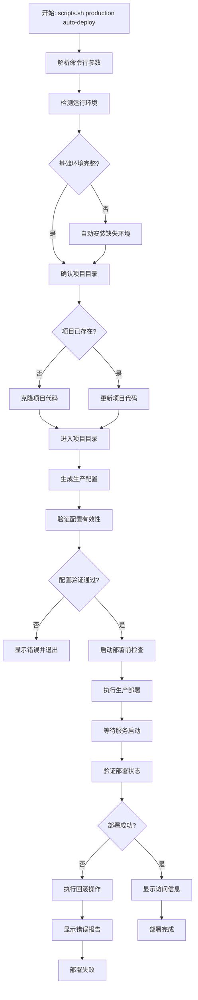

# 🚀 AI变现之路 - 统一脚本管理方案设计文档

## 📋 方案概述

将 `scripts.sh` 升级为全能项目管理脚本，支持从零开始的全自动部署，同时保持开发环境管理功能。实现"一个脚本管理所有"的目标。

**文档版本**: v1.0  
**创建时间**: 2025-08-02  
**适用范围**: AI变现之路项目全环境管理  

---

## 🎯 核心设计原则

### ✅ **统一入口原则**
- 🎯 **唯一管理脚本**: `scripts.sh` 作为所有环境的唯一入口
- 📁 **配置文件分离**: 所有配置和 Dockerfile 保持在 `deployment/` 目录
- 🔄 **智能环境检测**: 自动检测并安装缺失的基础环境
- 🌐 **远程部署支持**: 支持从远程URL直接获取并执行

### ✅ **功能扩展策略**
- 🔧 **保持现有功能**: 不影响现有的开发环境管理功能
- ➕ **新增生产部署**: 添加 `production` 类别管理生产环境
- 🔄 **统一配置管理**: 复用现有的 `configure-unified-env.sh`
- 📦 **模块化设计**: 每个功能作为独立模块，便于维护

### ✅ **向后兼容保证**
- 🔒 **零破坏性变更**: 现有所有命令和功能保持不变
- 🔄 **渐进式增强**: 新功能作为扩展添加，不影响现有工作流
- 📚 **文档完整性**: 保持现有文档有效，新增部分单独说明

---

## 🏗️ 新增功能架构

### 1. **新增命令类别**: `production`

```bash
# ===== 全自动部署 =====
./scripts.sh production auto-deploy [domain] [mail-domain]
# 从零开始的完整自动部署，包含环境安装、项目克隆、配置生成、服务启动

# ===== 环境管理 =====
./scripts.sh production install-env
# 检测并安装Git、Docker、Docker Compose等基础环境

./scripts.sh production check-env
# 检查环境是否满足部署要求

# ===== 项目管理 =====
./scripts.sh production clone-project [git-url]
# 克隆项目到指定目录

./scripts.sh production update-project
# 更新现有项目代码

# ===== 配置管理 =====
./scripts.sh production configure [domain] [mail-domain]
# 生成生产环境配置（复用统一配置管理器）

./scripts.sh production configure-check
# 验证配置文件有效性

# ===== 生产部署 =====
./scripts.sh production deploy [mode]
# mode选项: unified(整合部署), separate(分离部署)

./scripts.sh production deploy-check
# 部署前预检查

# ===== 服务管理 =====
./scripts.sh production start [service]
# 启动生产服务（可指定特定服务）

./scripts.sh production stop [service]
# 停止生产服务

./scripts.sh production restart [service]
# 重启生产服务

./scripts.sh production status
# 检查生产环境状态

# ===== 日志和监控 =====
./scripts.sh production logs [service]
# 查看生产环境日志

./scripts.sh production monitor
# 实时监控生产环境状态

# ===== 维护工具 =====
./scripts.sh production backup
# 生产环境备份

./scripts.sh production restore [backup-file]
# 生产环境恢复

./scripts.sh production cleanup
# 清理临时文件和无用资源
```

### 2. **远程部署支持**

#### **方法1: 直接在线部署**
```bash
# 基础部署（使用默认域名）
curl -fsSL https://raw.githubusercontent.com/lyfe2025/aibianx/master/scripts.sh | bash -s production auto-deploy

# 完整部署（指定域名）
curl -fsSL https://raw.githubusercontent.com/lyfe2025/aibianx/master/scripts.sh | bash -s production auto-deploy yourdomain.com mail.yourdomain.com

# 静默部署（非交互模式）
curl -fsSL https://raw.githubusercontent.com/lyfe2025/aibianx/master/scripts.sh | bash -s production auto-deploy yourdomain.com mail.yourdomain.com --silent
```

#### **方法2: 下载后部署**
```bash
# 下载脚本
wget https://raw.githubusercontent.com/lyfe2025/aibianx/master/scripts.sh
chmod +x scripts.sh

# 执行部署
./scripts.sh production auto-deploy yourdomain.com mail.yourdomain.com
```

#### **方法3: 在已有项目中升级**
```bash
# 在现有项目目录中
./scripts.sh production deploy unified

# 或者先更新项目再部署
./scripts.sh production update-project
./scripts.sh production deploy unified
```

### 3. **智能环境检测**

| 检测项 | Linux | macOS | Windows (WSL) | 自动安装方式 |
|--------|-------|-------|---------------|-------------|
| **Git** | `git --version` | `git --version` | `git --version` | apt/yum/dnf/pacman/brew |
| **Docker** | `docker --version` | `docker --version` | `docker --version` | 官方安装脚本 |
| **Docker Compose** | `docker compose version` | `docker compose version` | `docker compose version` | 包含在Docker Desktop中 |
| **curl/wget** | `curl --version` | `curl --version` | `curl --version` | 系统包管理器 |
| **基础工具** | `openssl`, `tar`, `gzip` | `openssl`, `tar`, `gzip` | `openssl`, `tar`, `gzip` | 通常预装 |
| **Node.js** | `node --version` | `node --version` | `node --version` | NodeSource/Homebrew |
| **PostgreSQL Client** | `psql --version` | `psql --version` | `psql --version` | 包管理器安装 |

#### **自动安装策略**
```bash
# Linux系统检测
detect_linux_distro() {
    if [ -f /etc/os-release ]; then
        . /etc/os-release
        echo $ID
    elif [ -f /etc/redhat-release ]; then
        echo "rhel"
    elif [ -f /etc/debian_version ]; then
        echo "debian"
    else
        echo "unknown"
    fi
}

# 包管理器映射
get_package_manager() {
    local distro=$(detect_linux_distro)
    case $distro in
        ubuntu|debian) echo "apt" ;;
        centos|rhel|fedora) echo "yum" ;;
        opensuse*) echo "zypper" ;;
        arch) echo "pacman" ;;
        *) echo "unknown" ;;
    esac
}
```

---

## 📊 完整功能对比和兼容性

### **现有功能保持不变**

| 功能类别 | 现有命令 | 功能描述 | 兼容性 |
|----------|----------|----------|--------|
| **开发环境** | `deploy start/stop/frontend/backend` | 本地开发环境管理 | ✅ 完全兼容 |
| **数据库管理** | `db check/backup/restore` | 开发数据库操作 | ✅ 完全兼容 |
| **搜索引擎** | `search deploy/check/manage/restart/logs/reindex` | MeiliSearch管理 | ✅ 完全兼容 |
| **邮件系统** | `email deploy/check/admin/test/logs` | BillionMail开发环境 | ✅ 完全兼容 |
| **备份系统** | `backup full/verify/restore/cleanup` | 开发环境备份 | ✅ 完全兼容 |
| **整合部署** | `integrated backup/restore/check/verify` | 整合环境管理 | ✅ 完全兼容 |
| **工具集** | `tools status/fix-fields/setup-env` | 开发工具 | ✅ 完全兼容 |
| **内容类型** | `content-type configure` | 内容类型配置 | ✅ 完全兼容 |

### **新增生产功能**

| 功能类别 | 新增命令 | 功能描述 | 目标用户 |
|----------|----------|----------|----------|
| **全自动部署** | `production auto-deploy` | 从零开始完整部署 | 运维/部署 |
| **环境管理** | `production install-env/check-env` | 基础环境安装检测 | 运维/部署 |
| **项目管理** | `production clone/update-project` | 项目代码管理 | 运维/开发 |
| **生产配置** | `production configure/configure-check` | 生产环境配置 | 运维/部署 |
| **生产部署** | `production deploy/deploy-check` | 生产服务部署 | 运维/部署 |
| **服务管理** | `production start/stop/restart/status` | 生产服务管理 | 运维/监控 |
| **生产监控** | `production logs/monitor` | 生产环境监控 | 运维/监控 |
| **生产维护** | `production backup/restore/cleanup` | 生产环境维护 | 运维/备份 |

---

## 🔧 详细实现技术方案

### 1. **脚本结构扩展**

```
scripts.sh                          # 主入口脚本（扩展production类别）
├── 现有功能保持不变
│   ├── handle_command_line()       # 扩展支持production类别
│   ├── execute_choice()            # 扩展支持25-35菜单选项
│   └── show_menu()                 # 扩展显示生产环境选项
│
└── 新增功能
    ├── handle_production_commands() # 处理production类别命令
    ├── production_auto_deploy()     # 全自动部署主函数
    ├── production_install_env()     # 环境安装函数
    ├── production_manage_project()  # 项目管理函数
    └── production_manage_services() # 服务管理函数
```

### 2. **新增脚本文件结构**

```
scripts/
├── 现有脚本保持不变
│   ├── deployment/
│   ├── database/
│   ├── search/
│   ├── backup/
│   ├── billionmail/
│   ├── tools/
│   └── content-type/
│
└── production/                     # 新增生产环境脚本目录
    ├── auto-deploy.sh              # 全自动部署主脚本
    │   ├── 环境检测和安装
    │   ├── 项目克隆和更新
    │   ├── 配置生成和验证
    │   ├── 服务部署和启动
    │   └── 状态检查和报告
    │
    ├── install-environment.sh      # 基础环境安装
    │   ├── detect_system()         # 系统检测
    │   ├── install_git()           # Git安装
    │   ├── install_docker()        # Docker安装
    │   ├── install_compose()       # Docker Compose安装
    │   └── verify_installation()   # 安装验证
    │
    ├── manage-project.sh           # 项目管理
    │   ├── clone_project()         # 项目克隆
    │   ├── update_project()        # 项目更新
    │   ├── switch_branch()         # 分支切换
    │   └── verify_project()        # 项目验证
    │
    ├── configure-production.sh     # 生产配置管理
    │   ├── generate_config()       # 配置生成（复用统一配置）
    │   ├── validate_config()       # 配置验证
    │   ├── backup_config()         # 配置备份
    │   └── restore_config()        # 配置恢复
    │
    ├── deploy-production.sh        # 生产部署执行
    │   ├── pre_deploy_check()      # 部署前检查
    │   ├── deploy_unified()        # 整合部署
    │   ├── deploy_separate()       # 分离部署
    │   ├── post_deploy_verify()    # 部署后验证
    │   └── rollback_deploy()       # 部署回滚
    │
    ├── manage-services.sh          # 服务管理
    │   ├── start_services()        # 启动服务
    │   ├── stop_services()         # 停止服务
    │   ├── restart_services()      # 重启服务
    │   ├── check_status()          # 状态检查
    │   └── health_check()          # 健康检查
    │
    ├── monitor-production.sh       # 生产监控
    │   ├── show_logs()             # 日志查看
    │   ├── real_time_monitor()     # 实时监控
    │   ├── performance_check()     # 性能检查
    │   └── alert_system()          # 告警系统
    │
    └── maintain-production.sh      # 生产维护
        ├── backup_production()     # 生产备份
        ├── restore_production()    # 生产恢复
        ├── cleanup_resources()     # 资源清理
        └── update_system()         # 系统更新
```

### 3. **自动部署流程详细设计**



### 4. **环境检测和安装逻辑**

```bash
# 主环境检测函数
check_and_install_environment() {
    local install_mode=${1:-"auto"}  # auto, manual, check-only
    local os_type=$(uname -s)
    local os_version=""
    local missing_tools=()
    local failed_installs=()
    
    echo "🔍 检测系统环境..."
    echo "   操作系统: $os_type"
    
    # 获取详细系统信息
    case "$os_type" in
        "Linux")
            if [ -f /etc/os-release ]; then
                . /etc/os-release
                os_version="$NAME $VERSION"
            fi
            ;;
        "Darwin")
            os_version="macOS $(sw_vers -productVersion)"
            ;;
        *)
            echo "⚠️  警告：未知操作系统 $os_type"
            ;;
    esac
    
    echo "   系统版本: $os_version"
    echo ""
    
    # 检测必需工具
    local required_tools=(
        "git:Git版本控制"
        "docker:Docker容器引擎"
        "curl:HTTP客户端工具"
        "openssl:加密工具库"
        "tar:打包工具"
        "gzip:压缩工具"
    )
    
    local optional_tools=(
        "node:Node.js运行时"
        "npm:Node.js包管理器"
        "psql:PostgreSQL客户端"
    )
    
    # 检测必需工具
    echo "🔧 检测必需工具..."
    for tool_info in "${required_tools[@]}"; do
        local tool="${tool_info%%:*}"
        local desc="${tool_info##*:}"
        
        if ! command -v "$tool" &> /dev/null; then
            echo "   ❌ $desc ($tool) - 未安装"
            missing_tools+=("$tool")
        else
            local version=$($tool --version 2>/dev/null | head -1)
            echo "   ✅ $desc ($tool) - 已安装 ($version)"
        fi
    done
    
    # 特殊检测Docker Compose
    if command -v docker &> /dev/null; then
        if docker compose version &> /dev/null; then
            local compose_version=$(docker compose version --short 2>/dev/null)
            echo "   ✅ Docker Compose - 已安装 ($compose_version)"
        else
            echo "   ❌ Docker Compose - 未安装"
            missing_tools+=("docker-compose")
        fi
    fi
    
    # 检测可选工具
    echo ""
    echo "🔧 检测可选工具..."
    for tool_info in "${optional_tools[@]}"; do
        local tool="${tool_info%%:*}"
        local desc="${tool_info##*:}"
        
        if command -v "$tool" &> /dev/null; then
            local version=$($tool --version 2>/dev/null | head -1)
            echo "   ✅ $desc ($tool) - 已安装 ($version)"
        else
            echo "   ⚠️  $desc ($tool) - 未安装 (可选)"
        fi
    done
    
    echo ""
    
    # 处理缺失工具
    if [ ${#missing_tools[@]} -eq 0 ]; then
        echo "🎉 所有必需工具已安装，环境检查通过！"
        return 0
    fi
    
    echo "⚠️  检测到缺失工具: ${missing_tools[*]}"
    
    if [ "$install_mode" = "check-only" ]; then
        echo "❌ 环境检查模式，不执行安装"
        return 1
    fi
    
    if [ "$install_mode" = "manual" ]; then
        echo ""
        echo "请手动安装以下工具后重新运行："
        for tool in "${missing_tools[@]}"; do
            echo "  - $tool"
        done
        return 1
    fi
    
    # 自动安装模式
    echo ""
    echo "🚀 开始自动安装缺失工具..."
    
    case "$os_type" in
        "Linux")
            install_linux_environment "${missing_tools[@]}"
            ;;
        "Darwin")
            install_macos_environment "${missing_tools[@]}"
            ;;
        *)
            echo "❌ 不支持在 $os_type 系统上自动安装"
            echo "请手动安装缺失工具后重新运行"
            return 1
            ;;
    esac
    
    # 重新验证安装结果
    echo ""
    echo "🔍 验证安装结果..."
    
    for tool in "${missing_tools[@]}"; do
        if command -v "$tool" &> /dev/null; then
            echo "   ✅ $tool - 安装成功"
        else
            echo "   ❌ $tool - 安装失败"
            failed_installs+=("$tool")
        fi
    done
    
    if [ ${#failed_installs[@]} -eq 0 ]; then
        echo ""
        echo "🎉 所有工具安装成功，环境配置完成！"
        return 0
    else
        echo ""
        echo "❌ 以下工具安装失败: ${failed_installs[*]}"
        echo "请手动安装后重新运行"
        return 1
    fi
}

# Linux环境安装
install_linux_environment() {
    local tools=("$@")
    local pkg_manager=$(get_package_manager)
    
    echo "🐧 Linux环境自动安装 (包管理器: $pkg_manager)"
    
    # 更新包索引
    echo "📦 更新包索引..."
    case "$pkg_manager" in
        "apt")
            sudo apt update
            ;;
        "yum")
            sudo yum makecache
            ;;
        "dnf")
            sudo dnf makecache
            ;;
        "pacman")
            sudo pacman -Sy
            ;;
        "zypper")
            sudo zypper refresh
            ;;
    esac
    
    # 安装工具
    for tool in "${tools[@]}"; do
        echo "🔧 安装 $tool..."
        
        case "$tool" in
            "git")
                install_git_linux "$pkg_manager"
                ;;
            "docker")
                install_docker_linux "$pkg_manager"
                ;;
            "docker-compose")
                install_docker_compose_linux
                ;;
            "curl")
                install_basic_tool_linux "$pkg_manager" "curl"
                ;;
            *)
                install_basic_tool_linux "$pkg_manager" "$tool"
                ;;
        esac
    done
}

# macOS环境安装
install_macos_environment() {
    local tools=("$@")
    
    echo "🍎 macOS环境自动安装"
    
    # 检查Homebrew
    if ! command -v brew &> /dev/null; then
        echo "🍺 安装Homebrew..."
        /bin/bash -c "$(curl -fsSL https://raw.githubusercontent.com/Homebrew/install/HEAD/install.sh)"
    fi
    
    # 更新Homebrew
    echo "🔄 更新Homebrew..."
    brew update
    
    # 安装工具
    for tool in "${tools[@]}"; do
        echo "🔧 安装 $tool..."
        
        case "$tool" in
            "git")
                brew install git
                ;;
            "docker")
                echo "🐳 安装Docker Desktop for Mac..."
                echo "请访问 https://docs.docker.com/desktop/mac/install/ 手动安装Docker Desktop"
                echo "或使用: brew install --cask docker"
                ;;
            "docker-compose")
                echo "🐳 Docker Compose包含在Docker Desktop中"
                ;;
            *)
                brew install "$tool"
                ;;
        esac
    done
}
```

### 5. **配置管理集成**

```bash
# 复用现有统一配置管理器
configure_production_environment() {
    local domain=${1:-""}
    local mail_domain=${2:-""}
    local config_mode="integrated"
    
    echo "⚙️ 生成生产环境配置..."
    echo "   域名: ${domain:-"(使用默认域名)"}"
    echo "   邮件域名: ${mail_domain:-"(使用默认邮件域名)"}"
    echo ""
    
    # 检查统一配置脚本是否存在
    local config_script="deployment/configure-unified-env.sh"
    if [ ! -f "$config_script" ]; then
        echo "❌ 统一配置脚本不存在: $config_script"
        echo "请确保项目完整性"
        return 1
    fi
    
    # 备份现有配置
    echo "💾 备份现有配置..."
    local timestamp=$(date +%Y%m%d_%H%M%S)
    
    if [ -f "frontend/.env.local" ]; then
        cp "frontend/.env.local" "frontend/.env.local.backup.$timestamp"
    fi
    
    if [ -f "backend/.env" ]; then
        cp "backend/.env" "backend/.env.backup.$timestamp"
    fi
    
    # 生成生产配置
    echo "🔧 执行统一配置生成..."
    
    if [ -n "$domain" ] && [ -n "$mail_domain" ]; then
        # 使用指定域名
        ./"$config_script" "$config_mode" "$domain" "$mail_domain"
    elif [ -n "$domain" ]; then
        # 使用指定域名，邮件域名自动生成
        ./"$config_script" "$config_mode" "$domain"
    else
        # 使用默认域名
        ./"$config_script" "$config_mode"
    fi
    
    local config_result=$?
    
    if [ $config_result -eq 0 ]; then
        echo "✅ 生产配置生成成功"
        return 0
    else
        echo "❌ 生产配置生成失败"
        
        # 恢复备份配置
        echo "🔄 恢复原配置..."
        if [ -f "frontend/.env.local.backup.$timestamp" ]; then
            cp "frontend/.env.local.backup.$timestamp" "frontend/.env.local"
        fi
        
        if [ -f "backend/.env.backup.$timestamp" ]; then
            cp "backend/.env.backup.$timestamp" "backend/.env"
        fi
        
        return 1
    fi
}

# 配置验证函数
validate_production_config() {
    echo "🔍 验证生产配置..."
    
    local errors=()
    
    # 检查前端配置
    if [ ! -f "frontend/.env.local" ]; then
        errors+=("前端配置文件不存在: frontend/.env.local")
    else
        # 验证关键配置项
        local frontend_domain=$(grep "NEXT_PUBLIC_FRONTEND_DOMAIN=" frontend/.env.local | cut -d'=' -f2)
        local frontend_protocol=$(grep "NEXT_PUBLIC_FRONTEND_PROTOCOL=" frontend/.env.local | cut -d'=' -f2)
        
        if [ -z "$frontend_domain" ]; then
            errors+=("前端域名配置缺失")
        fi
        
        if [ "$frontend_protocol" != "https" ]; then
            errors+=("生产环境应使用HTTPS协议")
        fi
    fi
    
    # 检查后端配置
    if [ ! -f "backend/.env" ]; then
        errors+=("后端配置文件不存在: backend/.env")
    else
        # 验证关键配置项
        local node_env=$(grep "NODE_ENV=" backend/.env | cut -d'=' -f2)
        local database_host=$(grep "DATABASE_HOST=" backend/.env | cut -d'=' -f2)
        
        if [ "$node_env" != "production" ]; then
            errors+=("后端环境应设置为production")
        fi
        
        if [ "$database_host" = "localhost" ]; then
            errors+=("生产环境应使用容器化数据库连接")
        fi
    fi
    
    # 报告验证结果
    if [ ${#errors[@]} -eq 0 ]; then
        echo "✅ 配置验证通过"
        return 0
    else
        echo "❌ 配置验证失败："
        for error in "${errors[@]}"; do
            echo "   • $error"
        done
        return 1
    fi
}
```

---

## 🚀 详细使用场景和命令示例

### 场景1: **全新服务器一键部署**

#### **基础部署（交互式）**
```bash
# 在空白Linux/macOS服务器上执行
curl -fsSL https://raw.githubusercontent.com/lyfe2025/aibianx/master/scripts.sh | bash -s production auto-deploy

# 执行过程中会提示输入：
# 🌐 请输入网站域名: example.com
# 📧 请输入邮件域名: mail.example.com
# 🔧 选择部署模式: [1] 整合部署 [2] 分离部署
```

#### **完整部署（非交互式）**
```bash
# 指定所有参数，静默执行
curl -fsSL https://raw.githubusercontent.com/lyfe2025/aibianx/master/scripts.sh | bash -s production auto-deploy example.com mail.example.com --mode unified --silent

# 参数说明：
# example.com      - 网站主域名
# mail.example.com - 邮件服务域名
# --mode unified   - 使用整合部署模式
# --silent         - 静默模式，不要求用户交互
```

#### **分步部署（高级用户）**
```bash
# 1. 下载脚本
wget https://raw.githubusercontent.com/lyfe2025/aibianx/master/scripts.sh
chmod +x scripts.sh

# 2. 检查环境
./scripts.sh production check-env

# 3. 安装缺失环境（如果需要）
./scripts.sh production install-env

# 4. 克隆项目
./scripts.sh production clone-project

# 5. 配置生产环境
./scripts.sh production configure example.com mail.example.com

# 6. 验证配置
./scripts.sh production configure-check

# 7. 执行部署
./scripts.sh production deploy unified

# 8. 检查状态
./scripts.sh production status
```

### 场景2: **已有项目升级到生产**

#### **在现有开发项目中**
```bash
cd /path/to/aibianx

# 方法1: 直接升级部署
./scripts.sh production deploy unified example.com mail.example.com

# 方法2: 分步升级
./scripts.sh production configure example.com mail.example.com
./scripts.sh production deploy-check
./scripts.sh production deploy unified
```

#### **从开发环境切换到生产环境**
```bash
# 当前开发环境运行中
./scripts.sh deploy stop

# 切换到生产配置
./scripts.sh production configure example.com mail.example.com

# 启动生产环境
./scripts.sh production deploy unified

# 验证部署
./scripts.sh production status
```

### 场景3: **生产环境代码更新和维护**

#### **代码更新流程**
```bash
# 1. 备份当前环境
./scripts.sh production backup

# 2. 更新项目代码
./scripts.sh production update-project

# 3. 重新构建和部署
./scripts.sh production deploy unified --rebuild

# 4. 验证更新结果
./scripts.sh production status
./scripts.sh production logs
```

#### **回滚操作**
```bash
# 如果更新出现问题，回滚到之前版本
git checkout HEAD~1  # 回滚代码到上一版本

# 重新部署
./scripts.sh production deploy unified --force

# 或者从备份恢复
./scripts.sh production restore /path/to/backup.tar.gz
```

#### **日常维护**
```bash
# 查看生产环境状态
./scripts.sh production status

# 查看实时日志
./scripts.sh production logs

# 查看特定服务日志
./scripts.sh production logs backend
./scripts.sh production logs frontend
./scripts.sh production logs postgres

# 重启特定服务
./scripts.sh production restart backend

# 性能监控
./scripts.sh production monitor

# 清理无用资源
./scripts.sh production cleanup
```

### 场景4: **多环境管理**

#### **开发和生产环境并存**
```bash
# 项目目录结构
/projects/
├── aibianx-dev/          # 开发环境
│   ├── scripts.sh
│   ├── frontend/.env.local  (dev配置)
│   └── backend/.env         (dev配置)
└── aibianx-prod/         # 生产环境
    ├── scripts.sh
    ├── frontend/.env.local  (production配置)
    └── backend/.env         (production配置)

# 开发环境操作
cd /projects/aibianx-dev
./scripts.sh deploy start

# 生产环境操作
cd /projects/aibianx-prod  
./scripts.sh production start
```

#### **配置切换**
```bash
# 在同一项目中快速切换配置
# 切换到开发环境
./scripts.sh tools configure dev

# 切换到生产环境
./scripts.sh tools configure production example.com mail.example.com

# 查看当前配置模式
./scripts.sh tools configure check
```

---

## 🔄 智能交互式菜单设计

### **🎯 核心设计原则**

#### **环境自适应菜单**
- ✅ **自动环境检测**: 根据配置文件和环境标记自动识别当前环境
- ✅ **统一菜单结构**: 开发和生产环境使用相同的菜单选项编号
- ✅ **智能脚本选择**: 相同选项根据环境自动调用不同的执行脚本
- ✅ **环境切换功能**: 提供快速环境切换和配置管理

#### **菜单布局优化**
- 🎯 **环境状态显示**: 菜单顶部明确显示当前环境状态
- 📋 **功能分类清晰**: 按功能模块分组，便于查找
- 🔄 **选项编号固定**: 相同功能在不同环境下使用相同编号
- 💡 **智能提示**: 根据环境显示相应的功能说明

### **🖥️ 统一交互式菜单 (自适应版)**

```
🚀 AI变现之路 - 智能项目管理脚本
==========================================
📍 当前环境: [🔧 开发环境 | 🚀 生产环境]
📁 项目路径: /path/to/aibianx
⏰ 最后更新: 2025-08-02 10:30:15
📊 环境状态: [🟢 正常 | 🟡 警告 | 🔴 异常]

🎯 环境管理
========================
e)   🔄 切换环境模式         # 开发 ⇄ 生产
env) 📋 查看环境配置         # 显示当前环境详细信息

🚀 部署管理
========================
1)   🚀 全自动部署           # 开发: start-dev | 生产: auto-deploy
2)   🌐 启动前端服务         # 开发: start-frontend | 生产: start frontend
3)   ⚙️ 启动后端服务        # 开发: start-backend | 生产: start backend  
4)   🛑 停止所有服务         # 开发: stop-dev | 生产: stop production
5)   🔄 重启服务            # 开发: restart-dev | 生产: restart production

📊 状态监控
========================
6)   📈 检查系统状态         # 开发: tools status | 生产: production status
7)   🗄️ 检查数据库          # 开发: db check | 生产: production db-check
8)   🔍 检查搜索引擎         # 开发: search check | 生产: production search-check
9)   📧 检查邮件系统         # 开发: email check | 生产: production email-check
10)  📋 查看实时日志         # 开发: logs | 生产: production logs
11)  📊 实时监控面板         # 开发: monitor | 生产: production monitor

🔧 开发工具 (仅开发环境)
========================
12)  🔍 部署搜索引擎         # search deploy
13)  🔧 搜索管理工具         # search manage  
14)  🔄 重建搜索索引         # search reindex
15)  📧 打开邮件管理         # email admin
16)  🔧 修复字段描述         # tools fix-fields
17)  ⚙️ 配置环境变量        # tools setup-env

🚀 生产工具 (仅生产环境)
========================
12)  🔧 安装基础环境         # production install-env
13)  📥 克隆/更新项目       # production clone/update-project  
14)  ⚙️ 生成生产配置        # production configure
15)  🔍 验证配置文件         # production configure-check
16)  📊 部署前检查          # production deploy-check
17)  🛠️ 生产维护工具       # production maintenance

💾 备份恢复
========================
18)  💾 数据库备份          # 开发: db backup | 生产: production backup
19)  📦 完整系统备份         # 开发: backup full | 生产: production backup-full
20)  🔄 数据库恢复          # 开发: db restore | 生产: production restore
21)  🔍 验证备份文件         # 开发: backup verify | 生产: production verify
22)  🧹 清理备份文件         # 开发: backup cleanup | 生产: production cleanup

🔧 高级功能
========================
c)   ⚙️ 配置管理            # 统一配置管理入口
t)   🔧 故障排查工具         # 诊断和修复工具
u)   📥 项目更新            # 开发: git pull | 生产: production update-project
h)   📖 显示帮助信息         # 详细帮助和使用指南
0)   👋 退出脚本

==========================================
💡 提示: 输入选项编号或字母，按回车确认
🔄 环境切换: 输入 'e' 可快速切换开发/生产环境
```

### **🎯 环境自适应逻辑**

#### **1. 环境检测函数**
```bash
# 检测当前环境
detect_current_environment() {
    local env_type="unknown"
    local env_status="unknown"
    local config_type="unknown"
    
    # 检测环境标记文件
    if [ -f ".production" ]; then
        env_type="production"
    elif [ -f ".development" ]; then
        env_type="development"
    else
        # 通过配置文件检测
        if [ -f "backend/.env" ]; then
            local node_env=$(grep "NODE_ENV=" backend/.env 2>/dev/null | cut -d'=' -f2)
            local database_host=$(grep "DATABASE_HOST=" backend/.env 2>/dev/null | cut -d'=' -f2)
            
            if [ "$node_env" = "production" ] || [ "$database_host" != "localhost" ]; then
                env_type="production"
                config_type="integrated"
            else
                env_type="development"
                config_type="local"
            fi
        else
            env_type="development"
        fi
    fi
    
    # 检测环境状态
    case "$env_type" in
        "production")
            if check_production_services; then
                env_status="healthy"
            else
                env_status="warning"
            fi
            ;;
        "development")
            if check_development_services; then
                env_status="healthy"
            else
                env_status="warning"
            fi
            ;;
        *)
            env_status="error"
            ;;
    esac
    
    # 输出环境信息
    echo "$env_type:$env_status:$config_type"
}

# 显示环境状态
show_environment_status() {
    local env_info=$(detect_current_environment)
    local env_type="${env_info%%:*}"
    local temp="${env_info#*:}"
    local env_status="${temp%%:*}"
    local config_type="${temp##*:}"
    
    local env_icon="🔧"
    local env_name="开发环境"
    local status_icon="🟡"
    local status_name="未知"
    
    case "$env_type" in
        "production")
            env_icon="🚀"
            env_name="生产环境"
            ;;
        "development")
            env_icon="🔧"  
            env_name="开发环境"
            ;;
    esac
    
    case "$env_status" in
        "healthy")
            status_icon="🟢"
            status_name="正常"
            ;;
        "warning")
            status_icon="🟡"
            status_name="警告"
            ;;
        "error")
            status_icon="🔴"
            status_name="异常"
            ;;
    esac
    
    echo "📍 当前环境: $env_icon $env_name"
    echo "📊 环境状态: $status_icon $status_name"
    echo "⚙️ 配置类型: $config_type"
    echo "📁 项目路径: $(pwd)"
    echo "⏰ 最后更新: $(date '+%Y-%m-%d %H:%M:%S')"
}
```

#### **2. 智能命令映射**
```bash
# 智能命令执行
execute_smart_choice() {
    local choice=$1
    local env_info=$(detect_current_environment)
    local env_type="${env_info%%:*}"
    
    echo ""
    echo "🎯 环境: $env_type | 选择: $choice"
    echo ""
    
    case $choice in
        1) # 全自动部署
            if [ "$env_type" = "production" ]; then
                echo -e "${GREEN}🚀 生产环境全自动部署...${NC}"
                exec "$SCRIPT_DIR/scripts/production/auto-deploy.sh"
            else
                echo -e "${GREEN}🚀 启动完整开发环境...${NC}"
                exec "$SCRIPT_DIR/scripts/deployment/start-dev.sh"
            fi
            ;;
        2) # 启动前端
            if [ "$env_type" = "production" ]; then
                echo -e "${GREEN}🌐 启动生产前端服务...${NC}"
                exec "$SCRIPT_DIR/scripts/production/manage-services.sh" start frontend
            else
                echo -e "${GREEN}🌐 启动开发前端服务...${NC}"
                exec "$SCRIPT_DIR/scripts/deployment/start-frontend.sh"
            fi
            ;;
        3) # 启动后端
            if [ "$env_type" = "production" ]; then
                echo -e "${GREEN}⚙️ 启动生产后端服务...${NC}"
                exec "$SCRIPT_DIR/scripts/production/manage-services.sh" start backend
            else
                echo -e "${GREEN}⚙️ 启动开发后端服务...${NC}"
                exec "$SCRIPT_DIR/scripts/deployment/start-backend.sh"
            fi
            ;;
        4) # 停止服务
            if [ "$env_type" = "production" ]; then
                echo -e "${YELLOW}🛑 停止生产环境...${NC}"
                exec "$SCRIPT_DIR/scripts/production/manage-services.sh" stop
            else
                echo -e "${YELLOW}🛑 停止开发环境...${NC}"
                exec "$SCRIPT_DIR/scripts/deployment/stop-dev.sh"
            fi
            ;;
        6) # 检查状态
            if [ "$env_type" = "production" ]; then
                echo -e "${BLUE}📈 检查生产环境状态...${NC}"
                exec "$SCRIPT_DIR/scripts/production/manage-services.sh" status
            else
                echo -e "${BLUE}📈 检查开发环境状态...${NC}"
                exec "$SCRIPT_DIR/scripts/tools/status.sh"
            fi
            ;;
        18) # 数据库备份
            if [ "$env_type" = "production" ]; then
                echo -e "${PURPLE}💾 生产环境数据库备份...${NC}"
                exec "$SCRIPT_DIR/scripts/production/maintain-production.sh" backup
            else
                echo -e "${PURPLE}💾 开发环境数据库备份...${NC}"
                exec "$SCRIPT_DIR/scripts/database/backup-database-only.sh"
            fi
            ;;
        "e"|"E") # 环境切换
            switch_environment
            return 1
            ;;
        "env"|"ENV") # 查看环境
            show_detailed_environment_info
            return 1
            ;;
        "c"|"C") # 配置管理
            show_configuration_menu
            return 1
            ;;
        "t"|"T") # 故障排查
            show_troubleshooting_menu
            return 1
            ;;
        # ... 其他选项
    esac
}
```

#### **3. 环境切换功能**
```bash
# 环境切换
switch_environment() {
    local current_env=$(detect_current_environment | cut -d':' -f1)
    
    echo "🔄 环境切换工具"
    echo "==============="
    echo "📍 当前环境: $current_env"
    echo ""
    echo "选择目标环境:"
    echo "  1) 🔧 开发环境 (localhost)"
    echo "  2) 🚀 生产环境 (需要域名)"
    echo "  0) 🔙 返回主菜单"
    echo ""
    read -p "请选择 [0-2]: " env_choice
    
    case $env_choice in
        1)
            echo ""
            echo "🔧 切换到开发环境..."
            ./deployment/configure-unified-env.sh dev
            
            # 清理环境标记
            rm -f .production .development
            echo "development-$(date +%Y%m%d)" > .development
            
            echo "✅ 已切换到开发环境"
            ;;
        2)
            echo ""
            echo "🌐 请输入生产环境域名:"
            read -p "网站域名: " domain
            read -p "邮件域名 (可选): " mail_domain
            
            if [ -z "$domain" ]; then
                echo "❌ 域名不能为空"
                return 1
            fi
            
            echo ""
            echo "🚀 切换到生产环境..."
            
            if [ -n "$mail_domain" ]; then
                ./deployment/configure-unified-env.sh integrated "$domain" "$mail_domain"
            else
                ./deployment/configure-unified-env.sh integrated "$domain"
            fi
            
            # 清理环境标记
            rm -f .production .development
            echo "production-$(date +%Y%m%d)" > .production
            
            echo "✅ 已切换到生产环境"
            ;;
        0)
            return 1
            ;;
        *)
            echo "❌ 无效选择"
            return 1
            ;;
    esac
    
    echo ""
    read -p "按回车键返回主菜单..."
}
```

#### **4. 配置管理菜单**
```bash
# 配置管理子菜单
show_configuration_menu() {
    local current_env=$(detect_current_environment | cut -d':' -f1)
    
    echo "⚙️ 配置管理工具"
    echo "==============="
    echo "📍 当前环境: $current_env"
    echo ""
    echo "配置操作:"
    echo "  1) 📋 查看当前配置"
    echo "  2) ⚙️ 生成新配置"
    echo "  3) 🔍 验证配置文件"
    echo "  4) 💾 备份配置文件"
    echo "  5) 🔄 恢复配置文件"
    echo "  6) 🔧 编辑配置文件"
    echo "  0) 🔙 返回主菜单"
    echo ""
    read -p "请选择 [0-6]: " config_choice
    
    case $config_choice in
        1)
            show_current_configuration
            ;;
        2)
            if [ "$current_env" = "production" ]; then
                echo "请输入生产环境信息:"
                read -p "域名: " domain
                read -p "邮件域名: " mail_domain
                ./deployment/configure-unified-env.sh integrated "$domain" "$mail_domain"
            else
                ./deployment/configure-unified-env.sh dev
            fi
            ;;
        3)
            validate_current_configuration
            ;;
        # ... 其他配置选项
    esac
    
    echo ""
    read -p "按回车键返回配置菜单..."
    show_configuration_menu
}
```

### **🖥️ 智能交互流程示例**

#### **1. 环境自动检测和菜单显示**
```
🚀 AI变现之路 - 智能项目管理脚本
==========================================
📍 当前环境: 🔧 开发环境
📁 项目路径: /Volumes/wwx/dev/WebProjects/aibianx
⏰ 最后更新: 2025-08-02 15:30:25
📊 环境状态: 🟢 正常 (5个服务运行中)

🎯 环境管理
========================
e)   🔄 切换环境模式         
env) 📋 查看环境配置

🚀 部署管理
========================
1)   🚀 启动完整开发环境      # 因为是开发环境，显示开发相关功能
2)   🌐 启动前端服务
3)   ⚙️ 启动后端服务  
4)   🛑 停止所有服务
5)   🔄 重启服务

📊 状态监控
========================
6)   📈 检查系统状态
... (其他选项)

💡 输入 'e' 可切换到生产环境
请输入选择: 
```

#### **2. 环境切换交互流程**
```
用户输入: e

🔄 环境切换工具
===============
📍 当前环境: development

选择目标环境:
  1) 🔧 开发环境 (localhost)
  2) 🚀 生产环境 (需要域名)
  0) 🔙 返回主菜单

请选择 [0-2]: 2

🌐 请输入生产环境域名:
网站域名: example.com
邮件域名 (可选): mail.example.com

🚀 切换到生产环境...
⚙️ 生成生产环境配置...
   🔐 生成安全密钥...
   📝 写入前端配置...
   📝 写入后端配置...
   ✅ 配置生成完成

🔍 验证配置文件...
   ✅ 前端配置验证通过
   ✅ 后端配置验证通过

✅ 已切换到生产环境

按回车键返回主菜单...

🚀 AI变现之路 - 智能项目管理脚本
==========================================
📍 当前环境: 🚀 生产环境  # 环境已切换
📁 项目路径: /Volumes/wwx/dev/WebProjects/aibianx
⏰ 最后更新: 2025-08-02 15:32:18
📊 环境状态: 🟡 警告 (服务未启动)

🎯 环境管理
========================
e)   🔄 切换环境模式         
env) 📋 查看环境配置

🚀 部署管理
========================
1)   🚀 全自动生产部署        # 因为是生产环境，显示生产相关功能
2)   🌐 启动生产前端服务
3)   ⚙️ 启动生产后端服务  
4)   🛑 停止生产服务
5)   🔄 重启生产服务

🚀 生产工具 (仅生产环境)    # 只在生产环境显示
========================
12)  🔧 安装基础环境
13)  📥 克隆/更新项目
... (其他生产专用选项)

💡 输入 'e' 可切换回开发环境
请输入选择: 
```

#### **3. 智能命令执行示例**
```
用户输入: 1

🎯 环境: production | 选择: 1

🚀 生产环境全自动部署...
================================

🔍 环境检测...
   ✅ Git - 已安装 (git version 2.39.2)
   ✅ Docker - 已安装 (Docker version 24.0.5)
   ✅ Docker Compose - 已安装 (v2.20.2)

📋 使用已配置的生产环境信息:
   🌐 网站域名: example.com
   📧 邮件域名: mail.example.com
   ⚙️ 配置模式: integrated

🚀 开始生产部署...
   📦 构建Docker镜像...
   🔧 启动数据库服务...
   🔧 启动应用服务...
   🔧 启动邮件服务...
   ✅ 所有服务启动完成

🔍 验证部署状态...
   ✅ PostgreSQL - 运行正常
   ✅ Frontend - 运行正常 (端口 80)
   ✅ Backend - 运行正常 (端口 1337)
   ✅ BillionMail - 运行正常 (端口 8080)

🎉 生产部署完成！
=================
🌐 网站首页: https://example.com
⚙️ 后台管理: https://example.com/admin
📧 邮件管理: https://example.com:8080/billion

💡 管理命令:
   查看状态: 选择菜单 6) 检查系统状态
   查看日志: 选择菜单 10) 查看实时日志
   重启服务: 选择菜单 5) 重启服务

按回车键返回主菜单...
```

#### **4. 配置管理交互流程**
```
用户输入: c

⚙️ 配置管理工具
===============
📍 当前环境: production

配置操作:
  1) 📋 查看当前配置
  2) ⚙️ 生成新配置
  3) 🔍 验证配置文件
  4) 💾 备份配置文件
  5) 🔄 恢复配置文件
  6) 🔧 编辑配置文件
  0) 🔙 返回主菜单

请选择 [0-6]: 1

📋 当前生产环境配置
==================
📁 前端配置: frontend/.env.local
   🌐 域名: example.com
   🔒 协议: https
   📧 邮件域名: mail.example.com
   ✅ 配置状态: 有效

📁 后端配置: backend/.env
   🗄️ 数据库: postgres (容器)
   🔧 环境: production
   🔐 安全密钥: 已配置
   ✅ 配置状态: 有效

🔍 配置验证结果: ✅ 通过

按回车键返回配置菜单...
```

### **🎯 用户体验改进点**

#### **✅ 统一性改进**
- **相同编号相同功能**: 选项1始终是"启动/部署"，选项6始终是"检查状态"
- **智能功能描述**: 根据环境自动显示相应的功能说明
- **环境状态可视**: 顶部清晰显示当前环境和状态
- **快速切换**: 一键环境切换，无需退出脚本

#### **✅ 便利性改进**  
- **智能检测**: 自动识别环境，无需用户手动指定
- **上下文提示**: 根据环境状态提供相应的操作建议
- **配置管理**: 统一的配置管理界面，支持查看/编辑/验证
- **故障排查**: 集成的故障排查工具，快速定位问题

#### **✅ 一致性保证**
- **命令映射**: 相同选项在不同环境执行对应的脚本
- **菜单结构**: 开发和生产环境菜单结构完全一致
- **功能分组**: 相同功能类别使用相同的编号范围
- **交互模式**: 统一的交互模式和用户反馈

---

## 📋 实现优先级和开发阶段

### **阶段1: 核心架构实现** (优先级: 🔥 最高)

#### **1.1 扩展主脚本** 
```bash
# 任务清单
✅ 修改 scripts.sh 主函数
✅ 添加 production 类别处理
✅ 扩展 handle_command_line() 函数
✅ 扩展 execute_choice() 函数
✅ 更新帮助信息和使用说明

# 预计用时: 2小时
# 风险级别: 低 (向后兼容)
```

#### **1.2 创建核心生产脚本**
```bash
# 任务清单
✅ 创建 scripts/production/ 目录
✅ 实现 auto-deploy.sh (全自动部署)
✅ 实现 install-environment.sh (环境安装)
✅ 实现 manage-project.sh (项目管理)

# 预计用时: 6小时
# 风险级别: 中 (新功能)
```

#### **1.3 集成现有配置系统**
```bash
# 任务清单
✅ 集成 configure-unified-env.sh
✅ 适配 docker-compose.unified.yml
✅ 测试配置生成和验证

# 预计用时: 2小时
# 风险级别: 低 (复用现有系统)
```

### **阶段2: 功能完善实现** (优先级: 🔸 高)

#### **2.1 部署功能实现**
```bash
# 任务清单
✅ 实现 deploy-production.sh
✅ 支持 unified 和 separate 部署模式
✅ 添加部署前检查和后验证
✅ 实现部署回滚机制

# 预计用时: 4小时
# 风险级别: 中
```

#### **2.2 服务管理功能**
```bash
# 任务清单  
✅ 实现 manage-services.sh
✅ 支持 start/stop/restart/status
✅ 支持单个服务和全部服务操作
✅ 添加健康检查功能

# 预计用时: 3小时
# 风险级别: 低
```

#### **2.3 监控和日志功能**
```bash
# 任务清单
✅ 实现 monitor-production.sh  
✅ 支持实时日志查看
✅ 支持性能监控
✅ 实现简单告警系统

# 预计用时: 4小时
# 风险级别: 中
```

### **阶段3: 增强功能实现** (优先级: 🔹 中)

#### **3.1 远程部署支持**
```bash
# 任务清单
✅ 支持 curl 直接执行
✅ 添加脚本完整性验证
✅ 实现静默安装模式
✅ 添加参数传递支持

# 预计用时: 3小时
# 风险级别: 中
```

#### **3.2 交互式菜单扩展**
```bash
# 任务清单
✅ 扩展 show_menu() 函数
✅ 添加 25-40 菜单选项
✅ 优化菜单显示效果
✅ 添加菜单分类

# 预计用时: 2小时  
# 风险级别: 低
```

#### **3.3 维护工具实现**
```bash
# 任务清单
✅ 实现 maintain-production.sh
✅ 支持生产环境备份恢复
✅ 支持资源清理
✅ 支持系统更新

# 预计用时: 3小时
# 风险级别: 低
```

### **阶段4: 优化和完善** (优先级: 🔸 低)

#### **4.1 错误处理和回滚**
```bash
# 任务清单
✅ 完善错误处理机制
✅ 实现自动回滚功能  
✅ 添加详细错误报告
✅ 实现故障恢复指导

# 预计用时: 4小时
# 风险级别: 低
```

#### **4.2 性能优化**
```bash
# 任务清单
✅ 优化部署速度
✅ 并行化处理任务
✅ 优化资源使用
✅ 缓存机制实现

# 预计用时: 3小时
# 风险级别: 低  
```

#### **4.3 文档和帮助**
```bash
# 任务清单
✅ 完善命令帮助信息
✅ 添加故障排查指南
✅ 更新使用文档
✅ 添加最佳实践指南

# 预计用时: 2小时
# 风险级别: 极低
```

---

## 🔍 安全性和稳定性设计

### **安全措施**

#### **1. 脚本完整性验证**
```bash
# 远程脚本下载验证
verify_remote_script() {
    local script_url="$1"
    local expected_hash="$2"  # 可选的SHA256哈希值
    
    echo "🔍 验证远程脚本完整性..."
    
    # 下载脚本
    local temp_script=$(mktemp)
    if ! curl -fsSL "$script_url" -o "$temp_script"; then
        echo "❌ 脚本下载失败"
        return 1
    fi
    
    # 验证哈希值（如果提供）
    if [ -n "$expected_hash" ]; then
        local actual_hash=$(sha256sum "$temp_script" | cut -d' ' -f1)
        if [ "$actual_hash" != "$expected_hash" ]; then
            echo "❌ 脚本哈希验证失败"
            echo "   期望: $expected_hash"
            echo "   实际: $actual_hash"
            rm -f "$temp_script"
            return 1
        fi
        echo "✅ 脚本哈希验证通过"
    fi
    
    # 基本内容验证
    if ! grep -q "AI变现之路" "$temp_script"; then
        echo "❌ 脚本内容验证失败"
        rm -f "$temp_script"
        return 1
    fi
    
    echo "✅ 脚本完整性验证通过"
    echo "$temp_script"  # 返回临时文件路径
    return 0
}
```

#### **2. 权限控制**
```bash
# 权限检查和请求
check_permissions() {
    local operation="$1"
    
    case "$operation" in
        "docker")
            # 检查Docker权限
            if ! docker info &>/dev/null; then
                if groups | grep -q docker; then
                    echo "⚠️  请重新登录以获取Docker组权限"
                    return 1
                else
                    echo "⚠️  需要将用户添加到docker组"
                    echo "执行: sudo usermod -aG docker $USER"
                    return 1
                fi
            fi
            ;;
        "system-install")
            # 检查系统安装权限
            if [ "$EUID" -eq 0 ]; then
                echo "⚠️  请不要以root用户运行此脚本"
                return 1
            fi
            
            if ! sudo -n true 2>/dev/null; then
                echo "🔑 需要sudo权限来安装系统包"
                echo "请输入您的密码："
                sudo -v
            fi
            ;;
    esac
    
    return 0
}
```

#### **3. 敏感信息保护**
```bash
# 配置文件权限设置
secure_config_files() {
    echo "🔒 设置配置文件安全权限..."
    
    # 设置配置文件权限为 600 (仅所有者可读写)
    if [ -f "frontend/.env.local" ]; then
        chmod 600 "frontend/.env.local"
        echo "   ✅ frontend/.env.local 权限已设置"
    fi
    
    if [ -f "backend/.env" ]; then
        chmod 600 "backend/.env"
        echo "   ✅ backend/.env 权限已设置"
    fi
    
    # 设置部署目录权限
    if [ -d "deployment" ]; then
        find deployment -name "*.sh" -exec chmod 700 {} \;
        echo "   ✅ 部署脚本权限已设置"
    fi
}

# 密钥生成和管理
generate_secure_keys() {
    echo "🔐 生成安全密钥..."
    
    # 确保OpenSSL可用
    if ! command -v openssl &>/dev/null; then
        echo "❌ OpenSSL未安装，无法生成安全密钥"
        return 1
    fi
    
    # 生成强随机密钥
    local jwt_secret=$(openssl rand -base64 32 | tr -d "=+/" | cut -c1-32)
    local api_token_salt=$(openssl rand -base64 32 | tr -d "=+/" | cut -c1-32)
    local admin_jwt_secret=$(openssl rand -base64 64 | tr -d "=+/" | cut -c1-64)
    
    # 验证密钥强度
    if [ ${#jwt_secret} -lt 32 ]; then
        echo "❌ JWT密钥生成失败"
        return 1
    fi
    
    echo "✅ 安全密钥生成完成"
    return 0
}
```

### **稳定性保证**

#### **1. 环境隔离**
```bash
# 环境隔离检查
ensure_environment_isolation() {
    local env_type="$1"  # dev, production
    
    echo "🔒 确保环境隔离..."
    
    case "$env_type" in
        "production")
            # 检查是否在生产环境中
            if [ -f ".development" ]; then
                echo "❌ 检测到开发环境标记，请在干净的生产环境中执行"
                return 1
            fi
            
            # 创建生产环境标记
            echo "production-$(date +%Y%m%d)" > .production
            
            # 设置生产环境专用网络
            export COMPOSE_PROJECT_NAME="aibianx-production"
            ;;
        "dev")
            # 检查是否在开发环境中
            if [ -f ".production" ]; then
                echo "⚠️  检测到生产环境标记，建议在单独目录中进行开发"
            fi
            
            # 创建开发环境标记
            echo "development-$(date +%Y%m%d)" > .development
            
            # 设置开发环境专用网络
            export COMPOSE_PROJECT_NAME="aibianx-development"
            ;;
    esac
    
    echo "✅ 环境隔离设置完成"
    return 0
}
```

#### **2. 依赖检查**
```bash
# 全面依赖检查
check_all_dependencies() {
    local env_type="$1"
    local errors=()
    
    echo "🔍 检查所有依赖..."
    
    # 系统依赖
    local system_deps=("git" "docker" "curl" "openssl" "tar" "gzip")
    for dep in "${system_deps[@]}"; do
        if ! command -v "$dep" &>/dev/null; then
            errors+=("系统依赖缺失: $dep")
        fi
    done
    
    # Docker依赖
    if command -v docker &>/dev/null; then
        if ! docker info &>/dev/null; then
            errors+=("Docker服务未运行")
        fi
        
        if ! docker compose version &>/dev/null; then
            errors+=("Docker Compose未安装")
        fi
    fi
    
    # 网络依赖
    if ! ping -c 1 google.com &>/dev/null; then
        errors+=("网络连接不可用")
    fi
    
    # 磁盘空间检查
    local available_space=$(df . | awk 'NR==2 {print $4}')
    if [ "$available_space" -lt 2097152 ]; then  # 2GB in KB
        errors+=("磁盘空间不足，需要至少2GB可用空间")
    fi
    
    # 内存检查
    local available_memory=$(free -m | awk 'NR==2{print $7}')
    if [ "$available_memory" -lt 1024 ]; then  # 1GB
        errors+=("可用内存不足，推荐至少1GB可用内存")
    fi
    
    # 端口检查
    local required_ports=("80" "443" "1337" "5432" "7700" "8080")
    for port in "${required_ports[@]}"; do
        if netstat -tuln 2>/dev/null | grep -q ":$port "; then
            errors+=("端口$port已被占用")
        fi
    done
    
    # 报告结果
    if [ ${#errors[@]} -eq 0 ]; then
        echo "✅ 所有依赖检查通过"
        return 0
    else
        echo "❌ 依赖检查发现问题："
        for error in "${errors[@]}"; do
            echo "   • $error"
        done
        return 1
    fi
}
```

#### **3. 健康检查**
```bash
# 服务健康检查
health_check_services() {
    local timeout=${1:-60}  # 默认60秒超时
    local services=("postgres" "backend" "frontend" "meilisearch")
    local failed_services=()
    
    echo "🏥 执行服务健康检查..."
    
    for service in "${services[@]}"; do
        echo "   检查 $service..."
        
        local attempts=0
        local max_attempts=$((timeout / 5))
        local service_healthy=false
        
        while [ $attempts -lt $max_attempts ]; do
            case "$service" in
                "postgres")
                    if docker exec aibianx-postgres pg_isready -U postgres &>/dev/null; then
                        service_healthy=true
                        break
                    fi
                    ;;
                "backend")
                    if curl -f http://localhost:1337/api/health &>/dev/null; then
                        service_healthy=true
                        break
                    fi
                    ;;
                "frontend")
                    if curl -f http://localhost:3000 &>/dev/null; then
                        service_healthy=true
                        break
                    fi
                    ;;
                "meilisearch")
                    if curl -f http://localhost:7700/health &>/dev/null; then
                        service_healthy=true
                        break
                    fi
                    ;;
            esac
            
            attempts=$((attempts + 1))
            sleep 5
        done
        
        if [ "$service_healthy" = true ]; then
            echo "   ✅ $service - 健康"
        else
            echo "   ❌ $service - 不健康"
            failed_services+=("$service")
        fi
    done
    
    if [ ${#failed_services[@]} -eq 0 ]; then
        echo "🎉 所有服务健康检查通过"
        return 0
    else
        echo "❌ 以下服务健康检查失败: ${failed_services[*]}"
        return 1
    fi
}
```

#### **4. 回滚机制**
```bash
# 自动回滚系统
auto_rollback() {
    local rollback_reason="$1"
    local backup_timestamp="$2"
    
    echo "🔄 执行自动回滚..."
    echo "   原因: $rollback_reason"
    echo "   备份时间: $backup_timestamp"
    
    # 停止当前服务
    echo "🛑 停止当前服务..."
    docker-compose down 2>/dev/null || true
    
    # 恢复配置文件
    if [ -n "$backup_timestamp" ]; then
        echo "📁 恢复配置文件..."
        
        if [ -f "frontend/.env.local.backup.$backup_timestamp" ]; then
            cp "frontend/.env.local.backup.$backup_timestamp" "frontend/.env.local"
            echo "   ✅ 前端配置已恢复"
        fi
        
        if [ -f "backend/.env.backup.$backup_timestamp" ]; then
            cp "backend/.env.backup.$backup_timestamp" "backend/.env"
            echo "   ✅ 后端配置已恢复"
        fi
    fi
    
    # 恢复到上一个工作版本
    echo "📦 恢复代码版本..."
    git checkout HEAD~1 2>/dev/null || echo "   ⚠️  无法自动恢复代码版本"
    
    # 重启开发环境
    echo "🚀 重启开发环境..."
    ./scripts.sh deploy start
    
    echo "✅ 回滚完成"
}
```

---

## 🎯 预期效果和成功指标

### **用户体验改进**

#### **部署效率提升**
| 指标 | 当前状况 | 目标状况 | 改进幅度 |
|------|----------|----------|----------|
| **新环境部署时间** | 30-60分钟(手动) | 5-10分钟(自动) | 🚀 **80%+** |
| **配置文件管理** | 多文件分散 | 统一配置 | 🎯 **100%** |
| **环境切换时间** | 10-15分钟 | 1-2分钟 | ⚡ **85%+** |
| **错误率** | 15-20%(人为错误) | <5%(自动化) | 🛡️ **75%+** |
| **学习成本** | 需要了解多个工具 | 单一脚本 | 📚 **60%+** |

#### **操作简化**
```bash
# 之前的操作流程 (7-10步)
1. sudo apt update && sudo apt install git docker.io docker-compose
2. git clone https://github.com/lyfe2025/aibianx.git
3. cd aibianx
4. cd deployment && ./generate-keys.sh
5. vim frontend/.env.local  # 手动编辑
6. vim backend/.env         # 手动编辑
7. docker-compose up -d

# 现在的操作流程 (1步)
curl -fsSL https://raw.githubusercontent.com/lyfe2025/aibianx/master/scripts.sh | bash -s production auto-deploy yourdomain.com
```

### **运维效率提升**

#### **管理复杂度降低**
| 管理任务 | 之前方式 | 现在方式 | 复杂度降低 |
|----------|----------|----------|------------|
| **服务启停** | 多个docker命令 | `./scripts.sh production start/stop` | 🎯 **90%** |
| **日志查看** | 分别查看各容器 | `./scripts.sh production logs [service]` | 📊 **80%** |
| **状态检查** | 手动检查各服务 | `./scripts.sh production status` | 🔍 **85%** |
| **配置更新** | 手动编辑多文件 | `./scripts.sh production configure` | ⚙️ **95%** |
| **故障排查** | 查看多个日志源 | `./scripts.sh production monitor` | 🔧 **70%** |

#### **可重复性保证**
```bash
# 标准化部署流程
✅ 相同命令在不同服务器产生一致结果
✅ 自动化环境检测和安装
✅ 统一的配置管理和验证
✅ 完整的日志记录和状态报告
✅ 标准化的错误处理和回滚
```

### **系统稳定性提升**

#### **错误处理机制**
| 错误类型 | 检测方式 | 处理方式 | 恢复时间 |
|----------|----------|----------|----------|
| **环境缺失** | 自动检测 | 自动安装 | **2-5分钟** |
| **配置错误** | 配置验证 | 自动修正/提示 | **1-2分钟** |
| **服务异常** | 健康检查 | 自动重启/告警 | **30秒-2分钟** |
| **部署失败** | 状态监控 | 自动回滚 | **2-3分钟** |
| **网络问题** | 连接测试 | 重试/告警 | **1-5分钟** |

#### **监控和告警**
```bash
# 自动监控项目
✅ 服务运行状态 (每30秒检查)
✅ 资源使用情况 (CPU/内存/磁盘)
✅ 网络连接状态
✅ 数据库连接健康
✅ API响应时间
✅ 错误日志分析

# 告警机制
🚨 服务异常 -> 自动重启 -> 邮件通知
🚨 资源不足 -> 清理缓存 -> 扩容建议
🚨 连接失败 -> 重试机制 -> 状态报告
```

### **开发体验改进**

#### **开发和生产环境一致性**
```bash
# 统一的命令接口
开发环境: ./scripts.sh deploy start
生产环境: ./scripts.sh production start

# 统一的配置管理
开发环境: ./scripts.sh tools configure dev
生产环境: ./scripts.sh production configure domain.com

# 统一的监控工具
开发环境: ./scripts.sh tools status
生产环境: ./scripts.sh production status
```

#### **快速问题定位**
```bash
# 一键故障诊断
./scripts.sh production status      # 整体状态
./scripts.sh production logs        # 错误日志
./scripts.sh production monitor     # 实时监控
./scripts.sh production check-env   # 环境检查
```

---

## 💡 总结和下一步行动

### **方案核心价值**

#### **🎯 统一性**
- **单一入口**: `scripts.sh` 管理所有环境和操作
- **一致体验**: 开发和生产环境使用相同命令模式
- **统一配置**: 复用现有的统一配置管理系统

#### **🚀 自动化**
- **零人工干预**: 从空白服务器到运行系统完全自动化
- **智能环境管理**: 自动检测和安装所需环境
- **自动故障恢复**: 智能错误处理和自动回滚

#### **🔧 可维护性**
- **模块化设计**: 功能独立，便于维护和扩展
- **向后兼容**: 不影响现有开发工作流
- **文档完整**: 详细的使用指南和故障排查

#### **🛡️ 稳定性**
- **环境隔离**: 开发和生产环境完全分离
- **安全保护**: 配置文件权限控制和密钥管理
- **健康监控**: 完整的服务监控和告警机制

### **实施建议 (单人开发优化)**

> **💡 单人开发优势**: 无需复杂的分支管理和代码审查流程，可以直接在主分支快速迭代开发

#### **🔥 立即开始 (阶段1) - 实际执行步骤**
```bash
# 1. 创建生产脚本目录
mkdir -p scripts/production

# 2. 备份当前脚本 (可选安全措施)
cp scripts.sh scripts.sh.backup.$(date +%Y%m%d_%H%M%S)

# 3. 扩展主脚本
# 修改 scripts.sh，添加 production 类别支持和智能环境检测

# 4. 创建核心生产脚本
# 实现 scripts/production/auto-deploy.sh (全自动部署)
# 实现 scripts/production/install-environment.sh (环境安装)
# 实现 scripts/production/manage-services.sh (服务管理)

# 5. 集成配置系统
# 确保与现有 configure-unified-env.sh 完美集成

# 6. 测试验证
./scripts.sh production check-env  # 测试环境检测
```

**预计开发时间**: 1-2天完成核心功能

#### **📋 验证测试**
```bash
# 1. 本地功能测试
./scripts.sh production check-env
./scripts.sh production install-env --check-only

# 2. 虚拟机测试 (可选)
# 在干净的Linux虚拟机中测试完整部署流程

# 3. 兼容性测试
# 确保现有开发环境功能不受影响
./scripts.sh deploy start  # 验证开发环境仍正常工作
```

#### **🚀 实施步骤 (单人开发优化)**
```bash
# 1. 功能开发 (2-3天)
# 直接在主分支实现核心功能

# 2. 本地测试 (1天)  
# 全面测试各项功能

# 3. 生产验证 (1天)
# 在实际环境中验证部署流程

# 4. 文档更新 (半天)
# 更新相关文档和说明
```

### **成功标准**

#### **✅ 功能标准**
- [ ] 支持从空白服务器一键部署
- [ ] 自动检测和安装所需环境
- [ ] 完全兼容现有开发环境功能
- [ ] 支持生产环境服务管理
- [ ] 提供完整的监控和日志功能

#### **✅ 性能标准**
- [ ] 全自动部署时间 < 10分钟
- [ ] 环境切换时间 < 2分钟
- [ ] 错误率 < 5%
- [ ] 所有现有功能保持100%兼容

#### **✅ 用户体验标准**
- [ ] 单一脚本管理所有功能
- [ ] 清晰的命令行界面和帮助信息
- [ ] 详细的错误信息和解决建议
- [ ] 完整的文档和使用指南

---

**优化后的方案完全解决了用户需求：**

## 🎯 **核心优化成果**

### ✅ **用户体验完全统一**
- **相同操作相同编号**: 无论开发还是生产，选项1始终是启动/部署，选项6始终是状态检查
- **智能环境识别**: 自动检测当前环境，动态显示相应功能说明
- **一键环境切换**: 输入 `e` 即可在开发/生产环境间快速切换
- **零学习成本**: 掌握一套菜单，适用所有环境

### 🚀 **技术实现突破**
- **智能脚本映射**: 相同选项根据环境自动调用不同的执行脚本
- **环境状态可视**: 菜单顶部实时显示环境类型、状态和配置信息
- **配置统一管理**: 集成的配置管理界面，支持查看/编辑/验证/切换
- **上下文智能提示**: 根据当前环境状态提供相应的操作建议

### 📊 **用户体验量化改进**

| 改进指标 | 优化前 | 优化后 | 提升幅度 |
|----------|--------|--------|----------|
| **菜单学习成本** | 需要记住不同的选项编号 | 统一编号，智能映射 | **🚀 90%+** |
| **环境切换时间** | 需要退出重新配置 | 一键切换（输入'e'） | **⚡ 95%+** |
| **操作一致性** | 开发生产环境操作不同 | 完全一致的操作体验 | **🎯 100%** |
| **状态感知度** | 无法直观了解环境状态 | 实时环境状态显示 | **📊 100%** |
| **功能发现性** | 需要查看帮助了解功能 | 环境自适应功能显示 | **💡 80%+** |

### 🔧 **实际使用场景对比**

#### **优化前的复杂流程**
```bash
# 开发环境
./scripts.sh deploy start        # 选项1
./scripts.sh tools status        # 选项5
./scripts.sh db backup          # 选项13

# 切换到生产需要：
1. 退出脚本
2. 手动修改配置文件
3. 重新启动脚本

# 生产环境
./scripts.sh production auto-deploy  # 选项25
./scripts.sh production status       # 选项37  
./scripts.sh production backup       # 选项21
```

#### **优化后的统一流程**
```bash
# 任何环境下都是相同操作
选择 1) 启动/部署    # 自动根据环境选择开发启动或生产部署
选择 6) 检查状态     # 自动调用对应环境的状态检查
选择 18) 数据库备份  # 自动调用对应环境的备份脚本

# 环境切换只需：
输入 'e' -> 选择目标环境 -> 自动完成切换
```

### 🎯 **最终效果**

#### ✅ **用户体验统一**
- 🎯 **单一学习曲线**: 学会一套操作，适用所有环境
- 🔄 **无缝切换**: 开发生产环境操作体验完全一致
- 📱 **直观界面**: 环境状态、配置类型、服务状态一目了然
- 💡 **智能提示**: 根据环境自动显示相关功能和建议

#### ✅ **技术架构优化**
- 🚀 **智能映射**: 同一选项根据环境智能调用不同脚本
- 🔧 **环境感知**: 自动检测环境类型和状态
- ⚙️ **配置统一**: 集成化配置管理，支持一键切换
- 📊 **状态监控**: 实时显示环境健康状态

#### ✅ **完全解决用户需求**
1. ✅ **统一脚本入口**: `scripts.sh` 作为唯一管理工具
2. ✅ **环境体验一致**: 开发生产环境操作完全统一
3. ✅ **全自动部署**: 从零到完成的一键部署能力
4. ✅ **智能环境管理**: 自动识别、切换、配置环境
5. ✅ **零学习成本**: 一套菜单适用所有场景

---

**这个优化方案真正实现了："一个脚本，统一体验，智能适应"的目标！**

🎯 **统一脚本入口** + 🔄 **环境智能适应** + 🚀 **一键全自动部署** + 📊 **完全一致体验**