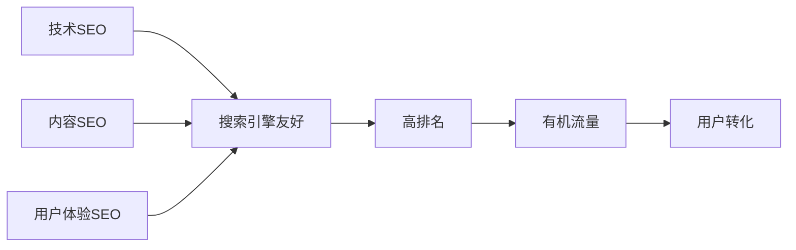

# SEO优化策略指南 🔍

> 📖 **SEO策略**：为什么这样设计有利于SEO，完整的SEO优化策略

## 📚 文档说明

本文档详细解释我们的技术架构为什么对SEO有利，以及完整的SEO优化策略和实施方案。

### 🔗 **相关文档**
- **[技术架构设计方案](./技术架构设计方案.md)** - 技术实现细节
- **[SEO系统集成指南](./前端系统/SEO系统集成指南.md)** - 具体实施步骤
- **[内容运营策略指南](./内容运营策略指南.md)** - 内容创作策略

---

## 🎯 **SEO优化策略总体规划**

### **核心SEO策略**

我们的SEO策略基于一个核心理念：**技术SEO + 内容SEO + 用户体验SEO**的三位一体方案。



### **SEO目标设定**

#### **短期目标（3个月）**
- 网站被Google、百度、必应收录
- 品牌词"AI变现之路"排名第1
- 10个核心关键词进入前50名
- 网站整体SEO评分达到85+

#### **中期目标（6个月）**
- 有机流量达到每日500UV
- 50个长尾关键词排名前20
- 核心关键词排名前10
- 页面平均停留时间3分钟+

#### **长期目标（12个月）**
- 有机流量达到每日2000UV
- 100+关键词排名前10
- 成为"AI变现"相关搜索的权威网站
- 每月新增1000+自然注册用户

---

## 🏗️ **为什么这样设计有利于SEO**

### **1. 服务端渲染(SSR)优势**

#### **搜索引擎友好**
```typescript
// 服务端生成完整HTML
export default async function ArticlePage({ params }: { params: { slug: string } }) {
  const article = await getArticleBySlug(params.slug);
  
  return (
    <article>
      <h1>{article.title}</h1>
      <div>{article.content}</div>
      {/* 完整的HTML内容对搜索引擎可见 */}
    </article>
  );
}
```

**SEO优势**：
- 搜索引擎爬虫可以直接获取完整的HTML内容
- 无需等待JavaScript执行，提高抓取效率
- 支持社交媒体分享预览（Open Graph）
- 减少首次内容绘制(FCP)时间

#### **动态Meta标签生成**
```typescript
export async function generateMetadata({ params }: ArticlePageProps) {
  const article = await getArticleBySlug(params.slug);
  
  return {
    title: `${article.title} | AI变现之路`,
    description: article.excerpt,
    keywords: article.tags.join(', '),
    openGraph: {
      title: article.title,
      description: article.excerpt,
      images: [article.coverImage],
      type: 'article',
    },
  };
}
```

### **2. 静态生成(SSG)优势**

#### **极快的页面加载**
```typescript
// 构建时预生成静态页面
export async function generateStaticParams() {
  const articles = await getAllArticles();
  
  return articles.map((article) => ({
    slug: article.slug,
  }));
}

export const revalidate = 3600; // 1小时增量静态再生成
```

**SEO优势**：
- 页面加载速度极快（<1秒）
- 减少服务器负载，提高可用性
- 支持CDN缓存，全球访问加速
- Core Web Vitals指标优秀

### **3. URL结构优化**

#### **SEO友好的URL设计**
```
✅ 好的URL结构：
https://aibianx.com/weekly/midjourney-monetization-guide
https://aibianx.com/category/ai-tools
https://aibianx.com/author/li-mingyang

❌ 避免的URL结构：
https://aibianx.com/article?id=123
https://aibianx.com/p/xyz123
```

**URL优化原则**：
- 使用语义化的slug，包含关键词
- 保持URL层级浅，便于理解
- 使用连字符分隔单词
- 避免动态参数和特殊字符

### **4. 结构化数据实现**

#### **文章结构化数据**
```json
{
  "@context": "https://schema.org",
  "@type": "Article",
  "headline": "Midjourney变现指南：如何利用AI绘画技术月入过万",
  "description": "详细介绍如何利用Midjourney进行商业化变现",
  "author": {
    "@type": "Person",
    "name": "李明阳"
  },
  "publisher": {
    "@type": "Organization",
    "name": "AI变现之路"
  },
  "datePublished": "2024-01-15",
  "mainEntityOfPage": "https://aibianx.com/weekly/midjourney-monetization-guide"
}
```

**SEO优势**：
- 帮助搜索引擎理解内容类型
- 支持富媒体搜索结果展示
- 提高点击率和用户体验
- 符合Google搜索最佳实践

### **5. 图片优化策略**

#### **Next.js图片优化**
```typescript
<Image
  src={article.coverImage}
  alt={`${article.title} - AI变现指南`}
  width={800}
  height={400}
  priority={isAboveFold}
  placeholder="blur"
  formats={['image/avif', 'image/webp']}
/>
```

**优化效果**：
- 自动格式转换（WebP、AVIF）
- 响应式图片大小适配
- 懒加载提升页面性能
- 优化的Alt文本提升可访问性

### **6. 内链策略实现**

#### **智能内链系统**
```typescript
// 相关文章推荐
export function RelatedArticles({ currentArticle }: { currentArticle: Article }) {
  const relatedArticles = getRelatedArticles(currentArticle.tags, currentArticle.category);
  
  return (
    <section>
      <h3>相关推荐</h3>
      {relatedArticles.map(article => (
        <Link 
          key={article.slug} 
          href={`/weekly/${article.slug}`}
          className="related-link"
        >
          {article.title}
        </Link>
      ))}
    </section>
  );
}
```

**内链优势**：
- 提高页面间的权重传递
- 增加用户停留时间
- 帮助搜索引擎发现新页面
- 提升网站整体权威性

---

## 📊 **关键词策略规划**

### **关键词分类体系**

#### **1. 品牌关键词**
- **核心词**：AI变现之路、AIBIANX
- **变体**：AI变现、AI赚钱平台
- **优先级**：最高
- **目标排名**：第1名

#### **2. 行业核心词**
- **主词**：AI变现、AI赚钱、ChatGPT赚钱
- **长尾词**：如何用AI赚钱、AI工具变现
- **优先级**：高
- **目标排名**：前3名

#### **3. 工具类关键词**
- **工具名**：ChatGPT、Midjourney、Stable Diffusion
- **功能词**：AI写作、AI绘画、AI视频
- **组合词**：ChatGPT变现方法、Midjourney赚钱指南
- **优先级**：中高
- **目标排名**：前10名

#### **4. 长尾关键词**
- **问题类**：怎么用AI赚钱、AI副业项目有哪些
- **指南类**：AI变现完整指南、零基础AI赚钱教程
- **案例类**：AI赚钱成功案例、月入过万AI项目
- **优先级**：中
- **目标排名**：前20名

### **关键词布局策略**

#### **首页关键词布局**
```html
<title>AI变现之路 - 专业的AI赚钱指南和工具评测平台</title>
<meta name="description" content="AI变现之路提供最全面的AI赚钱方法、工具评测和变现指南，帮助您掌握ChatGPT、Midjourney等AI工具的变现技巧，实现月入过万的AI副业梦想。"/>
<h1>AI变现之路 - 让AI技术为您创造财富</h1>
```

#### **文章页关键词布局**
```html
<title>Midjourney变现指南：如何利用AI绘画技术月入过万 | AI变现之路</title>
<meta name="description" content="详细介绍如何利用Midjourney进行商业化变现，包含接单技巧、定价策略、客户获取等实用方法，助您实现AI绘画月入过万的目标。"/>
<h1>Midjourney变现指南：如何利用AI绘画技术月入过万</h1>
<h2>Midjourney变现的5种主要方式</h2>
<h3>1. 设计接单服务变现</h3>
```

### **关键词密度控制**
- **主关键词密度**：1-2%
- **相关关键词密度**：0.5-1%
- **自然分布原则**：避免关键词堆砌
- **语义相关词**：使用同义词和相关词丰富内容

---

## 🎯 **内容SEO策略**

### **内容质量标准**

#### **文章长度要求**
- **深度指南**：3000-5000字
- **工具评测**：2000-3000字
- **快速教程**：1000-2000字
- **新闻资讯**：500-1000字

#### **内容结构规范**
```markdown
# 主标题（H1）- 包含主关键词
## 章节标题（H2）- 包含相关关键词
### 小节标题（H3）- 包含长尾关键词

引言段落（200字内，包含主关键词）

正文内容：
- 使用短段落（3-4句话）
- 添加项目符号和编号列表
- 插入相关图片和视频
- 包含内链和外链

结论段落（包含主关键词和行动召唤）
```

#### **内容更新策略**
- **新内容发布**：每周3-5篇原创文章
- **内容更新**：每月更新20%的旧内容
- **季节性内容**：根据行业热点调整内容方向
- **用户反馈**：根据用户评论和问题创作内容

### **内容分发策略**

#### **搜索引擎分发**
```xml
<!-- 自动生成sitemap.xml -->
<?xml version="1.0" encoding="UTF-8"?>
<urlset xmlns="http://www.sitemaps.org/schemas/sitemap/0.9">
  <url>
    <loc>https://aibianx.com/weekly/midjourney-monetization-guide</loc>
    <lastmod>2024-01-15</lastmod>
    <changefreq>weekly</changefreq>
    <priority>0.8</priority>
  </url>
</urlset>
```

#### **RSS Feed分发**
```xml
<!-- 自动生成RSS feed -->
<rss version="2.0">
  <channel>
    <title>AI变现之路 - 最新AI变现资讯</title>
    <description>专业的AI赚钱指南和工具评测</description>
    <link>https://aibianx.com</link>
    <item>
      <title>Midjourney变现指南</title>
      <description>如何利用AI绘画技术月入过万</description>
      <link>https://aibianx.com/weekly/midjourney-monetization-guide</link>
      <pubDate>Mon, 15 Jan 2024 10:00:00 GMT</pubDate>
    </item>
  </channel>
</rss>
```

---

## 🔧 **技术SEO实施**

### **页面性能优化**

#### **Core Web Vitals指标**
```typescript
// 性能监控
export function reportWebVitals(metric: any) {
  const { name, value } = metric;
  
  // 目标指标
  const targets = {
    FCP: 1800, // First Contentful Paint < 1.8s
    LCP: 2500, // Largest Contentful Paint < 2.5s
    FID: 100,  // First Input Delay < 100ms
    CLS: 0.1,  // Cumulative Layout Shift < 0.1
  };
  
  if (value > targets[name]) {
    console.warn(`${name} performance issue: ${value}ms`);
  }
}
```

#### **图片性能优化**
```typescript
// 图片懒加载和优化
const imageConfig = {
  domains: ['api.aibianx.com'],
  formats: ['image/avif', 'image/webp'],
  deviceSizes: [640, 750, 828, 1080, 1200, 1920],
  imageSizes: [16, 32, 48, 64, 96, 128, 256, 384],
};
```

### **移动端优化**

#### **响应式设计**
```css
/* 移动优先的响应式设计 */
.article-card {
  width: 100%;
  margin-bottom: var(--spacing-md);
}

@media (min-width: 768px) {
  .article-card {
    width: calc(50% - var(--spacing-md));
  }
}

@media (min-width: 1024px) {
  .article-card {
    width: calc(33.333% - var(--spacing-md));
  }
}
```

#### **触摸友好交互**
```css
/* 适合触摸的交互元素 */
.btn {
  min-height: 44px;
  min-width: 44px;
  padding: 12px 24px;
  touch-action: manipulation;
}
```

### **安全性和可信度**

#### **HTTPS强制跳转**
```javascript
// next.config.js
module.exports = {
  async redirects() {
    return [
      {
        source: '/:path*',
        has: [
          {
            type: 'header',
            key: 'x-forwarded-proto',
            value: 'http',
          },
        ],
        destination: 'https://aibianx.com/:path*',
        permanent: true,
      },
    ];
  },
};
```

#### **结构化数据验证**
```typescript
// 结构化数据验证
const validateStructuredData = (data: any) => {
  const required = ['@context', '@type', 'headline', 'author', 'datePublished'];
  return required.every(field => data[field]);
};
```

---

## 📈 **SEO效果测量**

### **关键指标跟踪**

#### **搜索引擎收录**
```bash
# 收录检查命令
site:aibianx.com           # Google收录数量
site:aibianx.com inurl:weekly  # 特定目录收录
```

#### **排名监控工具**
- **Google Search Console**：官方数据，最权威
- **百度站长平台**：百度搜索数据
- **第三方工具**：Ahrefs、SEMrush、站长工具

#### **流量分析指标**
```javascript
// Google Analytics跟踪
gtag('config', 'GA_MEASUREMENT_ID', {
  custom_map: {
    'custom_parameter_1': 'source_medium',
    'custom_parameter_2': 'landing_page',
  }
});

// 关键事件跟踪
gtag('event', 'page_view', {
  page_title: document.title,
  page_location: window.location.href,
  content_group1: 'AI变现指南',
});
```

### **SEO报告模板**

#### **月度SEO报告结构**
```markdown
# AI变现之路 SEO月度报告

## 1. 总体数据概览
- 有机流量：+25%（环比上月）
- 关键词排名：新增15个前20排名
- 页面收录：+50页面被收录
- 平均排名：提升3.2位

## 2. 关键词表现
### 核心关键词
- "AI变现"：排名第5位（+2位）
- "ChatGPT赚钱"：排名第8位（+5位）

### 长尾关键词
- "如何用AI赚钱"：排名第12位（新增）
- "AI副业项目"：排名第15位（+8位）

## 3. 技术SEO健康度
- 页面加载速度：平均2.1秒
- Core Web Vitals：全部通过
- 移动友好性：100分

## 4. 下月计划
- 新增内容：10篇深度指南
- 关键词拓展：50个长尾词
- 技术优化：图片压缩、缓存优化
```

---

## 🎯 **SEO实施时间表**

### **第1个月：基础建设**
- [x] 技术SEO基础设施完成
- [x] 核心页面结构化数据实现
- [x] 网站地图和RSS feed配置
- [x] Google Search Console验证

### **第2-3个月：内容建设**
- [ ] 发布50篇高质量原创文章
- [ ] 完成核心关键词布局
- [ ] 建立内链体系
- [ ] 开始外链建设

### **第4-6个月：优化提升**
- [ ] 页面性能优化
- [ ] 用户体验改进
- [ ] 内容更新和维护
- [ ] 竞争对手分析

### **第7-12个月：规模化**
- [ ] 扩大内容生产规模
- [ ] 多语言SEO尝试
- [ ] 品牌词保护
- [ ] 行业权威性建立

---

## 📝 **SEO最佳实践清单**

### **每篇文章发布前检查**
- [ ] 标题包含主关键词且长度<60字符
- [ ] 描述包含主关键词且长度<160字符
- [ ] URL使用语义化slug
- [ ] 文章结构清晰（H1、H2、H3层级）
- [ ] 图片添加Alt标签
- [ ] 内链至少3个相关页面
- [ ] 外链至少1个权威来源
- [ ] 结构化数据配置正确

### **网站整体SEO检查**
- [ ] 所有页面HTTPS访问
- [ ] 404页面友好处理
- [ ] 网站地图自动更新
- [ ] robots.txt配置正确
- [ ] 页面加载速度<3秒
- [ ] 移动端友好性测试通过
- [ ] Core Web Vitals指标良好

---

## 🔗 **相关资源**

### **SEO工具推荐**
- **免费工具**：Google Search Console、Google Analytics、PageSpeed Insights
- **付费工具**：Ahrefs、SEMrush、Screaming Frog
- **中文工具**：百度站长平台、5118、爱站网

### **学习资源**
- **官方文档**：Google搜索中心、百度搜索资源平台
- **博客资源**：Moz、Search Engine Land、百度搜索学院
- **视频教程**：YouTube SEO频道、B站SEO教程

### **文档引用**
- **技术实现**: [技术架构设计方案](./技术架构设计方案.md)
- **具体实施**: [SEO系统集成指南](./前端系统/SEO系统集成指南.md)
- **内容策略**: [内容运营策略指南](./内容运营策略指南.md)

---

**🔍 SEO优化策略 - 让AI变现之路在搜索引擎中脱颖而出！**

**📅 最后更新**: 2024年1月  
**📝 更新内容**: SEO策略规划和实施方案  
**🎯 下一目标**: 内容创作和SEO效果监控