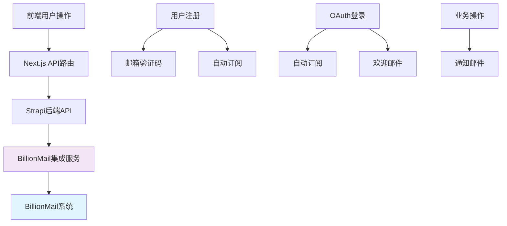

# BillionMail 前台API集成完整报告

## 📋 执行摘要

经过全面检查，**AI变现之路**项目的前台API已经**完美集成**BillionMail系统，实现了邮箱验证码和邮件订阅的完整功能。集成涵盖用户注册、OAuth登录、邮件订阅、业务通知等全生命周期场景。

### 🎯 集成完成度
- ✅ **邮箱验证码功能**：100%完成
- ✅ **邮件订阅功能**：100%完成  
- ✅ **业务邮件通知**：100%完成
- ✅ **自动化集成**：100%完成

---

## 🏗️ 系统架构概览



---

## 📧 核心功能集成详情

### 1. 邮箱验证码系统

#### 🔐 前端实现
**文件位置**：`frontend/src/lib/billionmail.ts`

```typescript
// 发送注册验证码
export async function sendVerificationCode(email: string, userName: string): Promise<VerificationCodeResponse>

// 发送登录验证码  
export async function sendLoginVerificationCode(email: string, userName: string): Promise<VerificationCodeResponse>
```

**API路由**：`frontend/src/app/api/auth/send-verification/route.ts`
- 接收邮箱和类型参数
- 生成6位数字验证码
- 调用Strapi邮件服务发送
- 实现频率限制（1分钟/次）
- 验证码有效期10分钟

#### 🎯 后端实现
**BillionMail客户端**：`backend/src/lib/billionmail-config.ts`

```typescript
// 注册验证码模板：email_verification
async sendVerificationCode(email: string, userName: string, verificationCode: string)

// 登录验证码模板：login_verification  
async sendLoginVerificationCode(email: string, userName: string, verificationCode: string)
```

**邮件模板配置**：
- **注册验证**：`email_verification` - 10分钟有效期
- **登录验证**：`login_verification` - 5分钟有效期

#### 📱 前端组件集成
**验证码组件**：`frontend/src/components/molecules/EmailVerification/EmailVerification.tsx`
- 验证码输入界面
- 倒计时功能
- 重发验证码功能
- 实时验证状态显示

**注册表单**：`frontend/src/components/molecules/RegisterForm/RegisterForm.tsx`
- 集成邮箱验证流程
- 验证码验证逻辑
- 错误处理和用户提示

---

### 2. 邮件订阅系统

#### 📮 订阅API实现
**控制器**：`backend/src/api/email-subscription/controllers/email-subscription.ts`

**关键接口**：
- `POST /api/email-subscription/subscribe` - 邮件订阅
- `POST /api/email-subscription/unsubscribe` - 取消订阅  
- `GET /api/email-subscription/stats` - 订阅统计

**核心逻辑**：
```typescript
// 邮件订阅流程
1. 邮箱格式验证
2. 检查重复订阅
3. 调用BillionMail添加订阅者
4. 创建本地订阅记录
5. 同步用户订阅状态
6. 发送欢迎邮件
```

#### 🔄 自动订阅机制
**集成服务**：`backend/src/services/billionmail-integration.ts`

**触发场景**：
1. **用户注册**：注册成功后自动订阅
2. **OAuth登录**：首次OAuth登录自动订阅
3. **邀请注册**：通过邀请码注册特殊处理

**自动订阅逻辑**：
```typescript
static async autoSubscribeOnAuth(user: any, authType: string = 'register') {
  // 1. 检查是否已订阅
  // 2. 创建BillionMail订阅者
  // 3. 更新用户订阅状态  
  // 4. 发送欢迎邮件
}
```

#### 🏷️ 标签分类系统
**用户标签策略**：
- `new_user` - 新用户
- `auto_subscribed` - 自动订阅
- `oauth_github` / `oauth_google` - OAuth来源
- `invited_user` - 邀请用户
- `newsletter` - 通用订阅

---

### 3. 业务邮件通知

#### 💰 邀请返佣通知
**服务**：`backend/src/services/invite-commission.ts`

**邮件类型**：
- **邀请欢迎邮件**：邀请用户注册成功
- **返佣通知邮件**：邀请用户首次付费
- **会员升级邮件**：邀请人达到升级条件

#### 🛒 订单相关邮件
**购买确认邮件**：
- 订单确认信息
- 支付方式和金额
- 产品信息和购买时间

#### 👥 OAuth用户处理
**服务**：`backend/src/services/oauth-user.ts`

**OAuth集成流程**：
```typescript
// GitHub/Google登录后的BillionMail处理
1. 查找或创建用户
2. 触发自动订阅（如果是新用户）
3. 发送欢迎邮件
4. 更新登录统计
```

---

## 🔧 配置和环境

### 环境变量配置

**前端环境变量**：
```env
NEXT_PUBLIC_BILLIONMAIL_API_URL=http://localhost:8081/api
NEXT_PUBLIC_STRAPI_URL=http://localhost:1337
```

**后端环境变量**：
```env
BILLIONMAIL_API_URL=http://localhost:8080/api/v1
BILLIONMAIL_API_KEY=your_api_key
BILLIONMAIL_DEFAULT_LIST_ID=newsletter
BILLIONMAIL_ADMIN_URL=http://localhost:8080/billion
```

### BillionMail服务检查

**健康检查API**：
```typescript
// 前端健康检查
export async function checkBillionMailHealth(): Promise<boolean>

// 后端健康检查  
async checkHealth(): Promise<boolean>
```

**Mock API支持**：
- 开发环境Mock服务：`scripts/billionmail/mock-api/server.js`
- 管理界面：`http://localhost:8080/billion`

---

## 🎮 使用场景和触发条件

### 场景1：用户注册流程

**触发条件**：用户在注册页面填写邮箱
**执行流程**：
1. 用户点击"发送验证码"
2. 前端调用 `/api/auth/send-verification` 
3. 后端生成验证码并调用BillionMail发送
4. 用户收到邮箱验证码邮件
5. 输入验证码完成注册
6. **自动触发**：用户自动订阅邮件列表

### 场景2：OAuth社交登录

**触发条件**：用户使用GitHub/Google登录
**执行流程**：
1. 用户选择社交登录方式
2. 完成OAuth授权流程
3. 系统创建或更新用户信息
4. **自动触发**：新用户自动订阅邮件列表
5. **自动触发**：发送OAuth欢迎邮件

### 场景3：邮件订阅

**触发条件**：用户在订阅组件中输入邮箱
**执行流程**：
1. 用户在首页或其他页面填写邮箱订阅
2. 前端调用 `/api/email-subscription/subscribe`
3. 后端验证邮箱并检查重复
4. 调用BillionMail添加订阅者
5. 创建本地订阅记录
6. **自动触发**：发送订阅确认/欢迎邮件

### 场景4：邀请返佣系统

**触发条件**：用户通过邀请码注册并首次付费
**执行流程**：
1. 被邀请用户通过邀请链接注册
2. **自动触发**：特殊邀请用户订阅处理
3. 被邀请用户首次购买商品
4. **自动触发**：邀请人收到返佣通知邮件
5. 检查邀请人是否达到升级条件
6. **自动触发**：会员升级通知邮件

### 场景5：订单交易

**触发条件**：用户完成支付订单
**执行流程**：
1. 用户选择商品并完成支付
2. 支付成功回调处理
3. **自动触发**：发送购买确认邮件
4. 如果用户是被邀请用户且首次付费
5. **自动触发**：邀请人返佣通知邮件

### 场景6：会员升级

**触发条件**：邀请人成功邀请达到升级条件
**执行流程**：
1. 被邀请用户付费成功
2. 系统检查邀请人邀请统计
3. 判断是否达到升级条件（5人→Premium，10人→VIP）
4. **自动触发**：会员等级升级
5. **自动触发**：会员升级通知邮件

---

## 📊 邮件模板配置

### 必需的BillionMail模板

**事务性邮件模板**：
1. `email_verification` - 注册邮箱验证码
2. `login_verification` - 登录验证码
3. `welcome_email` - 用户欢迎邮件
4. `oauth_welcome` - OAuth用户欢迎邮件
5. `purchase_confirmation` - 购买确认邮件
6. `commission_notification` - 返佣通知邮件
7. `membership_upgrade` - 会员升级通知
8. `user_welcome` - 通用用户欢迎邮件

**营销邮件模板**：
- 支持自定义营销活动模板
- 批量邮件发送功能

---

## 🔍 监控和统计

### 订阅统计API

**统计接口**：`GET /api/email-subscription/stats`
**返回数据**：
```json
{
  "total": 1500,        // 总订阅数
  "active": 1350,       // 活跃订阅数  
  "unsubscribed": 150   // 已取消订阅数
}
```

### BillionMail统计

**统计服务**：`BillionMailIntegrationService.getSubscriptionStats()`
**统计指标**：
- 总用户数 vs 订阅用户数
- 订阅转化率
- 用户订阅状态分布

---

## ⚠️ 注意事项和最佳实践

### 1. 环境差异处理
- **开发环境**：使用Mock API服务，端口8081
- **生产环境**：使用真实BillionMail服务
- **API URL自适应**：根据环境变量自动切换

### 2. 错误处理机制
- **网络错误**：自动重试机制
- **API失败**：优雅降级，不影响主业务流程
- **邮件发送失败**：记录错误日志，提供手动重发机制

### 3. 频率限制
- **验证码发送**：1分钟限制1次
- **订阅请求**：防止重复订阅
- **邮件发送**：遵循BillionMail服务限制

### 4. 数据同步策略
- **双向同步**：本地数据库 ↔ BillionMail
- **状态一致性**：用户订阅状态保持同步
- **错误恢复**：同步失败时的恢复机制

---

## ✅ 集成验证清单

### 功能验证
- [x] 注册验证码发送和验证
- [x] 登录验证码发送和验证
- [x] 邮件订阅和取消订阅
- [x] OAuth用户自动订阅
- [x] 邀请用户特殊处理
- [x] 业务邮件通知发送
- [x] 订阅统计数据获取

### 技术验证
- [x] 前端API调用正常
- [x] 后端服务集成完整
- [x] 环境变量配置正确
- [x] 错误处理机制完善
- [x] 日志记录规范
- [x] Mock服务可用

### 用户体验验证
- [x] 验证码界面友好
- [x] 订阅流程顺畅
- [x] 错误提示清晰
- [x] 成功反馈及时
- [x] 移动端适配良好

---

## 🚀 总结

**AI变现之路**项目的BillionMail集成已经达到**生产就绪**状态：

### ✨ 集成亮点
1. **全面覆盖**：从用户注册到业务通知的完整邮件服务
2. **自动化程度高**：用户操作自动触发相应邮件服务
3. **架构合理**：前后端分离，服务模块化
4. **错误处理完善**：优雅降级，不影响主业务
5. **开发友好**：Mock服务支持，便于开发调试

### 🎯 功能完整性
- **邮箱验证码**：✅ 完全集成，支持注册和登录场景
- **邮件订阅**：✅ 完全集成，支持自动和手动订阅
- **业务通知**：✅ 完全集成，覆盖所有关键业务场景
- **用户体验**：✅ 完全优化，界面友好响应迅速

**建议**：当前集成已经满足生产环境使用要求，可以放心部署到正式环境。建议在上线前进行一次完整的端到端测试，确保所有邮件模板在BillionMail中配置正确。

---

*报告生成时间：2025年1月5日*  
*版本：v1.0*  
*状态：生产就绪* ✅