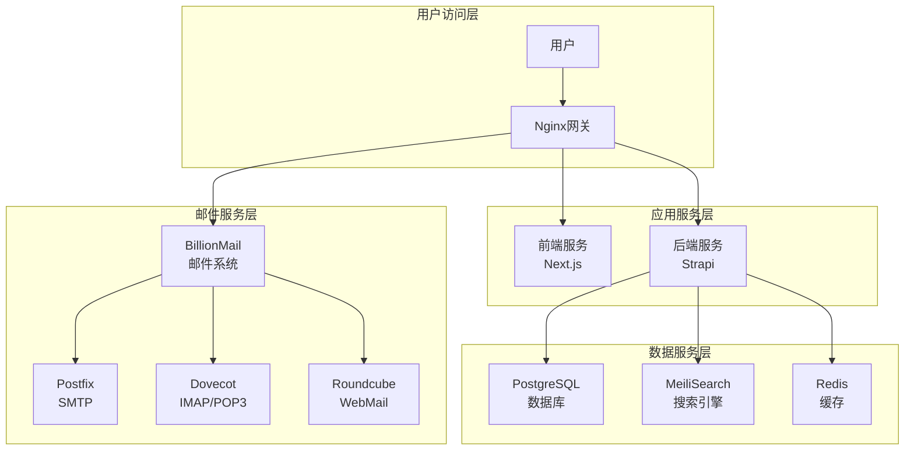

# 🚀 AI变现之路 - 生产部署完整指南

## 📋 部署概述

本指南将带你从零开始完成AI变现之路项目的完整生产部署。我们的部署系统采用Docker容器化架构，支持全自动化部署和智能环境管理。

### 🏗️ 系统架构



## 🎯 快速开始 (3分钟一键部署)

### 🚀 方式一：真正的一键部署 (强烈推荐)

**一条命令完成所有部署：**

```bash
bash <(curl -s https://raw.githubusercontent.com/lyfe2025/aibianx/master/scripts/bootstrap.sh)
```

**部署流程全自动：**
1. ✅ **自动检查环境** - 检测系统并安装Docker、Git等依赖
2. ✅ **自动拉取代码** - 从GitHub克隆最新项目到`/opt/aibianx`
3. ✅ **进入管理界面** - 自动启动交互式配置界面
4. ✅ **智能配置引导** - 配置域名、数据库、环境变量等
5. ✅ **一键启动服务** - 启动完整的生产环境

**全局快捷命令：**
```bash
# 部署完成后，随时随地使用
aibianx                    # 进入管理界面
aibianx production status  # 检查生产状态
aibianx deploy start      # 启动开发环境
```

### 🛠️ 方式二：传统手动部署

```bash
# 手动克隆项目
git clone https://github.com/lyfe2025/aibianx.git
cd aibianx

# 进入交互式管理界面
./scripts.sh

# 🔧 生产环境菜单 (红色主题)
# ================================
# 1) 全自动部署 (安装环境+代码+配置+部署)
# 2) 启动前端服务
# 3) 启动后端服务
# 4) 停止生产环境
# 5) 重启生产环境
# 6) 检查生产状态
# ...更多选项
```

### 🎯 推荐部署方案对比

| 方案 | 适用场景 | 优势 | 命令复杂度 |
|------|----------|------|------------|
| **一键部署** | 🔥 新用户、快速试用 | 零配置、自动化、全球可用 | ⭐ (1条命令) |
| 传统部署 | 高级用户、定制需求 | 完全控制、分步操作 | ⭐⭐⭐ (多步操作) |

## 📂 一键部署过程详解

### 🔧 阶段一：智能环境检测 (30秒)
```bash
✅ 系统检测和基础环境评估
1. 自动识别操作系统 (Ubuntu/CentOS/Debian/macOS)
2. 检查网络连接和GitHub访问
3. 验证磁盘空间和系统权限
4. 评估现有Docker/Git安装状态
```

### ⬇️ 阶段二：依赖自动安装 (1-2分钟)
```bash
✅ 基础依赖智能安装
1. 自动安装Docker和Docker Compose
2. 自动安装Git版本控制工具
3. 配置用户组和权限
4. 启动和验证Docker服务
```

### 📦 阶段三：项目代码获取 (30秒)
```bash
✅ 项目代码自动化管理
1. 克隆最新代码到 /opt/aibianx
2. 设置文件权限和所有者
3. 创建全局快捷命令 (aibianx)
4. 验证项目完整性
```

### 🎛️ 阶段四：交互式配置界面 (用户操作)
```bash
🎯 进入智能配置向导
1. 🌐 配置域名 (生产/开发环境)
2. 🗄️ 设置数据库参数和密码
3. 📧 配置邮件系统参数
4. 🔐 生成安全密钥和JWT
5. ⚙️ 检查和修改环境变量
```

### 🚀 阶段五：服务编排启动 (2-3分钟)
```bash
✅ Docker服务全自动启动
1. 构建前端Next.js镜像
2. 构建后端Strapi镜像
3. 启动PostgreSQL、Redis、MeiliSearch
4. 启动BillionMail邮件系统
5. 配置Nginx网关和SSL证书
```

### ✅ 阶段六：健康检查验证 (30秒)
```bash
✅ 系统完整性自动验证
1. 检查所有容器运行状态
2. 验证API端点响应
3. 测试数据库连接
4. 确认邮件系统状态
5. 生成访问地址清单
```

### 🎉 部署完成标志
```bash
🌐 网站前端: https://yourdomain.com
⚙️ 管理后台: https://yourdomain.com/admin
📖 API文档: https://yourdomain.com/documentation
📧 邮件管理: https://yourdomain.com:8080/billion
```

## 🔧 核心配置文件说明

### 环境变量配置
- **前端配置**: `frontend/.env.local`
- **后端配置**: `backend/.env`
- **Docker配置**: `deployment/docker-compose.unified.yml`

### 自动配置脚本
- **统一配置管理**: `deployment/configure-unified-env.sh`
- **自动部署**: `scripts/production/auto-deploy.sh`
- **服务管理**: `scripts.sh`

## 🌐 访问地址和端口

### 对外服务端口
| 服务 | 端口 | 访问地址 | 说明 |
|------|------|----------|------|
| 网站前端 | 80/443 | `https://yourdomain.com` | 主要网站 |
| 后台管理 | 80/443 | `https://yourdomain.com/admin` | Strapi管理后台 |
| API文档 | 80/443 | `https://yourdomain.com/documentation` | 接口文档 |
| 邮件管理 | 8080 | `https://yourdomain.com:8080/billion` | BillionMail管理 |
| WebMail | 8080 | `https://yourdomain.com:8080/roundcube` | 网页邮箱 |

### 邮件服务端口
| 协议 | 端口 | 加密 | 说明 |
|------|------|------|------|
| SMTP | 25 | 无 | 服务器间邮件传输 |
| SMTP | 587 | STARTTLS | 邮件客户端发送 |
| SMTP | 465 | SSL/TLS | 安全邮件发送 |
| IMAP | 143 | 无 | 邮件客户端接收 |
| IMAP | 993 | SSL/TLS | 安全邮件接收 |
| POP3 | 110 | 无 | 邮件下载 |
| POP3 | 995 | SSL/TLS | 安全邮件下载 |

## 🛠️ 管理和监控

### 服务状态检查
```bash
# 检查所有服务状态
./scripts.sh production status

# 查看服务日志
./scripts.sh production logs [service-name]

# 查看资源使用情况
./scripts.sh production monitor
```

### 数据备份
```bash
# 创建完整备份
./scripts.sh production backup

# 仅备份数据库
./scripts.sh database backup-only

# 恢复备份
./scripts.sh production restore [backup-file]
```

### 服务管理
```bash
# 重启特定服务
docker-compose restart [service-name]

# 查看容器状态
docker ps

# 进入容器调试
docker exec -it [container-name] /bin/sh
```

## 🚨 常见问题和解决方案

### 构建阶段错误

**问题**: `Invalid URL` 错误
```
Error occurred prerendering page "/weekly". TypeError: Invalid URL
```

**解决方案**:
```bash
# 检查环境变量配置
cat frontend/.env.local | grep SITE_URL

# 重新生成配置
./deployment/configure-unified-env.sh integrated yourdomain.com

# 清理缓存重新构建
docker-compose build --no-cache frontend
```

**问题**: Docker构建超时
```
failed to solve: process did not complete successfully: exit code: 1
```

**解决方案**:
```bash
# 增加Docker资源限制
echo '{"max-concurrent-downloads": 3}' > /etc/docker/daemon.json
systemctl restart docker

# 使用国内镜像源
npm config set registry https://registry.npmmirror.com
```

### 运行时错误

**问题**: 数据库连接失败
```
Error: connect ECONNREFUSED 127.0.0.1:5432
```

**解决方案**:
```bash
# 检查数据库容器状态
docker logs aibianx-postgres

# 重启数据库服务
docker-compose restart postgres

# 检查网络连接
docker network ls
docker network inspect aibianx-integrated_integrated-network
```

**问题**: 前端页面白屏
```
Application error: a client-side exception has occurred
```

**解决方案**:
```bash
# 检查前端日志
docker logs aibianx-frontend

# 验证后端API连接
curl http://localhost:1337/api/articles

# 重新构建前端
docker-compose build --no-cache frontend
docker-compose up -d frontend
```

## 🔐 安全配置

### SSL证书配置
```bash
# 安装Certbot
apt install certbot python3-certbot-nginx

# 申请SSL证书
certbot --nginx -d yourdomain.com -d mail.yourdomain.com

# 自动续期
echo "0 12 * * * /usr/bin/certbot renew --quiet" | crontab -
```

### 防火墙配置
```bash
# 开放必要端口
ufw allow 22        # SSH
ufw allow 80        # HTTP
ufw allow 443       # HTTPS
ufw allow 8080      # BillionMail
ufw allow 25        # SMTP
ufw allow 587       # SMTP Submission
ufw allow 465       # SMTPS
ufw allow 993       # IMAPS
ufw allow 995       # POP3S
ufw enable
```

### 数据安全
```bash
# 定期数据备份 (每日凌晨2点)
echo "0 2 * * * cd /opt/aibianx && ./scripts.sh production backup" | crontab -

# 日志轮转
echo "/opt/aibianx/logs/*.log {
    daily
    missingok
    rotate 30
    compress
    delaycompress
    notifempty
    copytruncate
}" > /etc/logrotate.d/aibianx
```

## 📊 性能优化

### 数据库优化
```bash
# PostgreSQL配置优化
echo "
shared_buffers = 256MB
effective_cache_size = 1GB
maintenance_work_mem = 64MB
checkpoint_completion_target = 0.9
wal_buffers = 16MB
default_statistics_target = 100
random_page_cost = 1.1
effective_io_concurrency = 200
" >> /var/lib/postgresql/data/postgresql.conf
```

### 缓存配置
```bash
# Redis配置优化
echo "
maxmemory 512mb
maxmemory-policy allkeys-lru
save 900 1
save 300 10
save 60 10000
" >> /etc/redis/redis.conf
```

## 🎉 部署成功验证

部署完成后，通过以下检查确认系统正常运行：

### ✅ 基础功能检查
- [ ] 网站首页正常访问: `https://yourdomain.com`
- [ ] 后台管理正常登录: `https://yourdomain.com/admin`
- [ ] API接口正常响应: `https://yourdomain.com/api/articles`
- [ ] 邮件系统管理界面: `https://yourdomain.com:8080/billion`

### ✅ 服务状态检查
```bash
# 所有容器运行正常
docker ps | grep aibianx

# 数据库连接正常
docker exec aibianx-postgres psql -U postgres -d aibianx -c "SELECT version();"

# 搜索引擎正常
curl http://localhost:7700/health

# 缓存服务正常
docker exec aibianx-redis redis-cli ping
```

### ✅ 功能完整性检查
- [ ] 文章列表加载正常
- [ ] 搜索功能工作正常
- [ ] 用户注册登录功能
- [ ] 邮件发送功能正常
- [ ] 管理后台CRUD操作

## 🔄 更新和维护

### 代码更新
```bash
# 更新到最新版本
cd /opt/aibianx
git pull origin master
docker-compose build --no-cache
docker-compose up -d
```

### 数据库迁移
```bash
# 执行数据库迁移
docker exec aibianx-backend npm run strapi migration:run
```

### 监控和报警
```bash
# 设置系统监控
./scripts.sh production monitor

# 配置报警通知 (可选)
./scripts.sh production alert-config
```

---

## 📞 技术支持

如果在部署过程中遇到问题：

1. **查看详细日志**: `./scripts.sh production logs`
2. **运行诊断工具**: `./scripts.sh tools diagnose`
3. **查看故障排查文档**: `docs/问题解决/`
4. **提交Issue**: [GitHub Issues](https://github.com/lyfe2025/aibianx/issues)

---

**🎯 部署成功标志**: 当你能够正常访问所有服务，并且功能检查全部通过时，说明部署成功！

记得定期备份数据并保持系统更新。祝你使用愉快！ 🚀