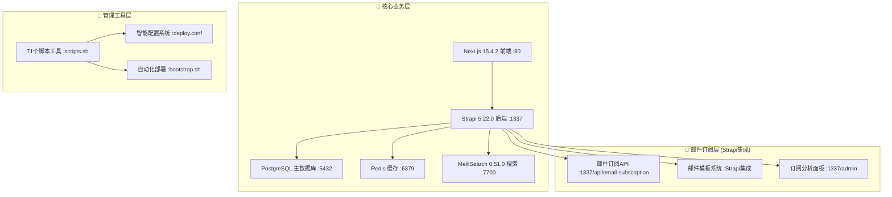

# 🚀 AI变现之路 - 详细部署说明

> **更新时间：2025年3月** | **基于Next.js 15.4.2 + Strapi 5.22.0 + 71个脚本工具链**

## 📋 部署概览

### 🎯 **部署策略**
AI变现之路项目采用**智能混合部署架构**，提供两种部署方式：
- **🔄 一键部署** - 30秒快速体验，自动化程度最高
- **🔧 手动部署** - 精确控制，适合生产环境和定制需求

### 📦 **系统组成**


---

## 🚀 **方式一：一键部署（推荐新手）**

### ⚡ **快速启动**
```bash
# 一行命令完成所有部署
bash <(curl -s https://raw.githubusercontent.com/lyfe2025/aibianx/master/scripts/bootstrap.sh)
```

### 🔧 **执行流程详解**
| 步骤 | 操作 | 说明 | 耗时 |
|------|------|------|------|
| 1️⃣ | **环境检查** | 自动检查并安装 Git, Docker, Node.js | ~30秒 |
| 2️⃣ | **项目克隆** | 从GitHub获取最新代码到当前目录 | ~20秒 |
| 3️⃣ | **配置生成** | 基于71个脚本工具生成环境变量和服务配置 | ~10秒 |
| 4️⃣ | **数据恢复** | 自动恢复演示数据(16种内容类型、测试文章等) | ~30秒 |
| 5️⃣ | **服务启动** | 按序启动: 数据库→搜索→后端→前端→邮件订阅 | ~60秒 |
| 6️⃣ | **健康检查** | 验证所有服务运行状态 | ~20秒 |

**🎯 总耗时: ~3分钟**

### 📊 **部署完成后访问地址**
```bash
# 系统会自动显示以下访问地址：
✅ 前端网站: http://localhost
✅ 后端管理: http://localhost:1337/admin  
✅ 邮件订阅管理: http://localhost:1337/admin (集成在Strapi)
✅ 搜索引擎: http://localhost:7700
✅ 状态监控: ./scripts.sh tools status
```

### ⚠️ **一键部署注意事项**
- ✅ **优势**: 零配置、全自动、适合快速体验
- ❌ **限制**: 使用默认配置，无法预先定制
- 🔄 **适用**: 新手用户、演示环境、快速测试

---

## 🔧 **方式二：手动部署（推荐生产）**

### 📋 **前置要求**
```bash
# 检查必要环境
node --version    # 需要 20.x+
docker --version  # 需要 20.x+
git --version     # 需要 2.x+
```

### 🛠️ **详细步骤**

#### **Step 1: 获取项目**
```bash
# 克隆项目代码
git clone https://github.com/lyfe2025/aibianx.git
cd aibianx

# 检查项目结构
ls -la  # 确认包含 scripts.sh 和 deployment/ 目录
```

#### **Step 2: 配置定制（关键步骤）**
```bash
# 编辑唯一配置文件
vim deployment/config/deploy.conf
```

**🔧 关键配置项说明:**
```ini
# 🌐 基础配置
DEPLOY_MODE=dev                    # dev | production
DOMAIN=localhost                   # 生产环境改为实际域名
MAIL_DOMAIN=localhost             # 邮件域名

# 🔐 数据库配置 (生产环境必须修改)  
DB_NAME=aibianx_dev                # 数据库名称 (自动添加环境后缀)
DB_USER=aibianx_dev               # 数据库用户名
DB_PASSWORD=your_secure_password   # 数据库密码
EMAIL_SUBSCRIPTION_KEY=email_pass  # 邮件订阅密钥

# 📦 自动化开关
AUTO_RESTORE_BACKUP=true          # 是否自动恢复数据
AUTO_DEPLOY_SEARCH=true           # 是否自动部署搜索
AUTO_CONFIGURE_EMAIL=true         # 是否自动配置邮件订阅

# 🌐 端口配置 (避免冲突)
FRONTEND_PORT=80                  # 前端端口
BACKEND_PORT=1337                 # 后端端口
MEILISEARCH_PORT=7700            # 搜索端口
EMAIL_API_PORT=1337              # 邮件订阅API端口(集成在Strapi)
```

#### **Step 3: 配置系统**
```bash
# 生成环境变量和Docker配置
./scripts.sh deploy config

# 配置完成后会显示:
# ✅ 环境变量已生成 (.env)
# ✅ Docker配置已生成
# ✅ 备份数据已恢复
# ✅ 端口冲突检查通过
```

#### **Step 4: 启动服务**
```bash
# 启动所有服务
./scripts.sh deploy start

# 启动过程中会依次显示:
# 🗄️ 启动PostgreSQL数据库...
# 🔍 检查目标数据库是否存在...
# ✅ 数据库 aibianx_dev 不存在，正在创建...
# ✅ 数据库创建成功
# 📦 从备份版本 latest 恢复数据...
# ⚡ 启动Redis缓存...
# 🔍 启动MeiliSearch 0.51.0搜索...
# 📧 配置邮件订阅系统(Strapi集成)...
# 🏗️ 启动Strapi 5.22.0后端...
# 🌐 启动Next.js 15.4.2前端...
```

#### **🗄️ 智能数据库管理**
系统提供完全自动化的数据库处理：

**📋 数据库命名规则:**
- **开发环境**: `{DB_NAME}_dev` (如: `aibianx_dev`)
- **生产环境**: `{DB_NAME}_prod` (如: `aibianx_prod`)  
- **统一数据库**: Strapi 5.22.0主业务库 + 集成邮件订阅系统

**🔧 自动创建流程:**
```bash
# 1. 检查数据库是否存在
if ! psql -lqt | grep -qw "${DATABASE_NAME}"; then
    echo "⚠️  数据库 ${DATABASE_NAME} 不存在，正在创建..."
    
    # 2. 自动创建数据库
    createdb -h "${DATABASE_HOST}" -U "${DATABASE_USERNAME}" "${DATABASE_NAME}"
    echo "✅ 数据库创建成功"
    
    # 3. 从指定备份版本恢复数据
    echo "📦 从备份版本 ${BACKUP_VERSION} 恢复数据..."
    ./scripts.sh backup restore "${BACKUP_VERSION}"
else
    echo "✅ 数据库已存在"
fi
```

**💡 核心特性:**
- ✅ **零手工配置** - 完全基于 `deploy.conf` 配置自动处理
- ✅ **智能检测** - 自动检查数据库是否存在
- ✅ **一键创建** - 数据库不存在时自动创建
- ✅ **版本恢复** - 根据 `BACKUP_VERSION` 配置恢复指定版本数据
- ✅ **邮件集成** - 邮件订阅系统已集成到Strapi主库

#### **Step 5: 验证部署**
```bash
# 查看所有服务状态
./scripts.sh tools status

# 获取访问地址
./scripts.sh tools services

# 检查日志（如有问题）
./scripts.sh tools logs
```

### 🎯 **手动部署优势**
- ✅ **可定制**: 部署前可修改所有配置
- ✅ **可控制**: 可分步执行、单独调试  
- ✅ **可重试**: 失败可单独重试某个步骤
- ✅ **生产级**: 适合生产环境精确控制

---

## ⚙️ **部署后管理**

### 📊 **常用管理命令**
```bash
# 🔍 系统状态
./scripts.sh tools status          # 查看所有服务状态
./scripts.sh tools services        # 获取访问地址
./scripts.sh tools logs            # 查看运行日志

# 🔄 服务控制  
./scripts.sh deploy stop           # 停止所有服务
./scripts.sh deploy start          # 启动所有服务
./scripts.sh deploy restart        # 重启所有服务

# 📦 备份管理
./scripts.sh backup create         # 创建完整备份
./scripts.sh backup list           # 查看可用备份
./scripts.sh backup restore        # 恢复系统数据

# 🔍 搜索管理
./scripts.sh search check          # 检查搜索引擎
./scripts.sh search reindex        # 重建搜索索引
./scripts.sh search manage         # 搜索管理工具

# 📧 邮件订阅管理  
./scripts.sh tools email-check     # 检查邮件订阅状态
./scripts.sh tools smtp-test       # 测试SMTP配置
curl http://localhost:1337/api/email-subscription # 邮件订阅API测试
```

### 🛡️ **健康监控**
```bash
# 🩺 系统健康检查
curl http://localhost/api/health              # 前端健康检查
curl http://localhost:1337/admin/init         # 后端健康检查  
curl http://localhost:7700/health             # 搜索健康检查
curl http://localhost:1337/api/email-subscription # 邮件订阅健康检查

# 📊 性能监控
docker stats                                  # 容器资源使用
./scripts.sh tools performance               # 系统性能报告
```

---

## 🔧 **常见问题与解决方案**

### ❓ **端口冲突问题**
```bash
# 问题: 端口被占用导致启动失败
# 解决方案:
1. 检查端口占用: lsof -i :80
2. 修改配置文件: vim deployment/config/deploy.conf
3. 重新配置: ./scripts.sh deploy config
4. 重新启动: ./scripts.sh deploy start
```

### ❓ **数据库连接失败**
```bash
# 问题: 后端无法连接数据库
# 解决方案:
1. 检查数据库状态: docker ps | grep postgres
2. 查看数据库日志: docker logs postgres-container-name
3. 检查数据库是否存在: psql -h localhost -U postgres -l
4. 手动创建数据库: createdb -h localhost -U postgres aibianx_dev
5. 重启数据库: ./scripts.sh deploy restart
6. 检查配置: grep DB_ deployment/config/deploy.conf
```

### ❓ **数据库自动创建失败**
```bash
# 问题: 数据库创建权限不足或连接失败
# 解决方案:
1. 检查PostgreSQL容器: docker ps | grep postgres
2. 检查用户权限: psql -h localhost -U postgres -c '\du'
3. 手动创建数据库: 
   createdb -h localhost -U postgres aibianx_dev
   createdb -h localhost -U postgres billionmail
4. 恢复备份数据: ./scripts.sh backup restore latest
5. 重新启动后端: ./scripts.sh deploy restart
```

### ❓ **搜索功能异常**
```bash
# 问题: 搜索无结果或报错
# 解决方案:
1. 检查搜索引擎: ./scripts.sh search check
2. 重建索引: ./scripts.sh search reindex  
3. 查看搜索日志: docker logs meilisearch-container
4. 重启搜索服务: ./scripts.sh search restart
```

### ❓ **邮件订阅功能异常**
```bash
# 问题: 邮件订阅API异常或无法发送邮件
# 解决方案:
1. 检查邮件配置: curl http://localhost:1337/api/email-subscription
2. 查看Strapi日志: ./scripts.sh tools logs | grep email
3. 测试SMTP配置: ./scripts.sh tools smtp-test
4. 重启后端服务: ./scripts.sh deploy restart
```

---

## 📈 **性能优化建议**

### 🚀 **生产环境优化**
```bash
# 1. 数据库优化
# 编辑: deployment/config/deploy.conf
DB_POOL_MIN=5
DB_POOL_MAX=20

# 2. 缓存优化
REDIS_MAXMEMORY=1gb
REDIS_POLICY=allkeys-lru

# 3. 搜索优化  
MEILISEARCH_MAX_INDEXING_MEMORY=2gb
MEILISEARCH_MAX_INDEXING_THREADS=4

# 4. 应用配置重新生成
./scripts.sh deploy config
./scripts.sh deploy restart
```

### 🔒 **安全加固**
```bash
# 1. 修改默认密码
vim deployment/config/deploy.conf  # 更新所有密码

# 2. 启用HTTPS (生产环境)
DEPLOY_MODE=production
DOMAIN=yourdomain.com
MAIL_DOMAIN=mail.yourdomain.com

# 3. 配置防火墙规则
sudo ufw allow 80/tcp              # HTTP
sudo ufw allow 443/tcp             # HTTPS  
sudo ufw allow 25/tcp              # SMTP
sudo ufw allow 587/tcp             # SMTP TLS
```

---

## 📞 **技术支持**

### 🆘 **获取帮助**
```bash
# 📋 查看帮助信息
./scripts.sh --help                # 主菜单帮助
./scripts.sh deploy --help         # 部署帮助
./scripts.sh tools --help          # 工具帮助

# 🔍 问题诊断
./scripts.sh tools diagnose        # 系统诊断
./scripts.sh tools check-deps      # 依赖检查
./scripts.sh tools performance     # 性能分析
```

### 📚 **相关文档**
- 📖 [项目架构文档](../架构文档/)
- 🔧 [开发指南](../开发指南/)  
- 🔒 [安全配置指南](../安全配置/)
- 📦 [备份恢复指南](./完整备份与恢复指南.md)

---

## 🎯 **总结**

AI变现之路提供了两种灵活的部署方式：

- **🚀 一键部署**: 适合快速体验和演示，30秒即可启动完整系统
- **🔧 手动部署**: 适合生产环境和定制需求，提供精确控制能力

无论选择哪种方式，都能获得：
- ✅ **完整功能**: 内容管理 + MeiliSearch搜索 + 邮件订阅系统
- ✅ **零硬编码**: 所有配置来自 `deploy.conf` + 71个脚本工具
- ✅ **智能管理**: 统一的 `scripts.sh` 管理入口
- ✅ **生产就绪**: 支持从开发到生产的无缝升级

**🎯 建议使用流程:**
1. **首次体验** → 一键部署快速了解功能
2. **深度使用** → 手动部署进行定制配置  
3. **生产部署** → 手动部署配置安全参数

选择适合您需求的部署方式，开始您的AI变现之路！