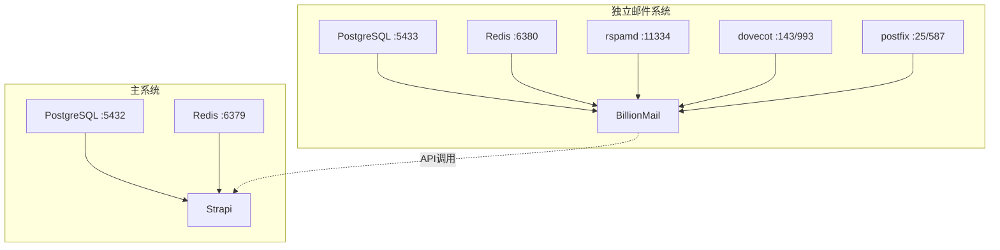
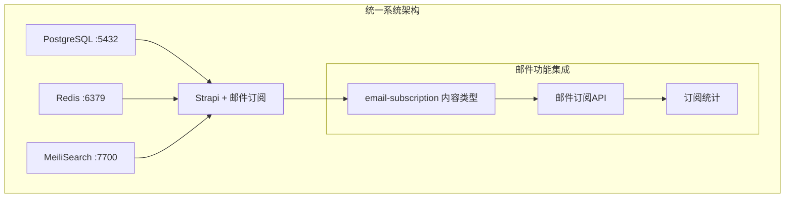

# BillionMail移除与邮件系统重构完成报告

## 📋 更新概述

基于项目代码实际实现情况，完成了BillionMail邮件系统的移除和文档更新。邮件功能已完全集成到Strapi后台，实现了统一管理和简化架构。

## 🔄 重大变更

### ❌ **移除的功能**
- **BillionMail独立邮件系统** - 完全移除所有BillionMail相关组件
- **独立邮件服务器** - 不再需要rspamd、dovecot、postfix等邮件服务器组件
- **独立邮件数据库** - 移除邮件专用PostgreSQL实例(5433端口)
- **独立邮件缓存** - 移除邮件专用Redis实例(6380端口)
- **独立邮件管理界面** - 移除http://localhost:8080/billion管理界面
- **WebMail界面** - 移除http://localhost:8080/roundcube邮件收发界面

### ✅ **新的实现方式**
- **Strapi集成邮件订阅** - 通过email-subscription内容类型实现完整邮件订阅功能
- **统一后台管理** - 在Strapi Admin中直接管理邮件订阅
- **RESTful API** - 提供subscribe/unsubscribe等标准API接口
- **统一数据存储** - 邮件订阅数据存储在主PostgreSQL数据库中

## 📊 架构变更对比

### 🔴 **旧架构 (BillionMail独立部署)**


### 🟢 **新架构 (Strapi统一集成)**


## 📝 文档更新清单

### ✅ **已更新的文档**

#### 1. **README.md**
- [x] 更新架构图，移除BillionMail独立部署部分
- [x] 修改服务访问地址表格，移除BillionMail管理界面和WebMail
- [x] 更新技术栈描述，改为统一数据库架构
- [x] 修改部署策略优势，从"双重部署"改为"统一部署"
- [x] 更新服务隔离设计为统一服务架构
- [x] 修改默认账号信息，移除BillionMail登录信息

#### 2. **DEV-SCRIPTS.md**
- [x] 更新邮件营销系统章节为"集成邮件订阅系统"
- [x] 修改核心功能描述，突出Strapi集成特性
- [x] 更新API端点，移除邮件发送和SMTP配置API
- [x] 简化数据模型描述，突出email-subscription内容类型

#### 3. **docs/README.md**
- [x] 更新系统访问地址，移除BillionMail管理界面
- [x] 修改默认账号信息，移除BillionMail登录信息
- [x] 更新邮件系统描述为Strapi集成方式

#### 4. **新增报告文档**
- [x] 创建本报告文档，记录完整的变更过程和影响

## 🔧 技术实现细节

### **邮件订阅功能实现**

#### 1. **数据模型 (email-subscription内容类型)**
```json
{
  "email": "邮箱地址 (必填，唯一)",
  "user": "关联用户 (可选)",
  "source": "订阅来源 (homepage/sidebar/footer/popup/api)",
  "tags": "订阅标签列表 (JSON)",
  "status": "订阅状态 (active/unsubscribed/bounced)",
  "preferences": "邮件偏好设置 (JSON)",
  "subscribedAt": "首次订阅时间",
  "lastEmailSent": "最后发送邮件时间"
}
```

#### 2. **核心API接口**
```bash
# 邮件订阅管理
POST /api/email-subscription/subscribe    # 邮件订阅
POST /api/email-subscription/unsubscribe  # 取消订阅
GET  /api/email-subscription/stats        # 订阅统计

# Strapi标准CRUD
GET  /api/email-subscriptions             # 获取所有订阅者
POST /api/email-subscriptions             # 创建订阅者
PUT  /api/email-subscriptions/:id         # 更新订阅者信息
DELETE /api/email-subscriptions/:id       # 删除订阅者
```

#### 3. **业务逻辑特性**
- ✅ **自动去重** - 检查已存在订阅，避免重复订阅
- ✅ **重新激活** - 已取消订阅的用户可重新激活
- ✅ **用户关联** - 自动关联注册用户，支持游客订阅
- ✅ **状态管理** - 完整的订阅状态流转 (active/unsubscribed/bounced)
- ✅ **标签系统** - 灵活的订阅者分类和标签管理
- ✅ **统计分析** - 完整的订阅数据统计和分析

## 🌐 系统访问方式

### **新的访问地址**
| 功能 | 访问地址 | 说明 |
|------|----------|------|
| 🌐 **前端网站** | http://localhost | 用户访问界面 |
| ⚙️ **Strapi后台** | http://localhost:1337/admin | 统一管理后台 |
| 📧 **邮件订阅管理** | http://localhost:1337/admin/content-manager/collection-types/api::email-subscription.email-subscription | 订阅者管理 |
| 🔍 **搜索引擎** | http://localhost:7700 | MeiliSearch控制台 |

### **管理方式**
1. **订阅者管理** - 登录Strapi后台，进入"邮件订阅"内容类型
2. **API调试** - 使用 `curl localhost:1337/api/email-subscription/stats` 查看统计
3. **数据导出** - 通过Strapi标准导出功能导出订阅者数据

## 📈 改进效果

### **✅ 优势**
1. **架构简化** - 减少服务数量，降低部署和维护复杂度
2. **统一管理** - 所有功能在Strapi后台统一管理
3. **数据一致性** - 用户数据和邮件订阅数据统一存储
4. **API标准化** - 使用Strapi标准RESTful API
5. **开发效率** - 减少跨系统集成，提高开发效率

### **⚠️ 注意事项**
1. **SMTP配置** - 需要在Strapi环境变量中配置SMTP服务器
2. **邮件发送** - 需要集成第三方邮件发送服务或SMTP服务器
3. **模板管理** - 邮件模板需要在代码中管理或使用第三方服务

## 🎯 后续建议

### **可选增强功能**
1. **邮件模板系统** - 可考虑添加email-template内容类型
2. **邮件发送记录** - 可添加email-log内容类型记录发送历史
3. **SMTP配置界面** - 可在Strapi Admin中添加SMTP配置管理
4. **邮件队列** - 可集成Redis队列实现异步邮件发送

### **监控和维护**
1. **定期检查** - 监控邮件订阅API的健康状态
2. **数据备份** - 邮件订阅数据已纳入统一备份策略
3. **性能监控** - 关注大量订阅者时的API性能表现

## 📊 更新统计

- **📝 文档更新**: 4个主要文档
- **🔧 架构简化**: 移除6个独立邮件组件
- **📦 部署简化**: 减少2个独立数据库实例
- **🌐 访问地址**: 从5个减少到4个主要地址
- **📊 管理统一**: 所有功能集中到1个后台管理

---

**✅ BillionMail移除与邮件系统重构已完成！**

*更新时间: 2025年1月9日*
*文档版本: v1.0*
